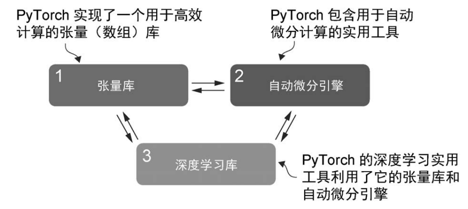
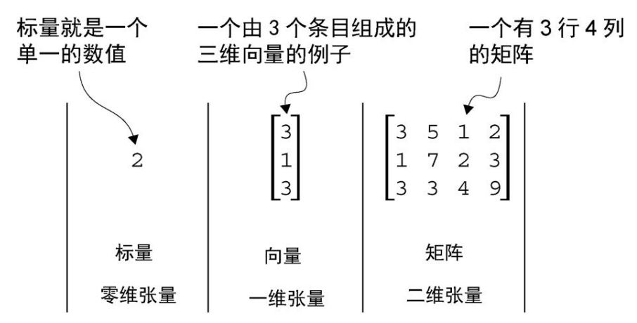
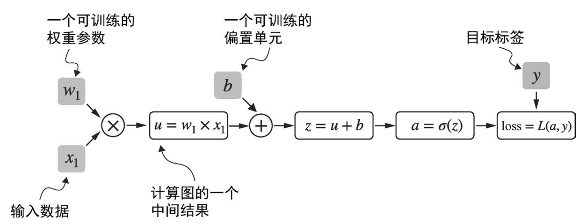

# Pytorch 基础

## 1. 项目介绍

本节课程聚焦 PyTorch 框架的核心基础操作，系统讲解张量（Tensor）的创建、运算与自动微分机制，帮助学员掌握深度学习模型的底层实现逻辑。课程从张量的基本概念入手，涵盖张量的创建（如从 Python 列表、NumPy 数组初始化）、形状变换（`reshape`、`view`）、数学运算（逐元素操作、矩阵乘法）及广播机制，结合实例演示如何通过 `torch.Tensor` 实现数据的高效存储与处理。随后深入解析自动微分（Autograd）的原理，通过代码演示如何设置 `requires_grad=True` 跟踪梯度、利用 `backward()` 计算梯度，并分析梯度中断（如 `torch.no_grad()`）对反向传播的影响

## 2. 项目内容

### 2.1. PyTorch 简介

PyTorch 是一个开源的基于 Python 的深度学习库。根据 Papers With Code 这个跟踪和分析研究论文平台的数据，自 2019 年以来，PyTorch 已成为研究领域使用最广泛的深度学习库，并且领先优势显著。此外，根据 2022 年 Kaggle 数据科学与机器学习调查，大约 40% 的受访者正在使用 PyTorch，并且这一比例每年都在增长。

#### 2.1.1. 三大核心组件

- 首先，PyTorch 是一个张量库，它扩展了 NumPy 基于数组的编程功能，增加了 GPU 加速特性，从而实现了 CPU 和 GPU 之间的无缝计算切换。
- 其次，PyTorch 是一个自动微分引擎，也称为 autograd，它能够自动计算张量操作的梯度，从而简化反向传播和模型优化。
- 最后，PyTorch 是一个深度学习库，它提供了模块化、灵活且高效的构建块（包括预训练模型、损失函数和优化器），能够帮助研究人员和开发人员轻松设计和训练各种深度学习模型。



#### 2.1.2. 安装 PyTorch

PyTorch 可以像其他任何 Python 库或包一样进行安装。本教程中使用的是 PyTorch 2.7.0，为了确保与教程书的兼容性，建议你使用以下命令安装该版本

```shell
pip install torch==2.7.0
```

要检查 PyTorch 的版本，请在 PyTorch 中执行以下代码：

```python
import torch

print(torch.__version__)
# '2.7.0'
```

> Python 库之所以被命名为 PyTorch，主要是因为它是 Torch 库的延续，但适用于 Python（因此称为“PyTorch”）。“Torch”这个名字承认了该库源于 Torch。Torch 是一个广泛支持机器学习算法的科学计算框架，最初使用 Lua 编程语言创建。

### 2.2. 张量简介

张量表示一个数学概念，它可以将向量和矩阵推广到潜在的更高维度。换句话说，张量是可以通过其阶数（或秩）来表征的数学对象，其中阶数提供了维度的数量。例如，标量（仅是一个数值）是秩为 0 的张量，向量是秩为 1 的张量，矩阵是秩为 2 的张量。



从计算的角度来看，张量是一种数据容器。举例来说，它们存储多维数据，其中每个维度表示一个不同的特征。像 PyTorch 这样的张量库能够高效地创建、操作和计算这些数组。

#### 2.2.1. 张量初始化

如前所述，PyTorch 张量是用于与数组类似结构的数据容器。可以使用 `torch.tensor()` 函数创建 PyTorch 的 Tensor 类对象。

```python
import numpy as np
import torch

# 从 Python 整数创建一个零维张量（标量）
tensor0d = torch.tensor(1)

# 从 Python 列表创建一个一维张量（向量）
tensor1d = torch.tensor([1, 2, 3])

# 从嵌套的 Python 列表创建一个二维张量
tensor2d = torch.tensor([[1, 2], [3, 4]])

# 从嵌套的 Python 列表创建一个三维张量
tensor3d = torch.tensor([[[1, 2], [3, 4]], [[5, 6], [7, 8]]])
```

生成一个包含三行四列，且填充零的张量对象

```python
torch.zeros((3, 4))
```

类似地

```python
torch.ones((3, 4))
```

生成三行四列，数值介于 0 到 10 之间（包含下限，不包含上限）的值

```python
torch.randint(low=0, high=10, size=(3, 4))
```

生成三行四列，介于 0 到 1 之间的随机数

```python
torch.rand(3, 4)
```

生成三行四列，服从正态分布的数值

```python
torch.randn((3, 4))
```

Tensor 类型可以与 NumPy Array 实现相互转换

```python
# 从 NumPy 数组创建一个张量
array3d = np.array([[[1, 2], [3, 4]], [[5, 6], [7, 8]]])
array3d[0, 0, 0] = 999
```

```python
tensor3d_2 = torch.tensor(array3d)  # 复制 NumPy 数组
print(tensor3d_2)  # 保持不变
# tensor([[[1, 2], [3, 4]], [[5, 6], [7, 8]]])
```

```python
tensor3d_3 = torch.from_numpy(array3d)  # 与 NumPy 数组共享内存
print(tensor3d_3)  # 由于共享内存而发生变化
# tensor([[[999, 2], [3, 4]], [[5, 6], [7, 8]]])
```

#### 2.2.2. 张量重塑

以下，我们将在介绍 PyTorch 时简要描述其相关操作。代码片段的输出，将以注释形式呈现。

```python
tensor2d = torch.tensor([[1, 2, 3], [4, 5, 6]])
tensor2d
# tensor([[1, 2, 3], [4, 5, 6]])
```

```python
tensor2d.shape
# torch.Size([2, 3])
```

如你所见，`.shape` 返回的是\[2, 3\]，这意味着该张量有 2 行 3 列。要将该张量变为 3×2 的形状，可以使用 `.reshape` 方法：

```python
tensor2d.reshape(3, 2)
# tensor([[1, 2], [3, 4], [5, 6]])
```

然而，请注意，在 PyTorch 中，重塑张量更常用的命令是`.view()`。

```python
tensor2d.view(3, 2)
# tensor([[1, 2], [3, 4], [5, 6]])
```

> 类似于`.reshape()`和`.view()`，在某些情况下，PyTorch 提供了多种语法选项来执行相同的计算。PyTorch 最初遵循了原始 Lua 版本 Torch 的语法约定，但后来应用户的要求，添加了与 NumPy 类似的语法。

接下来，可以使用.T 来转置张量，这意味着将其沿对角线翻转。

```python
tensor2d.T
# tensor([[1, 2], [3, 4], [5, 6]])
```

另一种重塑张量的方法是使用 squeeze 方法，其中提供要移除的轴索引。请注意，这仅适用于要移除的轴在该维度上只有一个元素时。

```python
z = torch.randn(3, 1, 5)
z
```

```python
z.squeeze(1)
```

squeeze 操作的逆操作是 unsqueeze，它是在矩阵中添加一个维度，可以使用以下代码完成。

```python
z.unsqueeze(0)
```

#### 2.2.3. 张量计算

类似于 NumPy，你可以对张量对象执行各种基本操作。这些操作与神经网络操作相呼应，包括输入与权重的矩阵乘法、添加偏置项，以及在需要时重塑输入或权重值。张量对象也遵循广播（broadcast）机制。如将 x 中所有元素乘以 10，可以使用以下代码

```python
x = torch.tensor([[1, 2, 3, 4], [5, 6, 7, 8]])
print(x * 10)
# tensor([[10, 20, 30, 40],
# [50, 60, 70, 80]])
```

类似地

```python
y = x.add(10)
print(y)
# tensor([[11, 12, 13, 14],
# [15, 16, 17, 18]])
```

PyTorch 中常用的矩阵相乘方法是 `.matmul` 方法。

```python
x.matmul(x.T)
# tensor([[30, 70], [70, 174]])
```

类似 NumPy，也可以使用@运算符，它能够更简洁地实现相同的功能：

```python
x @ x.T
# tensor([[30, 70], [70, 174]])
```

### 2.3. 计算图

现在让我们来了解一下 PyTorch 的自动微分引擎，也称为 autograd。PyTorch 的 autograd 系统能够在动态计算图中自动计算梯度。

计算图是一种有向图，主要用于表达和可视化数学表达式。在深度学习的背景下，计算图列出了计算神经网络输出所需的计算顺序——我们需要用它来计算反向传播所需的梯度，这是神经网络的主要训练算法。

让我们通过一个具体的例子来说明计算图的概念。下面的代码实现了一个简单逻辑回归分类器的前向传播（预测步骤），我们可以将其看作一个单层神经网络。它会返回一个介于 0 和 1 之间的分数，当计算损失时，这个分数会与真实的类别标签（0 或 1）进行比较。

```python
import torch
import torch.nn.functional as F

y = torch.tensor([1.0])  # 真实标签
x1 = torch.tensor([1.1])  # 输入特征
w1 = torch.tensor([2.2])  # 权重参数
b = torch.tensor([0.0])  # 偏置单元

z = x1 * w1 + b  # 净输入
a = torch.sigmoid(z)  # 激活和输出

loss = F.binary_cross_entropy(a, y)
print(loss)
# tensor(0.0852)
```

即使没有完全理解上述代码中的所有部分，也不要担心。这个例子的重点不是实现一个逻辑回归分类器，而是为了说明如何将一系列计算看作一个计算图。



实际上，PyTorch 在后台构建了这样一个计算图，我们可以利用它来计算损失函数相对于模型参数（这里是 w1 和 b）的梯度，从而训练模型。

### 2.4. 实现自动微分

若在 PyTorch 中进行计算，则只要其终端节点之一的 `requires_grad` 属性被设置为 `True`，PyTorch 默认就会在内部构建一个计算图。这在我们想要计算梯度时非常有用。在训练神经网络时，需要使用反向传播算法计算梯度。反向传播可以被视为微积分中链式法则在神经网络中的应用。

```python
import torch.nn.functional as F
from torch.autograd import grad

y = torch.tensor([1.0])
x1 = torch.tensor([1.1])
w1 = torch.tensor([2.2], requires_grad=True)
b = torch.tensor([0.0], requires_grad=True)

z = x1 * w1 + b
a = torch.sigmoid(z)

loss = F.binary_cross_entropy(a, y)

grad_L_w1 = grad(loss, w1, retain_graph=True)
grad_L_b = grad(loss, b, retain_graph=True)

print(grad_L_w1)
print(grad_L_b)
# (tensor([-0.0898]),)
# (tensor([-0.0817]),)
```

这里我们手动使用了 grad 函数，这在实验、调试和概念演示中很有用。但是，在实际操作中，PyTorch 提供了更高级的工具来自动化这个过程。例如，我们可以对损失函数调用 `.backward()` 方法，随后 PyTorch 将计算计算图中所有叶节点的梯度，这些梯度将通过张量的 `.grad` 属性进行存储：

```python
loss.backward()

print(w1.grad)
print(b.grad)
# (tensor([-0.0898]),)
# (tensor([-0.0817]),)
```

## 3. 项目练习（每题 10 分）

### 3.1. 理论题

1. ​解释 PyTorch 的三大核心组件的功能。
2. ​标量、向量、矩阵与张量的关系是什么？
3. 如何从该矩阵中提取一个标量？（用代码描述）

### 3.2. 实践题

使用 PyTorch 完成以下张量操作，并输出结果。

1. 创建一个形状为 (2, 3) 的浮点型张量（`dtype=torch.float32`）
2. 将上述浮点型张量形状（2, 3）重塑为 (3, 2)
3. 计算该重塑后张量与整数张量（3,）的逐元素乘法
4. 计算结果张量的转置（transpose）
5. 从重塑后的浮点型张量（3, 2）中，选取第 0 行所有元素，和第 1 行的第 1 列元素，组成一个新的长度为 3 的张量

### 3.3. 综合题

1. 定义变量 `a = torch.tensor([1.0, 2.0, 3.0], requires_grad=True)`，常数 `b = torch.tensor([4.0, 5.0, 6.0])`。

- 计算 a 与 b 的点积，输出为 c
- 调用 `c.backward()`，输出 `a.grad`（即 dc/da）

2. 定义变量 `A = torch.randn(2, 3, requires_grad=True)`，常数矩阵 `B = torch.tensor([[1.0, 2.0], [3.0, 4.0], [5.0, 6.0]])`。

- 计算矩阵乘法 + A 的转置，输出为 D
- 计算 D 的梯度

## 4. 参考阅读

- [tensors](https://docs.pytorch.org/docs/stable/tensors.html)
