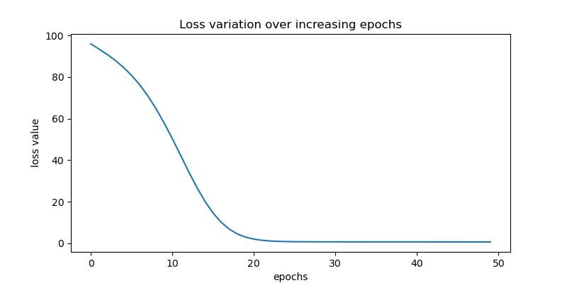

# 搭建神经网络

## 1. 上节回顾

上节我们学习了 Pytorch 的安装和基本构成，以及相关操作包括

- 张量操作（初始化、重塑、计算）
- 计算图
- 自动微分

## 2. 项目介绍

在本节中，我们将利用我们迄今为止所学的关于初始化张量对象、对其进行各种操作以及计算梯度值以更新神经网络权重的知识，搭建一个简单的神经网络，并对其进行训练。

## 3. 项目内容

### 3.1. 通用流程

为了理解如何在 PyTorch 中使用神经网络，我们将解决一个简单问题，即简单地将两个数字相加。数据集初始化如下：

- 定义输入（x）和输出（y）值。

```python
import torch

x = [[1, 2], [3, 4], [5, 6], [7, 8]]
y = [[3], [7], [11], [15]]
```

- 将输入列表转换为张量对象：

```python
X = torch.tensor(x).float()
Y = torch.tensor(y).float()
```

正如你所见，我们已经将张量对象转换为浮点数对象。将张量对象转换为浮点数或长整型是一个好习惯，因为它们最终会乘以小数（权重）。

- 定义神经网络结构

torch.nn 模块包含用于构建神经网络模型的功能：

```python
import torch.nn as nn
```

我们将创建一个类（MyNeuralNet）来构建我们的神经网络架构。创建模型架构时，必须继承自 `nn.Module`，因为它是所有神经网络模块的基类：

```python
class MyNeuralNet(nn.Module):
    # 使用 `__init__` 方法初始化神经网络的所有组件
    def __init__(self):
        # 确保类继承自 `nn.Module`
        super().__init__()
        # 定义神经网络结构的各个层
        self.input_to_hidden_layer = nn.Linear(2, 8)
        self.hidden_layer_activation = nn.ReLU()
        self.hidden_to_output_layer = nn.Linear(8, 1)

    # 定义向前传播
    # 必须使用 `forward` 作为函数名，因为 PyTorch 已经将此函数预留为执行前向传播的方法。使用其他名称代替会导致错误。
    def forward(self, x):
        x = self.input_to_hidden_layer(x)
        x = self.hidden_layer_activation(x)
        x = self.hidden_to_output_layer(x)
        return x  # noqa: RET504
```

在前面的代码行中，我们指定了神经网络的所有层——一个线性层（`self.input_to_hidden_layer`），后跟 ReLU 激活函数（`self.hidden_layer_activation`），最后是一个线性层（`self.hidden_to_output_layer`）。目前，层数和激活函数的选择是任意的。

- 检查权重值

到目前为止，我们已经构建了模型架构；接下来的一步是检查随机初始化的权重值。你可以通过以下步骤访问每个组件的初始权重：

```python
torch.manual_seed(0)
# 创建我们之前定义的 MyNeuralNet 类的一个实例。
mynet = MyNeuralNet()
# 每个层的权重和偏置可以通过以下方式访问：
mynet.input_to_hidden_layer.weight
# Parameter containing:
# tensor([[-0.2883,  0.0234],
#         [-0.3512,  0.2667],
#         [-0.6025,  0.5183],
#         [-0.5140, -0.5622],
#         [-0.4468,  0.3202],
#         [-0.2613,  0.2646],
#         [-0.6001, -0.4290],
#         [-0.2596, -0.1390]], requires_grad=True)
```

```python
# 可以使用以下代码获取神经网络的所有参数：
mynet.parameters()  # 返回一个生成器对象
# 参数可以通过循环生成器来获取，如下所示：
for param in mynet.parameters():
    print(param)

# Parameter containing:
# tensor([[-0.2741,  0.6511],
#         [-0.1106,  0.6907],
#         [-0.4593,  0.1763],
#         [ 0.4336,  0.3273],
#         [-0.5888, -0.5587],
#         [ 0.3239,  0.1835],
#         [ 0.6643, -0.2613],
#         [-0.5546, -0.4220]], requires_grad=True)
# Parameter containing:
# tensor([ 0.3506,  0.6582,  0.4533, -0.3913, -0.4327,  0.3969,  0.5686, -0.0374],
#        requires_grad=True)
# Parameter containing:
# tensor([[ 0.3034, -0.2661,  0.1696,  0.1320,  0.0192,  0.0388,  0.1029,  0.1502]],
#        requires_grad=True)
# Parameter containing:
# tensor([0.2289], requires_grad=True)
```

模型将这些张量注册为特殊对象，这些对象对于跟踪前向和反向传播都至关重要。在 `__init__` 方法中定义任何 `nn` 层时，它会自动创建相应的张量并同时注册它们。你还可以使用 `nn.Parameter(<tensor>)` 函数手动注册这些参数。因此，以下代码等效于我们之前定义的神经网络类。

- 由于我们预测的是连续输出，我们将优化均方误差作为损失函数：

```python
loss_func = nn.MSELoss()
```

为了规范起见，在本章中，我们使用 `_<variable>` 来表示与真实值 `<variable>` 对应的预测值。请注意，在计算损失时，我们始终先发送预测值，然后再发送真实值。这是 PyTorch 的惯例。

从 torch.optim 模块导入 SGD 方法，并将神经网络对象 (mynet) 和学习率 (lr) 作为参数传递给 SGD 方法：

```python
from torch.optim import SGD

opt = SGD(mynet.parameters(), lr=0.001)
```

- 整合执行一个 epoch 中需要做的所有步骤：

i. 计算给定输入和输出对应的损失值。

ii. 计算每个参数对应的梯度。

iii. 根据每个参数的学习率和梯度更新参数值。

iv. 在权重更新后，确保清除前一步骤计算的梯度，以便在下一个 epoch 中计算梯度：

```python
opt.zero_grad()  # flush the previous epoch's gradients
loss_value = loss_func(mynet(X), Y)  # compute loss
loss_value.backward()  # perform backpropagation
opt.step()
```

使用 for 循环重复上述步骤，次数为 epoch 数。在以下示例中，我们总共执行 50 个 epoch 的权重更新过程。此外，我们将每个 epoch 的损失值存储在列表 – `loss_history` 中：

```python
loss_history = []
for _ in range(50):
    opt.zero_grad()  # 刷新梯度
    loss_value = loss_func(mynet(X), Y)  # 计算损失
    loss_value.backward()  # 反向传播
    opt.step()
    loss_history.append(loss_value.item())
```

让我们绘制损失随 epoch 增加的变化趋势（如我们在上一章看到的，我们以权重更新的方式使整体损失值随着 epoch 增加而降低）：

```python
import matplotlib.pyplot as plt

_, ax = plt.subplots(figsize=(8, 4))

ax.plot(loss_history)
ax.set(
    xlabel="epochs", ylabel="loss value", title="Loss variation over increasing epochs"
)

plt.savefig("images/torch-loss.png")
```



### 3.2. 处理数据集

我们尚未考虑的神经网络的一个超参数是批次大小（batch size）。批次大小指的是计算损失值或更新权重时考虑的数据点数量。当数据点数量达到数百万时，这个超参数特别有用，因为一次权重更新使用所有数据点并非最佳选择，因为内存不足以存储如此多的信息。

此外，单个样本可能已经足够代表数据。批次大小有助于确保我们获取多个足够具有代表性的数据样本，但不必完全代表总数据。现在，我们将找到一种方法来指定在计算权重梯度和更新权重时要考虑的批次大小，这些权重反过来用于计算更新后的损失值：

```python
# 导入用于加载数据和处理数据集的方法：
import torch
import torch.nn as nn
from torch.utils.data import DataLoader, Dataset

# 导入数据，将其转换为浮点数，并将其注册到设备上：
x = [[1, 2], [3, 4], [5, 6], [7, 8]]
y = [[3], [7], [11], [15]]
X = torch.tensor(x).float()
Y = torch.tensor(y).float()


# 实例化一个 Dataset 类
# 在 MyDataset 类中，我们存储信息以便一次获取一个数据点，以便将一批数据点组合在一起（使用 DataLoader），并通过一次前向传播和一次反向传播来更新权重：
class MyDataset(Dataset):
    # 定义一个 __init__ 方法，该方法接收输入输出对并将它们转换为 Torch 浮点对象：
    def __init__(self, x, y):
        self.x = x.detach().clone().float()
        self.y = y.detach().clone().float()

    # 指定输入数据集的长度（__len__），以便该类知道输入数据集中存在多少个数据点：
    def __len__(self):
        return len(self.x)

    # __getitem__ 方法用于获取特定的行：
    def __getitem__(self, ix):
        return self.x[ix], self.y[ix]
```

创建该类的一个实例：

```python
ds = MyDataset(X, Y)
```

将先前定义的数据集实例通过 `DataLoader`，从原始输入和输出张量对象中获取 `batch_size` 个数据点：

```python
dl = DataLoader(ds, batch_size=2, shuffle=True)
```

此外，在前面的代码中，我们还指定了从原始输入数据集（ds）中随机抽取两个数据点（通过提到 `batch_size=2`），并且进行了打乱（通过提到 `shuffle=True`）。

现在，我们定义上一节中定义的神经网络类：

```python
class MyNeuralNet(nn.Module):
    def __init__(self):
        super().__init__()
        self.input_to_hidden_layer = nn.Linear(2, 8)
        self.hidden_layer_activation = nn.ReLU()
        self.hidden_to_output_layer = nn.Linear(8, 1)

    def forward(self, x):
        x = self.input_to_hidden_layer(x)
        x = self.hidden_layer_activation(x)
        x = self.hidden_to_output_layer(x)
        return x
```

接下来，我们像上一节中定义的，也定义模型对象（mynet）、损失函数（loss_func）和优化器（opt）。

```python
from torch.optim import SGD

mynet = MyNeuralNet()
loss_func = nn.MSELoss()

opt = SGD(mynet.parameters(), lr=0.001)
```

循环遍历数据批次以最小化损失值：

```python
import time

loss_history = []
start = time.time()
for _ in range(50):
    for ix, iy in dl:
        opt.zero_grad()
        loss_value = loss_func(mynet(ix), iy)
        loss_value.backward()
        opt.step()
        loss_history.append(loss_value)

end = time.time()
print(end - start)
# 0.02455306053161621
```

虽然前面的代码看起来与上一节中的代码非常相似，但与上一节中权重更新的次数相比，我们每次 epoch 进行了 2 倍的权重更新。本节的批次大小为 2，而上一节的批次大小为 4（数据点的总数）。

### 3.3. 预测新数据点

现在，我们将学习如何利用上一节中训练好的 mynet 模型中定义的 `forward` 方法来预测未见过的数据点。我们将从上一节中构建的代码继续：

```python
# 创建我们想要用来测试模型的的数据点
val_x = [[10, 11]]
val_x = torch.tensor(val_x).float()
# 将张量对象作为 Python 函数传递给训练好的神经网络 mynet。这相当于在构建的模型中执行前向传播：
mynet(val_x)
# tensor([[20.3506]], grad_fn=<AddmmBackward0>)
```

到目前为止，我们已经能够训练神经网络将输入映射到输出，并通过执行反向传播来更新权重值，以最小化损失值（该值是使用预定义的损失函数计算得出的）。

### 3.4. 实现自定义损失函数

在本节中，我们将实现一个自定义损失函数，它与 `nn.Module` 中预定义的 MSELoss 函数完成相同的任务：

```python
def my_mean_squared_error(_y, y):
    loss = (_y - y) ** 2
    return loss.mean()


loss_func = nn.MSELoss()
loss_value = loss_func(mynet(X), Y)
print(loss_value)
# tensor(0.1062, grad_fn=<MseLossBackward0>)

loss_value2 = my_mean_squared_error(mynet(X), Y)
print(loss_value2)
# tensor(0.1062, grad_fn=<MeanBackward0>)
```

我们使用了内置的 `MSELoss` 函数，并将结果与我们构建的自定义函数的结果进行了比较，结果是匹配的。我们可以根据我们正在解决的问题定义一个我们选择的自定义函数。

在某些情况下，获取神经网络的中间层值是很有帮助的。PyTorch 提供了两种方法来获取神经网络的中间值：

```python
# 方法 1：直接将层作为函数调用
input_to_hidden = mynet.input_to_hidden_layer(X)
hidden_activation = mynet.hidden_layer_activation(input_to_hidden)
print(hidden_activation)


# 方法 2：在 forward 方法中指定我们想要观察的层
class NeuralNet(nn.Module):
    def __init__(self):
        super().__init__()
        self.input_to_hidden_layer = nn.Linear(2, 8)
        self.hidden_layer_activation = nn.ReLU()
        self.hidden_to_output_layer = nn.Linear(8, 1)

    def forward(self, x):
        hidden1 = self.input_to_hidden_layer(x)
        hidden2 = self.hidden_layer_activation(hidden1)
        output = self.hidden_to_output_layer(hidden2)
        return output, hidden2


mynet = NeuralNet()
mynet(X)[1]
```

### 3.5. Sequential 方法

```python
model = nn.Sequential(nn.Linear(2, 8), nn.ReLU(), nn.Linear(8, 1))

loss_func = nn.MSELoss()
opt = SGD(model.parameters(), lr=0.001)

loss_history = []
start = time.time()
for _ in range(50):
    for ix, iy in dl:
        opt.zero_grad()
        loss_value = loss_func(model(ix), iy)
        loss_value.backward()
        opt.step()
        loss_history.append(loss_value.item())

end = time.time()
print(end - start)
# 0.0188748836517334
```

### 3.6. 保存和加载模型

神经网络模型开发中的一个重要方面是训练后保存模型并将其加载回来。设想一种情况，你需要从已经训练好的模型进行推理，这时你只需要加载训练好的模型，而无需再次训练。

在介绍用于实现此功能的具体命令之前，以前面的例子为例，让我们了解完全定义神经网络的重要组成部分。我们需要以下内容：

- 每个张量（参数）都需要一个唯一的名称（键）；
- 需要一种将网络中的每个张量与其他张量连接起来的逻辑；
- 每个张量的值（权重/偏置值）。

第一点在定义模块的 `__init__` 阶段得到处理，第二点在 `forward` 方法定义时得到处理。默认情况下，张量中的值在 `__init__` 阶段被随机初始化。但我们想要的是加载一组在模型训练时学习到的特定权重（或值），并将每个值与特定的名称相关联。

#### 3.6.1. 使用 `state_dict`

理解 PyTorch 模型保存和加载的关键在于 `model.state_dict()` 命令。`state_dict` 返回一个键值对的字典（有序字典）：键是模型各层的名称，而值对应于这些层的权重。

```python
model.state_dict()
```

#### 3.6.2. 保存

运行 `torch.save(model.state_dict(), model_path)` 会以 Python 序列化的格式将模型保存在磁盘上，文件名为 `chapter2.pth`。一个好的做法是在调用 `torch.save` 之前将模型转移到 CPU 上，这样可以保存张量为 CPU 张量，而非 CUDA 张量。这有助于将模型加载到任何机器上，无论该机器是否具有 CUDA 功能。

```python
torch.save(model.to("cpu").state_dict(), "data/chap02-demo.pth")
```

#### 3.6.3. 加载

```python
state_dict = torch.load("data/chap02-demo.pth")
model.load_state_dict(state_dict)

val = [[8, 9], [10, 11], [1.5, 2.5]]
val = torch.tensor(val).float()
model(val)
```

## 4. 项目练习（每题 10 分）

### 4.1. 理论题

1. 为什么在训练期间应该将整数输入转换为浮点值？
2. Dataset 类需要定义哪些方法？
3. 神经网络类中的`__init__`是什么？
4. 为什么我们在执行反向传播之前需要清零梯度？
5. `Sequential` 方法如何帮助简化神经网络架构的定义？

### 4.2. 实践题（用代码描述）

1. 用于重塑张量对象的有哪些方法？
2. 如何对新的数据点进行预测？
3. 如何获取神经网络中间层的数值？
4. 如何保存数据？
5. 如何加载数据？

## 5. 参考阅读

- [深度学习计算¶](https://zh.d2l.ai/chapter_deep-learning-computation/index.html)
