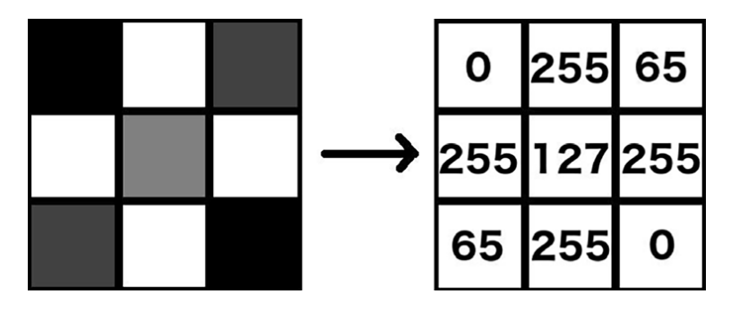
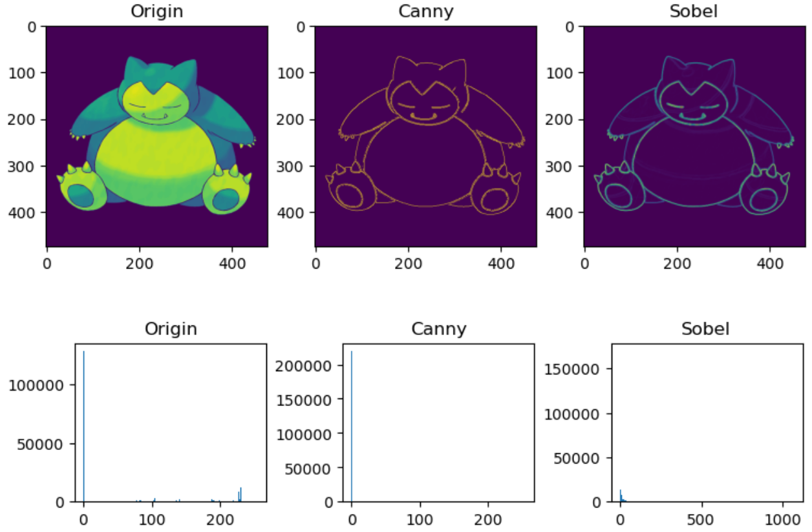
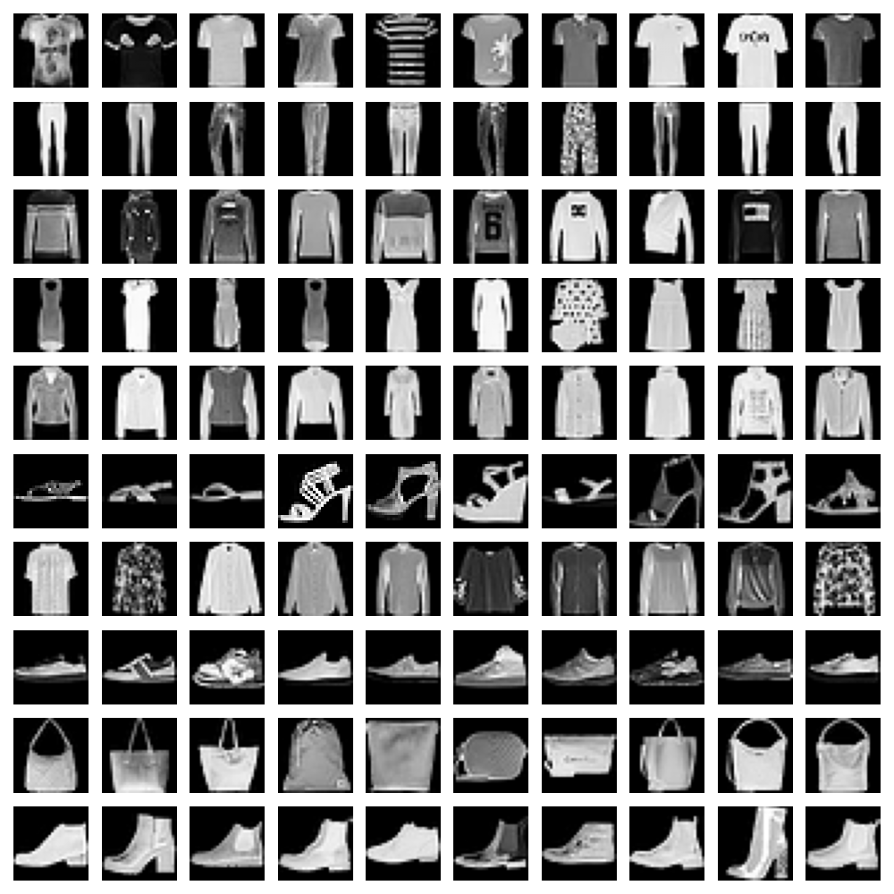
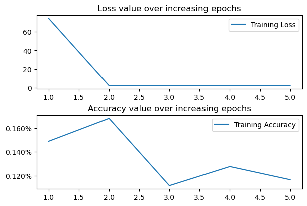
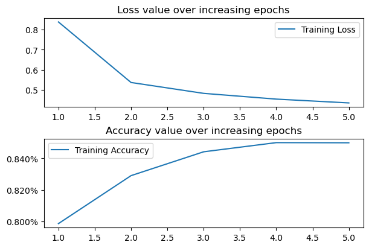

# 神经网络模型探究

## 1. 上节回顾

上节我们学习了 Pytorch 搭建神经网络的基本流程，包括

- 定义数据集载入类
- 定义损失函数
- Sequential 方法
- 保存和加载模型

## 2. 项目介绍

在本节中，我们将学习如何使用神经网络对图像进行分类，并探究影响模型性能的主要因素。

## 3. 项目内容

### 3.1. 图像表示

数字图像文件（通常与“JPEG”或“PNG”扩展名相关联）由一个像素数组组成。像素是图像的最小组成元素。在灰度图像中，每个像素是一个标量（单个）值，介于 0 和 255 之间：0 为黑色，255 为白色，介于两者之间的是灰色（像素值越小，像素越暗）。另一方面，彩色图像中的像素是三维向量，对应于它们红色、绿色和蓝色通道中可以找到的标量值。

图像具有高度 x 宽度 x c 个像素，其中高度是像素的行数，宽度是像素的列数，c 是通道数。对于彩色图像，c 为 3（分别对应图像的红色、绿色和蓝色强度），对于灰度图像，c 为 1。此处显示了一个包含 3x3 像素的灰度图像及其对应的标量值示例：



再次强调，像素值为 0 表示完全黑暗，而 255 表示纯亮度（即灰度图像的纯白色，以及彩色图像中各自通道的纯红色/绿色/蓝色）。

### 3.2. 计算机视觉

在传统的计算机视觉中，我们会为每个图像创建一些特征，然后再将它们作为输入。为了体会训练神经网络所节省的精力，让我们来看一些这样的特征：



这里，我们不会指导你如何获取这些特征，因为这里的目的是帮助你认识到手动创建特征是一种次优做法。你可以通过以下链接熟悉不同的特征提取方法：<https://docs.opencv.org/4.x/d7/da8/tutorial_table_of_content_imgproc.html>

- 直方图特征：对于某些任务，例如自动亮度调节或夜视功能，了解图像的照明情况至关重要，即明亮或黑暗的像素比例。
- 边缘和角点特征：对于图像分割等任务，在确定每个人的像素集合时，首先提取边缘是有意义的，因为一个人的边界只不过是一组边缘的集合。在其他任务，例如图像配准中，检测关键地标至关重要。这些地标将是图像中所有角点的子集。
- 颜色分离特征：在自动驾驶汽车的交通灯检测等任务中，系统需要了解交通灯上显示的颜色。
- 图像梯度特征：在颜色分离特征的基础上进一步，了解像素级别的颜色变化可能很重要。不同的纹理可以产生不同的梯度，这意味着它们可以用作纹理检测器。实际上，寻找梯度是边缘检测的先决条件。

这些只是众多特征中的一部分。还有更多，难以全部涵盖。创建这些特征的主要缺点是，你需要精通图像和信号分析，并充分理解哪些特征最适合解决问题。即使两个约束都得到满足，也不能保证这样的专家能够找到正确的输入组合，即使他们能找到，也不能保证这种组合能在新的、未见过的场景中有效。

由于存在这些缺点，社区已基本转向基于神经网络的模型。这些模型不仅可以自动找到合适的特征，还可以学习如何将它们以最佳方式组合以完成任务。正如我们此前看到，神经网络既充当特征提取器，又充当分类器。现在我们已经了解了一些历史特征提取技术的示例及其缺点，让我们学习如何训练神经网络来处理图像。

### 3.3. 准备图像分类数据

为了在本章涵盖多个场景，以便我们看到一种场景相对于另一种场景的优势，我们将贯穿整个本章使用一个数据集：Fashion MNIST 数据集，其中包含 10 种不同类别的服装图像（衬衫、裤子、鞋子等等）。让我们准备这个数据集：

首先，下载数据集并导入相关的包。torchvision 包包含各种数据集，其中之一是 FashionMNIST 数据集。

```python
import os

from torchvision import datasets

data_folder = "$HOME/Documents/col-models/"
data_folder = os.path.expandvars(data_folder)
train_data = datasets.FashionMNIST(
    data_folder, train=True, download=True, target_transform=None
)
```

在前面的代码中，我们指定了一个文件夹（data_folder），用于存储下载的数据集。然后，我们从 `datasets.FashionMNIST` 获取 train_data 数据并将其存储到 data_folder 中。此外，我们指定只想下载训练图像，通过设置 `train = True`。

接下来，我们需要将 `train_data.data` 中可用的图像存储为 `tr_images`，将 `train_data.targets` 中可用的标签（targets）存储为 `tr_targets`：

```python
tr_images = train_data.data
tr_targets = train_data.targets
```

查看数据的形状

```python
len(train_data.data), len(train_data.targets)
# (60000, 60000)
```

查看标签名称

```python
class_names = train_data.classes
class_names
#  ['T-shirt/top', 'Trouser', 'Pullover', 'Dress', 'Coat', 'Sandal', 'Shirt', 'Sneaker', 'Bag', 'Ankle boot']
```

在这里，我们可以看到有 60,000 张图像，每张图像的大小为 28x28，所有图像共有 10 个可能的类别。需要注意的是，`tr_targets` 包含每个类别的数值，而 `fmnist.classes` 提供了与 `tr_targets` 中每个数值对应的名称。

绘制 10 个随机样本图像，涵盖所有 10 个可能的类别：

```python
import matplotlib.pyplot as plt
import numpy as np
import torch

torch.manual_seed(0)
# 创建一个 10x10 的网格图，其中网格的每一行对应一个类别，每一列展示属于该类别行的一个示例图像。循环遍历唯一的类别编号（label_class），并获取与给定类别编号对应的行的索引（label_x_rows）：
R, C = len(tr_targets.unique()), 10
fig, ax = plt.subplots(R, C, figsize=(10, 10))

for label_class, plot_row in enumerate(ax):
    # 我们获取 np.where 条件的第 0 个索引作为输出，因为它的长度为 1。它包含所有目标值（tr_targets）等于 label_class 的索引数组。
    label_x_rows = np.where(tr_targets == label_class)[0]
    for plot_cell in plot_row:
        plot_cell.grid(False)
        plot_cell.axis("off")
        ix = np.random.choice(label_x_rows)
        x, y = tr_images[ix], tr_targets[ix]
        plot_cell.imshow(x, cmap="gray")

plt.tight_layout()

# plt.savefig("images/data-fashionmnist.png")
```



请注意，在上述图像中，每一行代表 10 个不同图像的样本，它们都属于同一个类别。

### 3.4. 训练神经网络

为了训练神经网络，必须执行以下步骤：

1. 导入相关的包
2. 获取数据集
3. 包装数据集的 DataLoader
4. 构建模型，并定义损失函数和优化器
5. 定义两个函数，分别用于训练和验证一批数据
6. 定义一个函数来计算数据的准确率
7. 根据不断增加的 epoch，基于每一批数据执行权重更新

#### 3.4.1. 准备步骤

```python
import numpy as np
import torch.nn as nn
from torch.utils.data import DataLoader, Dataset


class FMNISTDataset(Dataset):
    def __init__(self, x, y):
        x = x.float()
        x = x.view(-1, 28 * 28)
        self.x, self.y = x, y

    def __getitem__(self, ix):
        x, y = self.x[ix], self.y[ix]
        return x, y

    def __len__(self):
        return len(self.x)


# 创建一个函数，从名为 FMNISTDataset 的数据集生成训练 DataLoader，trn_dl。这将以批次大小为 32 随机抽取 32 个数据点：
def get_data(batch_size=32):
    trn_dl = FMNISTDataset(tr_images, tr_targets)
    return DataLoader(trn_dl, batch_size=batch_size, shuffle=True)


batch_size = 32
train_dataloader = get_data(batch_size)
print(f"Length of train dataloader: {len(train_dataloader)} batches of {batch_size}")
```

#### 3.4.2. 模型、损失函数和优化器

模型是一个具有一个隐藏层的网络。输出层是 10 神经元的层，因为有 10 个可能的类别。我们调用 `CrossEntropyLoss` 函数，因为每个图像的输出可能属于 10 个类别中的任何一个。

```python
from torch.optim import SGD

# 设置设备：若有 GPU 则调用 GPU，计算，反正使用 CPU 计算
device = "cuda" if torch.cuda.is_available() else "cpu"


def get_model():
    model = nn.Sequential(nn.Linear(28 * 28, 1000), nn.ReLU(), nn.Linear(1000, 10)).to(
        device
    )
    criterion = nn.CrossEntropyLoss()
    optimizer = SGD(model.parameters(), lr=1e-2)
    return model, criterion, optimizer
```

#### 3.4.3. 训练数据集

下面的代码将一批图像传递到模型进行前向传播，计算该批次的损失，然后将权重通过反向传播传递并更新它们。最后，它刷新梯度内存，以防止其影响下一次传递中梯度的计算。现在，我们可以将损失值提取为标量，通过获取 `batch_loss.item()` 来获取 `batch_loss`。

```python
def train_batch(x, y, model, optimizer, criterion):
    model.train()
    prediction = model(x)  # 获取预测矩阵
    batch_loss = criterion(prediction, y)  # 计算损失
    batch_loss.backward()  # 反向传播
    optimizer.step()
    optimizer.zero_grad()  # 梯度清零
    return batch_loss.item()
```

#### 3.4.4. 计算准确率

在下面的代码中，我们明确指出无需计算梯度，而是通过提供 `@torch.no_grad()` 并将输入前向传递到模型来计算预测值。接下来，我们调用 `prediction.max(-1)` 来识别与每行对应的最大索引（argmax）。然后，我们将我们的 argmax 与真实标签（通过 `argmaxes == y`）进行比较，以检查每行是否被正确预测。最后，我们将移动到 CPU 的 `is_correct` 列表转换为 NumPy 数组并返回。

```python
@torch.no_grad()
def accuracy(x, y, model):
    model.eval()
    prediction = model(x)  # 获取预测矩阵
    _, argmaxes = prediction.max(-1)  # 计算每行最大值的索引是否与真实标签一致。
    is_correct = argmaxes == y
    return is_correct.cpu().numpy().tolist()
```

#### 3.4.5. 开始训练

```python
trn_dl = get_data()
model, criterion, optimizer = get_model()

losses, accuracies = [], []
for _ in range(5):
    epoch_losses, epoch_accuracies = [], []

    for _, batch in enumerate(iter(trn_dl)):
        x, y = batch
        batch_loss = train_batch(x, y, model, optimizer, criterion)
        epoch_losses.append(batch_loss)
    epoch_loss = np.array(epoch_losses).mean()

    for _, batch in enumerate(iter(trn_dl)):
        x, y = batch
        is_correct = accuracy(x, y, model)
        epoch_accuracies.extend(is_correct)

    epoch_accuracy = np.mean(epoch_accuracies)
    losses.append(epoch_loss)
    accuracies.append(epoch_accuracy)

# 不要忘记保存训练得到的模型权重
torch.save(model.to("cpu").state_dict(), "data/chap03-unscaled.pth")
```

#### 3.4.6. 可视化损失

可以使用以下代码显示训练损失和准确率随 epoch 增加的变化：

```python
import matplotlib.pyplot as plt
from matplotlib.ticker import PercentFormatter

epochs = np.arange(5) + 1

_, axes = plt.subplots(2, 1, figsize=(6, 4), constrained_layout=True)
axes[0].plot(epochs, losses, label="Training Loss")
axes[0].set_title("Loss value over increasing epochs")
axes[0].legend()

axes[1].plot(epochs, accuracies, label="Training Accuracy")
axes[1].set_title("Accuracy value over increasing epochs")
axes[1].legend()
axes[1].yaxis.set_major_formatter(PercentFormatter())
```



在五个 epoch 结束后，训练准确率仅为 12%。注意，随着 epoch 增加，损失值并没有显著降低。换句话说，无论等待多久，模型不太可能提供高准确率（例如，高于 80%）。这需要我们理解所使用的各种超参数如何影响神经网络的准确率。

### 3.5. 缩放数据集

缩放数据集的过程是确保变量被限制在有限的范围内。在本节中，我们将通过将每个输入值除以数据集中可能的最大值，将独立变量的值限制在 0 到 1 之间。这个最大值是 255，对应于白色像素：

```python
class FMNISTDataset(Dataset):
    def __init__(self, x, y):
        x = x.float() / 255
        x = x.view(-1, 28 * 28)
        self.x, self.y = x, y

    def __getitem__(self, ix):
        x, y = self.x[ix], self.y[ix]
        return x, y

    def __len__(self):
        return len(self.x)
```

与上一节相比，我们所做的唯一改动是将输入数据除以数据集中可能的最大像素值：255。由于像素值范围在 0 到 255 之间，因此除以 255 将导致始终在 0 到 1 之间的值。重复此前步骤，结果见下图



正如我们所见，训练损失持续降低，训练准确率也持续增加，达到约 85% 的准确率。与未缩放输入数据的情况形成对比，未缩放时，训练损失没有持续降低，并且在五个 epoch 结束时，训练数据集的准确率仅为 12%。

这是因为根据 Sigmoid 函数，输入过大会导致函数值趋近于 0，而小的输入使函数函数对权重变化更敏感。

$$
\text{Sigmoid}= \frac{1}{1 + e^{-(\text{输入} * \text{权重})}}
$$

### 3.6. 批归一化

当输入值非常小的时候，Sigmoid 输出会发生微小变化，需要权重值发生很大的变化才能达到最佳效果。

此外，在“缩放数据集”部分，我们看到大输入值会对训练准确性产生负面影响。这表明我们的输入值既不能太小也不能太大。

除了输入值过小或过大，我们还可能遇到一种情况，即隐藏层中某个节点的数值可能导致非常小的数字或非常大的数字，从而导致与之前权重连接到下一层时遇到的相同问题。批归一化（Batch Normalization）在这种情况下可以发挥作用，因为它会像我们缩放输入值时一样，对每个节点的值进行归一化。通常，一个批次的输入值会按照以下方式进行缩放：

- 批均值

$$
\mu_B=\frac{1}{m} \sum_{i=1}^m x_i \\
$$

- 批方差

$$
\sigma_2^B=\frac{1}{m} \sum_{i=1}^m(x_i-\mu_B)^2 \\
$$

- 归一化输入

$$
\bar{x}_i=\frac{(x_i-\mu_B)}{\sqrt{\sigma_B^2+\epsilon}}
$$

- 批归一化输入

$$
\gamma \bar{x}_i+\beta
$$

通过从批次均值中减去每个数据点，然后除以批次方差，我们已经将批次中每个节点的数值归一化到一个固定范围。虽然这被称为硬归一化，但通过引入$\gamma$和$\beta$参数，我们允许网络识别最佳归一化参数。

当输入层和隐藏层的值范围都很小，权重必须发生很大的变化（无论是连接输入层到隐藏层的权重，还是连接隐藏层到输出层的权重）。这里，我们将对此前的代码进行唯一的一次修改；即，在定义模型架构时添加批量归一化。

> 需要回顾上一课（搭建神经网络）的内容。

```python
from torch.optim import Adam


def get_model():
    class neuralnet(nn.Module):
        def __init__(self):
            super().__init__()
            self.input_to_hidden_layer = nn.Linear(784, 1000)
            self.batch_norm = nn.BatchNorm1d(1000)  # 批归一化
            self.hidden_layer_activation = nn.ReLU()
            self.hidden_to_output_layer = nn.Linear(1000, 10)

        def forward(self, x):
            x = self.input_to_hidden_layer(x)
            x0 = self.batch_norm(x)  # 批归一化
            x1 = self.hidden_layer_activation(x0)
            x2 = self.hidden_to_output_layer(x1)
            return x2, x1

    model = neuralnet()
    criterion = nn.CrossEntropyLoss()
    optimizer = Adam(model.parameters(), lr=1e-3)
    return model, criterion, optimizer
```

在上面的代码中，我们声明了一个变量（`batch_norm`），它执行批量归一化（`nn.BatchNorm1d`）。我们执行 `nn.BatchNorm1d(1000)` 的原因是每个图像的输出维度为 1000（即隐藏层的 1 维输出）。此外，在 `forward` 方法中，我们将隐藏层的输出值通过批量归一化，然后再通过 `ReLU` 激活函数。

由于 `get_model` 函数现在返回两个输出，我们需要修改 `train_batch` 和 `val_loss` 函数，这些函数会进行预测并将输入传递给模型。在这里，我们只需要获取输出层的值，而非隐藏层的值。由于输出层的值在模型返回值的第 0 个索引中，我们将修改这些函数，使其仅获取预测的第 0 个索引，如下所示：

```python
def train_batch(x, y, model, optimizer, criterion):
    prediction = model(x)[0]  # 更改
    batch_loss = criterion(prediction, y)
    batch_loss.backward()
    optimizer.step()
    optimizer.zero_grad()
    return batch_loss.item()


def accuracy(x, y, model):
    with torch.no_grad():
        prediction = model(x)[0]  # 更改
    _, argmaxes = prediction.max(-1)
    is_correct = argmaxes == y
    return is_correct.cpu().numpy().tolist()
```

> 批量归一化在训练深度神经网络时能提供很大的帮助。它可以避免梯度变得太小，导致权重几乎不更新。

这部分，我们暂时不展示结果，留作练习，见项目练习的第 5 题。

## 4. 项目练习（每题 20 分）

### 4.1. 训练批次大小

在前面的部分，训练数据集的每个批次考虑 32 个数据点。这导致每个 epoch 的权重更新次数更多，因为有 1,875 次权重更新（60,000/32 几乎等于 1,875，其中 60,000 是训练图像的数量）。

此外，我们没有考虑模型在验证数据集上的表现。请比较以下内容：

- 训练批次大小为 32 时，训练数据和验证数据的损失和准确率值
- 训练批次大小为 10,000 时，训练数据和验证数据的损失和准确率值

> 提示：调整`batch_size`参数

### 4.2. 损失优化器

为了最小化总体损失，需要调整权重值。损失优化器（调整权重值以最小化损失值的不同方法）会影响模型的总体损失和准确率。比较 10 个 epoch 内，SGD 和 Adam 的性能。

> 提示：将 `SGD` 替换为 `Adam`

### 4.3. 学习率

调整学习率，并对比使用同一优化器时，如下几种情况之间的模型性能

- 在缩放数据集上使用较高的学习率（0.1）
- 在缩放数据集上使用较低的学习率（0.00001）
- 在未缩放的数据集上使用较低的学习率（0.00001）

> 提示：调整`lr`参数

### 4.4. 网络层数

到目前为止，我们的神经网络架构只有一层隐藏层。现在，构造具有两层隐藏层和没有隐藏层的模型。以下是具有两层隐藏层的修改后的 `get_model` 函数：

```python
def get_model():
    model = nn.Sequential(
        nn.Linear(28 * 28, 1000),
        nn.ReLU(),
        nn.Linear(1000, 1000),  # 增加一层
        nn.ReLU(),
        nn.Linear(1000, 10),
    )
    criterion = nn.CrossEntropyLoss()
    optimizer = Adam(model.parameters(), lr=1e-3)
    return model, criterion, optimizer
```

类比上述函数，构造没有隐藏层的模型，并对比其与具有两层隐藏层的模型的性能。

### 4.5. 批归一化

对比不使用/使用批归一化的模型性能。

为使对比明显，请先修改数据集处理类

```python
class FMNISTDataset(Dataset):
    def __init__(self, x, y):
        x = x.float() / (255 * 10000)
        x = x.view(-1, 28 * 28)
        self.x, self.y = x, y

    def __getitem__(self, ix):
        x, y = self.x[ix], self.y[ix]
        return x, y

    def __len__(self):
        return len(self.x)
```

## 5. 参考阅读

- [图像分类数据集](https://zh.d2l.ai/chapter_linear-networks/image-classification-dataset.html)
- [批归一化](https://zh.d2l.ai/chapter_convolutional-modern/batch-norm.html)
