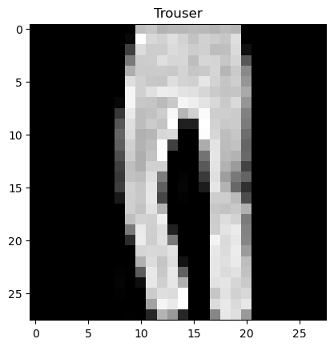
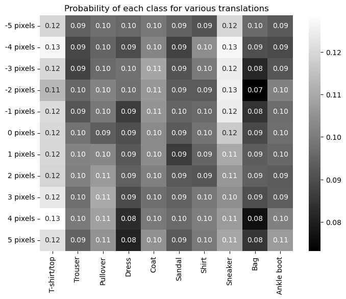
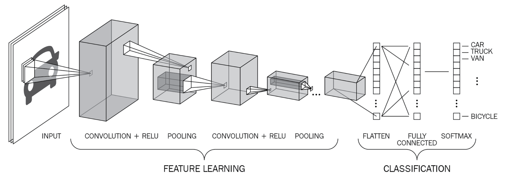
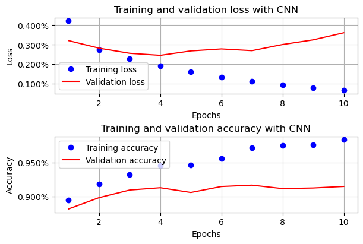
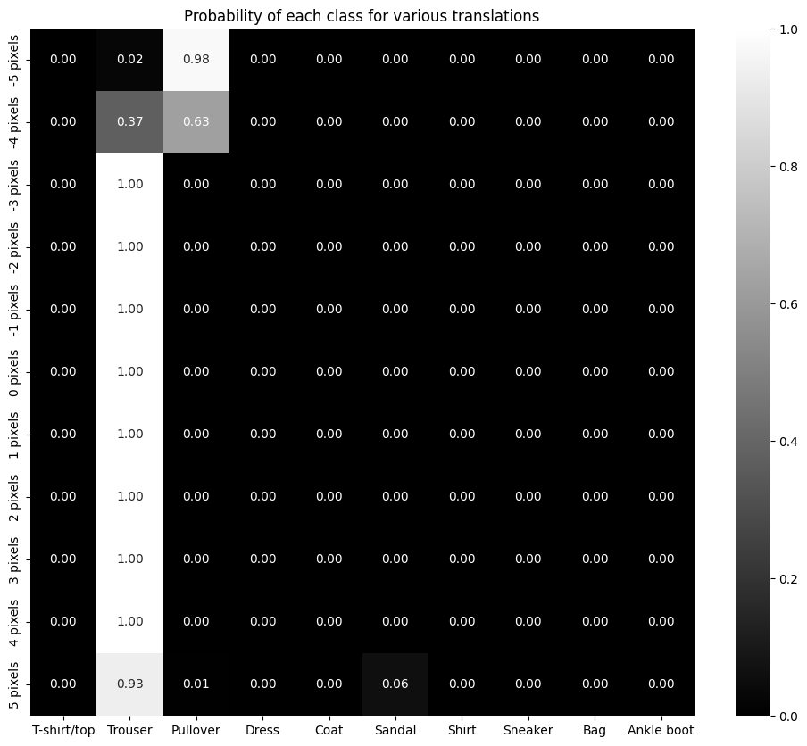

# 卷积神经网络实战

## 1. 上节回顾

上节我们学习了使用神经网络进行图像分类，并探究了影响神经网络模型性能的因素，包括

- 训练批次大小
- 损失优化器
- 学习率
- 网络层数
- 批归一化

## 2. 项目介绍

在本节中，我们将学习如何搭建卷积神经网络，并使用其实现更为高效图像分类。

## 3. 项目内容

### 3.1. 传统神经网络的问题

在深入卷积神经网络 (CNN) 之前，让我们了解一下在使用传统深度神经网络时面临的主要问题。让我们重新考虑在上次课构建的 Fashion-MNIST 数据集模型。我们将获取一个随机图像并预测与该图像对应的类别。

#### 3.1.1. 载入数据

```python
import os

import matplotlib.pyplot as plt
from torchvision import datasets, transforms

# 获取数据集
data_folder = "$HOME/Documents/col-models/"
data_folder = os.path.expandvars(data_folder)
# 训练集
train_data = datasets.FashionMNIST(
    data_folder,
    train=True,
    download=True,
    transform=transforms.ToTensor(),  # 将像素值缩放为 [0, 255]
    target_transform=None,
)

# 测试集
test_data = datasets.FashionMNIST(
    data_folder, train=False, download=True, transform=transforms.ToTensor()
)

tr_images = train_data.data
tr_targets = train_data.targets
ts_images = test_data.data
ts_targets = test_data.targets

# 任选一张图片
ix = 24300
# ix = np.random.randint(len(tr_images))
plt.imshow(tr_images[ix], cmap="gray")
plt.title(train_data.classes[tr_targets[ix]])
```



#### 3.1.2. 回顾模型

```python
import torch.nn as nn
from torch.optim import SGD


def get_model():
    model = nn.Sequential(nn.Linear(28 * 28, 1000), nn.ReLU(), nn.Linear(1000, 10))
    criterion = nn.CrossEntropyLoss()
    optimizer = SGD(model.parameters(), lr=1e-2)
    return model, criterion, optimizer


model, criterion, optimizer = get_model()
```

#### 3.1.3. 处理数据

```python
import numpy as np

img = tr_images[ix] / 255.0
img = img.view(28 * 28)

# 提取与各种类别相关的概率
np_output = model(img).cpu().detach().numpy()
np_prob = np.exp(np_output) / np.sum(np.exp(np_output))
np_prob
# array([0.09639223, 0.10124732, 0.10511327, 0.09338168, 0.11662405,
#        0.09929736, 0.09344715, 0.09385072, 0.1136809 , 0.08696532],
#       dtype=float32)
```

我们可以看到最高概率对应于第一个索引，即裤子。

#### 3.1.4. 图像增强

```python
import seaborn as sns
import torch

preds = []
for px in range(-5, 6):
    img = tr_images[ix] / 255.0
    img = img.view(28, 28)
    img_rolled = np.roll(img, px, axis=1)
    img_new = torch.Tensor(img_rolled).view(28 * 28)
    np_output = model(img_new).cpu().detach().numpy()
    preds.append(np.exp(np_output) / np.sum(np.exp(np_output)))

# 可视化模型对所有平移（-5 像素到 +5 像素）的预测结果。
_, ax = plt.subplots(figsize=(8, 6))

sns.heatmap(
    np.array(preds),
    annot=True,
    ax=ax,
    fmt=".2f",
    xticklabels=train_data.classes,
    yticklabels=[str(i) + " pixels" for i in range(-5, 6)],
    cmap="gray",
)
ax.set_title("Probability of each class for various translations")
```



由于我们只是将图像向左和向右平移了 5 个像素，图像内容没有发生改变。然而，当平移量超过 2 个像素时，图像的预测类别发生了变化。由图可见，每个类别的预测概率都近乎一样！

这是因为在模型训练期间，所有训练和测试图像的内容都位于中心位置。这与我们之前使用平移后的图像进行测试的情况不同，平移后的图像偏离中心（5 个像素），导致预测结果不正确。

### 3.2. 实现 CNN

CNN 模型的整体流程如下：图像通过多个卷积核进行卷积，然后进行池化（在前面的情况下，重复卷积和池化过程两次），最后将最终池化层的输出展平。这构成了前面图像的特征学习部分，我们在提取图像并将其降维（展平输出）的同时，保留了所需的信息。

卷积和池化操作构成了特征学习部分，因为卷积核有助于从图像中提取相关特征，而池化有助于聚合信息，从而减少展平层的节点数量。卷积和池化有助于获得一个比原始图像具有更小表示的展平层。

最后是分类部分，下面我们开始用代码实现。



#### 3.2.1. 读取数据集

```python
import torch
from torch.utils.data import DataLoader, Dataset

device = "cuda" if torch.cuda.is_available() else "cpu"


# 构建一个类来获取数据集。请记住，它派生自 Dataset 类，并且需要始终定义三个魔法函数：__init__、__getitem__ 和 __len__。
class FMNISTDataset(Dataset):
    def __init__(self, x, y):
        x = x.float() / 255
        x = x.view(-1, 1, 28, 28)  # 保证输入形状为：size x channels x height x width
        self.x, self.y = x, y

    def __getitem__(self, ix):
        x, y = self.x[ix], self.y[ix]
        return x, y

    def __len__(self):
        return len(self.x)


# 这里我们暂且将测试集作为验证集使用
def get_data(batch_size=32):
    train = FMNISTDataset(tr_images, tr_targets)
    trn_dl = DataLoader(train, batch_size=batch_size, shuffle=True)
    val = FMNISTDataset(ts_images, ts_targets)
    val_dl = DataLoader(val, batch_size=batch_size, shuffle=True)
    return trn_dl, val_dl
```

#### 3.2.2. CNN 模型

下面，我们加入 CNN 模型（狭义上的层指卷积层和全连接层）

- 层 1：有 64 个卷积核，核大小为 3，故有 64 x 1 x 3 x 3 个权重和 64 x 1 个偏置，共 640 个参数。
- 层 2：有 128 个卷积核，核大小为 3，故有 128 x 64 x 3 x 3 个权重和 128 x 1 个偏置，共 73,856 个参数。
- 层 3：一个具有 3,200 个节点的层连接到另一个具有 256 个节点的层，故共有 3,200 x 256 个权重和 256 个偏置，共 819,456 个参数。
- 层 4：一个具有 256 个节点的层连接到另一个具有 10 个节点的层，故共有 256 x 10 个权重和 10 个偏置，共 2,570 个参数。

```python
from torch.optim import Adam

torch.manual_seed(0)


def get_model():
    model = nn.Sequential(
        nn.Conv2d(1, 64, kernel_size=3),  # 层 1
        nn.MaxPool2d(2),
        nn.ReLU(),
        nn.Conv2d(64, 128, kernel_size=3),  # 层 2
        nn.MaxPool2d(2),
        nn.ReLU(),
        nn.Flatten(),
        nn.Linear(3200, 256),  # 层 3
        nn.ReLU(),
        nn.Linear(256, 10),  # 层 4
    ).to(device)

    criterion = nn.CrossEntropyLoss()
    optimizer = Adam(model.parameters(), lr=1e-3)
    return model, criterion, optimizer
```

查看模型结构

```python
model_cnn, criterion, optimizer = get_model()

X = torch.rand(size=(1, 1, 28, 28))
for layer in model_cnn:
    X = layer(X)
    print(f"{layer.__class__.__name__:<20} output shape: {X.shape}")

# Conv2d               output shape: torch.Size([1, 64, 26, 26])
# MaxPool2d            output shape: torch.Size([1, 64, 13, 13])
# ReLU                 output shape: torch.Size([1, 64, 13, 13])
# Conv2d               output shape: torch.Size([1, 128, 11, 11])
# MaxPool2d            output shape: torch.Size([1, 128, 5, 5])
# ReLU                 output shape: torch.Size([1, 128, 5, 5])
# Flatten              output shape: torch.Size([1, 3200])
# Linear               output shape: torch.Size([1, 256])
# ReLU                 output shape: torch.Size([1, 256])
# Linear               output shape: torch.Size([1, 10])
```

#### 3.2.3. 训练评估

回顾上节，加入必要的训练和评估函数

```python
def train_batch(x, y, model, optimizer, criterion):
    prediction = model(x)
    batch_loss = criterion(prediction, y)
    batch_loss.backward()
    optimizer.step()
    optimizer.zero_grad()
    return batch_loss.item()


@torch.no_grad()
def accuracy(x, y, model):
    model.eval()
    prediction = model(x)
    _, argmaxes = prediction.max(-1)
    is_correct = argmaxes == y
    return is_correct.cpu().numpy().tolist()


@torch.no_grad()
def val_batch(x, y, model, criterion):
    model.eval()
    prediction = model(x)
    val_loss = criterion(prediction, y)
    return val_loss.item()
```

开始训练

```python
trn_dl, val_dl = get_data()
train_losses, train_accuracies = [], []
val_losses, val_accuracies = [], []

n_epochs = 5
for epoch in range(n_epochs):
    print(f"Epoch: {epoch + 1}/{n_epochs}")
    train_epoch_losses, train_epoch_accuracies = [], []
    for _, batch in enumerate(iter(trn_dl)):
        x, y = batch
        batch_loss = train_batch(x, y, model_cnn, optimizer, criterion)
        train_epoch_losses.append(batch_loss)
    train_epoch_loss = np.array(train_epoch_losses).mean()

    for _, batch in enumerate(iter(trn_dl)):
        x, y = batch
        is_correct = accuracy(x, y, model_cnn)
        train_epoch_accuracies.extend(is_correct)
    train_epoch_accuracy = np.mean(train_epoch_accuracies)

    for _, batch in enumerate(iter(val_dl)):
        x, y = batch
        val_is_correct = accuracy(x, y, model_cnn)
        validation_loss = val_batch(x, y, model_cnn, criterion)
    val_epoch_accuracy = np.mean(val_is_correct)

    train_losses.append(train_epoch_loss)
    train_accuracies.append(train_epoch_accuracy)
    val_losses.append(validation_loss)
    val_accuracies.append(val_epoch_accuracy)

# 不要忘记保存训练得到的模型权重
torch.save(model.to("cpu").state_dict(), "data/chap04-cnn.pth")
```

> 若不想训练，可以直接读取预保存的模型权重。
>
> ```python
> import os
>
> model_path = "data/chap04-cnn.pth"
> if os.path.isfile(model_path):
>     model_cnn.load_state_dict(torch.load(model_path))
> ```

#### 3.2.4. 可视化

```python
from matplotlib.ticker import PercentFormatter

epochs = np.arange(n_epochs) + 1

_, axes = plt.subplots(2, 1, figsize=(6, 4), constrained_layout=True)

axes[0].plot(epochs, train_losses, "bo", label="Training loss")
axes[0].plot(epochs, val_losses, "r", label="Validation loss")
axes[0].set(
    title="Training and validation loss with CNN", xlabel="Epochs", ylabel="Loss"
)
axes[0].yaxis.set_major_formatter(PercentFormatter())
axes[0].legend()
axes[0].grid("off")

axes[1].plot(epochs, train_accuracies, "bo", label="Training accuracy")
axes[1].plot(epochs, val_accuracies, "r", label="Validation accuracy")
axes[1].set(
    title="Training and validation accuracy with CNN",
    xlabel="Epochs",
    ylabel="Accuracy",
)
axes[1].yaxis.set_major_formatter(PercentFormatter())
axes[1].legend()
axes[1].grid("off")
```



#### 3.2.5. 验证模型效果

在平移后的图像上，绘制预测准确率热图，验证 CNN 的模型效果

```python
preds = []
ix = 24300
for px in range(-5, 6):
    img = tr_images[ix] / 255.0
    img = img.view(28, 28)
    img2 = np.roll(img, px, axis=1)
    img3 = torch.Tensor(img2).view(-1, 1, 28, 28).to(device)
    np_output = model_cnn(img3).cpu().detach().numpy()
    pred = np.exp(np_output) / np.sum(np.exp(np_output))
    preds.append(pred)

# 可视化模型对所有平移（-5 像素到 +5 像素）的预测结果。
_, ax = plt.subplots(figsize=(8, 6))

sns.heatmap(
    np.array(preds).reshape(11, 10),
    annot=True,
    ax=ax,
    fmt=".2f",
    xticklabels=train_data.classes,
    yticklabels=[str(i) + " pixels" for i in range(-5, 6)],
    cmap="gray",
)
ax.set_title("Probability of each class for various translations")
```

在这个场景中，即使图像平移了 -5~4 个像素内，预测仍然是正确的，而当我们在没有使用 CNN 的情况下，图像平移后，预测是错误的。



当然，由于模型尚且比较简单，我们还不能保证所有情况均能预测正确。

## 4. 项目练习（每题 20 分）

### 4.1. 基础题

1. 精简 3.2.4 部分的代码
2. 对 FashionMNIST 数据集，增加 CNN 模型的训练的 epoch 数，对平移后图像，绘制预测准确率热图
3. 对 FashionMNIST 数据集，调整卷积核大小为 2，对平移后图像，绘制预测准确率热图

### 4.2. 进阶题

使用如下函数读取数据集

```python
import random
from glob import glob

import cv2
from torch.utils.data import Dataset


class cats_dogs(Dataset):
    def __init__(self, folder):
        cats = glob(folder + "/cats/*.jpg")
        dogs = glob(folder + "/dogs/*.jpg")
        self.fpaths = cats + dogs
        # 随机化文件路径，并根据与这些文件路径对应的文件夹创建目标变量。
        random.seed(10)
        random.shuffle(self.fpaths)
        self.targets = [
            fpath.split("/")[-1].startswith("dog") for fpath in self.fpaths
        ]  # dog=1 & cat=0

    def __len__(self):
        return len(self.fpaths)

    # 定义 __getitem__ 方法，该方法用于指定从文件路径列表中的随机文件路径，读取图像，并将所有图像调整大小为 224x224 像素。
    def __getitem__(self, ix):
        path = self.fpaths[ix]
        target = self.targets[ix]
        img = cv2.imread(path)[:, :, ::-1]
        img = cv2.resize(img, (224, 224))
        # 将调整大小后的图像进行置换，以便在返回缩放后的图像和相应的目标值之前，先提供通道：
        return torch.tensor(img / 255).permute(2, 0, 1).to(
            device
        ).float(), torch.tensor([target]).float().to(device)
```

这里，我们需要定义 `conv_layer` 函数，其中按顺序执行卷积、ReLU 激活、批量归一化和最大池化。

```python
def conv_layer(input_channels, num_channels, kernel_size, stride=1):
    return nn.Sequential(
        nn.Conv2d(input_channels, num_channels, kernel_size, stride),
        nn.ReLU(),
        nn.BatchNorm2d(num_channels),
        nn.MaxPool2d(2),
    )
```

组成我们的最终模型。

```python
def get_model():
    model = nn.Sequential(
        conv_layer(3, 64, 3),
        conv_layer(64, 512, 3),
        conv_layer(512, 512, 3),
        conv_layer(512, 512, 3),
        conv_layer(512, 512, 3),
        nn.Flatten(),
        nn.Linear(512, 1),
        nn.Sigmoid(),
    ).to(device)
    criterion = nn.BCELoss()
    optimizer = torch.optim.Adam(model.parameters(), lr=1e-3)
    return model, criterion, optimizer
```

读取数据集

```python
train_data_dir = "$HOME/Documents/col-models/cat-and-dog/training_set"
test_data_dir = "$HOME/Documents/col-models/cat-and-dog/test_set"
train_data_dir = os.path.expandvars(train_data_dir)
test_data_dir = os.path.expandvars(test_data_dir)

def get_data():
    train = cats_dogs(train_data_dir)
    trn_dl = DataLoader(train, batch_size=32, shuffle=True, drop_last=True)
    val = cats_dogs(test_data_dir)
    val_dl = DataLoader(val, batch_size=32, shuffle=True, drop_last=True)
    return trn_dl, val_dl
```

需要注意的是，先前的准确率计算代码与 FashionMNIST 分类中的代码不同，因为当前的模型（猫与狗分类）是为二元分类构建的，而 FashionMNIST 模型是为多类别分类构建的。

```python
@torch.no_grad()
def accuracy(x, y, model):
    prediction = model(x)
    is_correct = (prediction > 0.5) == y
    return is_correct.cpu().numpy().tolist()
```

1. 使用上述 CNN 模型进行图像分类，绘制准确率随 epoch 变化曲线
2. 增加 CNN 模型中的 CNN 模块个数，绘制准确率随 epoch 变化曲线

> 提示：调整 `self.fpaths = cats + dogs`

## 5. 参考阅读

- [图像卷积](https://zh.d2l.ai/chapter_convolutional-neural-networks/conv-layer.html)
