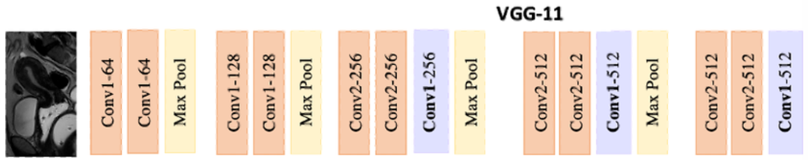
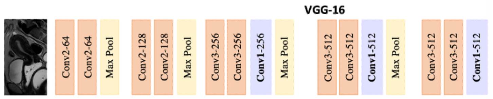

# VGG 网络实战

## 1. 上节回顾

上节我们学习了传统神经网络在图像分类中的局限，以及卷积神经网络的相关知识，包括

- 数据集读取
- 模型架构
- 代码实现

## 2. 项目介绍

在 LeNet 提出后，卷积神经网络在计算机视觉和机器学习领域中很有名气。但卷积神经网络并没有主导这些领域。这是因为虽然 LeNet 在小数据集上取得了很好的效果，但是在更大、更真实的数据集上训练卷积神经网络的性能和可行性还有待研究。事实上，在上世纪 90 年代初到 2012 年之间的大部分时间里，神经网络往往被其他机器学习方法超越，如支持向量机（support vector machines，SVM）。

在 2012 年前，图像特征都是机械地计算出来的。事实上，设计一套新的特征函数、改进结果，并撰写论文是盛极一时的潮流。SIFT、SURF、HOG（定向梯度直方图）和类似的特征提取方法占据了主导地位。2012 年，AlexNet 横空出世。它首次证明了学习到的特征可以超越手工设计的特征。它一举打破了计算机视觉研究的现状。AlexNet 使用了 8 层卷积神经网络，并以很大的优势赢得了 2012 年 ImageNet 图像识别挑战赛。虽然 AlexNet 证明深层神经网络卓有成效，但它没有提供一个通用的模板来指导后续的研究人员设计新的网络。

与芯片设计中工程师从放置晶体管到逻辑元件再到逻辑块的过程类似，神经网络架构的设计也逐渐变得更加抽象。研究人员开始从单个神经元的角度思考问题，发展到整个层，现在又转向块，重复层的模式。

使用块的想法首先出现在牛津大学的视觉几何组（visual geometry group）的 VGG 网络中。通过使用循环和子程序，可以很容易地在任何现代深度学习框架的代码中实现这些重复的架构。

## 3. 项目内容

本节我们将从模型过拟合开始，认识 VGG16，了解其设计并对其训练，利用其对猫狗数据集进行分类预测。

### 3.1. 必要工作

首先，我们还是先导入必要包和函数

```python
import random
from glob import glob

import cv2
import numpy as np
import torch
import torch.nn as nn
import torchvision.transforms as transforms
from torch.utils.data import DataLoader, Dataset
from torchvision import datasets, models

torch.manual_seed(0)
device = "cuda" if torch.cuda.is_available() else "cpu"
```

我们依然从 FashionMNIST 数据集开始

```python
import os

from PIL import Image

torch.manual_seed(0)
# 获取数据集
data_folder = "$HOME/Documents/col-models/"
data_folder = os.path.expandvars(data_folder)


class FMNISTDataset(Dataset):
    def __init__(self, images, labels, transform=None):
        self.images = images
        self.labels = labels
        self.transform = transform

    def __len__(self):
        return len(self.images)

    def __getitem__(self, idx):
        image = (
            self.images[idx].numpy()
            if isinstance(self.images[idx], torch.Tensor)
            else self.images[idx]
        )
        label = self.labels[idx]
        image = Image.fromarray(image).convert("L")  # 灰度图

        if self.transform:
            image = self.transform(image)
        return image, label


# VGG 需要 224x224
transform = transforms.Compose([transforms.Resize((224, 224)), transforms.ToTensor()])


def get_data(batch_size=64):
    train_fmnist = datasets.FashionMNIST(data_folder, download=True, train=True)
    val_fmnist = datasets.FashionMNIST(data_folder, download=True, train=False)

    train_dataset = FMNISTDataset(
        train_fmnist.data, train_fmnist.targets, transform=transform
    )
    val_dataset = FMNISTDataset(
        val_fmnist.data, val_fmnist.targets, transform=transform
    )

    trn_dl = DataLoader(train_dataset, batch_size=batch_size, shuffle=True)
    val_dl = DataLoader(val_dataset, batch_size=batch_size, shuffle=True)
    return trn_dl, val_dl
```

### 3.2. 过拟合

我们之前模型对训练数据集的准确率通常超过 95%，而验证数据集的准确率是 ~89%。本质上，这表明这些模型在未见过的数据集上的泛化能力不强，也就是说，这些模型学习了训练数据集中所有可能的边缘情况；这些情况无法应用于验证数据集。

> 在训练数据集上具有高精度，而在验证数据集上精度显著较低，指的是过拟合的情况。

#### 3.2.1. Dropout

我们已经学过，每当 `loss.backward()` 被计算时，就会发生权重更新。通常，网络中会有数十万甚至上百万个参数，而我们训练模型时有数千个数据点。这给了我们这样的可能性，即虽然大多数参数能合理地帮助训练模型，但某些参数可能会针对训练图像进行微调，导致它们的值仅由训练数据集中的少数图像决定。这反过来又导致训练数据集具有较高的准确率，但不一定在验证数据集上也是如此。

Dropout 是一种机制，它随机选择指定百分比的节点激活并将其减少到 0。在下一轮迭代中，另一组随机隐藏单元被关闭。这样，神经网络不会针对边缘情况进行优化，因为网络没有那么多机会调整权重以记住边缘情况（考虑到权重在每次迭代中不会更新）。

> 请记住，在预测时不需要应用 Dropout，因为这种机制只能用于训练模型时。

通常，在训练和验证期间，层的表现可能会有所不同，就像你在 Dropout 的情况中所看到的那样。因此，你必须从一开始就使用两种方法中的一种指定模型的模式：`model.train()` 让模型知道它处于训练模式，以及 `model.eval()` 让它知道它处于评估模式。若不这样做，我们可能会得到意外的结果。在定义架构时，Dropout 在 `get_model` 函数中指定如下：

```python
from torch.optim import Adam


def get_model():
    model = nn.Sequential(
        nn.Dropout(0.25),  # 每个神经元有 0.25 的概率不被更新
        nn.Linear(28 * 28, 1000),
        nn.ReLU(),
        nn.Dropout(0.25),
        nn.Linear(1000, 10),
    ).to(device)

    criterion = nn.CrossEntropyLoss()
    optimizer = Adam(model.parameters(), lr=1e-3)
    return model, criterion, optimizer
```

#### 3.2.2. 正则化

除了训练准确率远高于验证准确率之外，过拟合的另一个特征是某些权重值将远高于其他权重值。较大的权重值可能是模型在训练数据上学习得非常好（简单说，基于它所见的内容进行死记硬背）的一个症状。

虽然 Dropout 是一种机制，用于使权重值不频繁更新，但正则化是另一种可以用于此目的的机制。正则化中，我们会惩罚模型具有较大的权重值。因此，它是一个目标函数，既最小化训练数据的损失，也最小化权重值。

对 L1 正则化

$$
\text { L1 loss }=-\frac{1}{n}\left(\sum_{i=1}^n(y_i * \log (p_i)+(1-y_i) * \log (1-p_i)) + \Delta \sum_{j=1}^m|w_j|\right)
$$

上述公式中

- 第一部分指的是交叉熵损失
- 第二部分指的是模型权重的绝对值之和。

请注意，L1 正则化通过将其纳入损失值计算中来确保对权重的较高绝对值进行惩罚。$\Delta$指的是我们与正则化（权重最小化）损失关联的权重。训练函数修改如下

```python
def train_batch(x, y, model, optimizer, criterion):
    prediction = model(x)
    l1_regularization = 0
    for param in model.parameters():
        l1_regularization += torch.norm(param, 1)
    batch_loss = criterion(prediction, y) + 0.0001 * l1_regularization
    batch_loss.backward()
    optimizer.step()
    optimizer.zero_grad()
    return batch_loss.item()
```

对 L2 正则化

$$
L 2 \text { loss }=-\frac{1}{n}\left(\sum_{i=1}^n (y_i * \log (p_i)+(1-y_i) * \log (1-p_i))+\Delta \sum_{j=1}^m w_j^2\right)
$$

与 L1 正则化类似，

- 第一部分指的是交叉熵损失
- 第二部分指的是模型权重的平方和。

$\Delta$指的是我们与正则化（权重最小化）损失关联的权重。训练函数修改如下

```python
def train_batch(x, y, model, optimizer, criterion):
    prediction = model(x)
    l2_regularization = 0
    for param in model.parameters():
        l2_regularization += torch.norm(param, 2)
    batch_loss = criterion(prediction, y) + 0.01 * l2_regularization
    batch_loss.backward()
    optimizer.step()
    optimizer.zero_grad()
    return batch_loss.item()
```

在上述代码中，正则化参数 (0.01) 略高于 L1 正则化，因为权重通常在 -1 和 1 之间，平方它们会产生更小的值。像 L1 正则化中那样乘以一个更小的数，会导致我们在整体损失计算中正则化的权重非常小。

### 3.3. VGG 架构

VGG 代表 视觉几何组 其总部位于牛津大学。通常，VGG 神经网络指 VGG16，16 代表模型中的层数。VGG16 模型用于在 ImageNet 竞赛中对物体进行分类，并在 2014 年成为亚军架构。我们之所以研究这个架构而不是冠军架构（GoogleNet），是因为它的简洁性以及视觉社区在多个其他任务中更广泛地使用它。

#### 3.3.1. VGG 块

经典卷积神经网络的基本组成部分是下面的这个序列：

1. 带填充以保持分辨率的卷积层
2. 非线性激活函数，如 ReLU
3. 池化层，如最大池化层

而一个 VGG 块与之类似，由一系列卷积层组成，后面再加上用于空间下采样的最大汇聚层。在最初的 VGG 论文中，作者使用了带有 3 × 3 卷积核、填充为 1（保持高度和宽度）的卷积层，和带有 2 × 2 汇聚窗口、步幅为 2（每个块后的分辨率减半）的最大汇聚层。在下面的代码中，我们定义了一个函数来实现 VGG 块。该函数有三个参数，分别对应于卷积层的数量 `num_convs`、输入通道的数量 `in_channels` 和输出通道的数量 `out_channels`。

```python
def vgg_block(num_convs, in_channels, out_channels):
    layers = []
    for _ in range(num_convs):
        layers.append(nn.Conv2d(in_channels, out_channels, kernel_size=3, padding=1))
        layers.append(nn.ReLU())
        in_channels = out_channels
    layers.append(nn.MaxPool2d(kernel_size=2, stride=2))
    return nn.Sequential(*layers)
```



相比之前的神经网络，VGG 主要有两大进步：其一是它增加了深度，其二是它使用了小的 3x3 的卷积核，这可以使它在增加深度的时候一定程度上防止了参数的增长。以下为模型代码

```python
def vgg(conv_arch):
    conv_blks = []
    in_channels = 1
    # 卷积层部分
    for num_convs, out_channels in conv_arch:
        conv_blks.append(vgg_block(num_convs, in_channels, out_channels))
        in_channels = out_channels
    return nn.Sequential(
        *conv_blks,
        nn.Flatten(),
        # 全连接层部分
        nn.Linear(out_channels * 7 * 7, 4096),
        nn.ReLU(),
        nn.Dropout(0.5),
        nn.Linear(4096, 4096),
        nn.ReLU(),
        nn.Dropout(0.5),
        nn.Linear(4096, 10),
    )


# 由于机器性能，这里我们使用 VGG 11
conv_arch = ((1, 64), (1, 128), (2, 256), (2, 512), (2, 512))
vgg_net = vgg(conv_arch)
```

接下来，我们将构建一个高度和宽度为 224 的单通道数据样本，以观察每个层输出的形状。

```python
X = torch.rand(size=(1, 1, 224, 224))
for layer in vgg_net:
    X = layer(X)
    print(f"{layer.__class__.__name__:<20} output shape: {X.shape}")

# Sequential           output shape: torch.Size([1, 64, 112, 112])
# Sequential           output shape: torch.Size([1, 128, 56, 56])
# Sequential           output shape: torch.Size([1, 256, 28, 28])
# Sequential           output shape: torch.Size([1, 512, 14, 14])
# Sequential           output shape: torch.Size([1, 512, 7, 7])
# Flatten              output shape: torch.Size([1, 25088])
# Linear               output shape: torch.Size([1, 4096])
# ReLU                 output shape: torch.Size([1, 4096])
# Dropout              output shape: torch.Size([1, 4096])
# Linear               output shape: torch.Size([1, 4096])
# ReLU                 output shape: torch.Size([1, 4096])
# Dropout              output shape: torch.Size([1, 4096])
# Linear               output shape: torch.Size([1, 10])
```

#### 3.3.2. 相关函数

定义必要函数

```python
def train_batch(x, y, model, optimizer, criterion):
    model.train()
    prediction = model(x)
    batch_loss = criterion(prediction, y)
    optimizer.step()
    optimizer.zero_grad()
    return batch_loss.item()


@torch.no_grad()
def val_batch(x, y, model, criterion):
    model.eval()
    prediction = model(x)
    val_loss = criterion(prediction, y)
    return val_loss.item()


@torch.no_grad()
def accuracy(x, y, model):
    model.eval()
    prediction = model(x)
    _, argmaxes = prediction.max(-1)
    is_correct = argmaxes == y
    return is_correct.cpu().numpy().tolist()
```

由于 VGG-11 计算量很大，我们这里不再训练，仅给出代码，供本节课后题参考

```python
criterion = nn.CrossEntropyLoss()
optimizer = Adam(vgg_net.parameters(), lr=1e-3)

trn_dl, val_dl = get_data()
train_losses, train_accuracies = [], []
val_losses, val_accuracies = [], []

n_epochs = 5
for epoch in range(n_epochs):
    print(f"Epoch: {epoch + 1}/{n_epochs}")
    train_epoch_losses, train_epoch_accuracies = [], []

    for _, (data, targets) in enumerate(iter(trn_dl)):
        data = data.to(device)
        targets = targets.to(device)
        batch_loss = train_batch(data, targets, vgg_net, optimizer, criterion)
        train_epoch_losses.append(batch_loss)
        is_correct = accuracy(data, targets, vgg_net)
        train_epoch_accuracies.extend(is_correct)
    train_epoch_loss = np.array(train_epoch_losses).mean()
    train_epoch_accuracy = np.mean(train_epoch_accuracies)

    for _, (data, targets) in enumerate(iter(val_dl)):
        data = data.to(device)
        targets = targets.to(device)
        val_is_correct = accuracy(data, targets, vgg_net)
        validation_loss = val_batch(data, targets, vgg_net, criterion)
        val_epoch_accuracy = np.mean(val_is_correct)

    train_losses.append(train_epoch_loss)
    train_accuracies.append(train_epoch_accuracy)
    val_losses.append(validation_loss)
    val_accuracies.append(val_epoch_accuracy)

# 不要忘记保存训练得到的模型权重
torch.save(vgg_net.to("cpu").state_dict(), "data/chap05-vgg-fashion.pth")
```

绘制模型性能曲线

```python
import matplotlib.pyplot as plt
from matplotlib.ticker import PercentFormatter

epochs = np.arange(n_epochs) + 1

_, axes = plt.subplots(2, 1, figsize=(6, 4), constrained_layout=True)

axes[0].plot(epochs, train_losses, "bo", label="Training loss")
axes[0].plot(epochs, val_losses, "r", label="Validation loss")
axes[0].set(
    title="Training and validation loss with CNN", xlabel="Epochs", ylabel="Loss"
)
axes[0].yaxis.set_major_formatter(PercentFormatter())
axes[0].legend()
axes[0].grid("off")

axes[1].plot(epochs, train_accuracies, "bo", label="Training accuracy")
axes[1].plot(epochs, val_accuracies, "r", label="Validation accuracy")
axes[1].set(
    title="Training and validation accuracy with CNN",
    xlabel="Epochs",
    ylabel="Accuracy",
)
axes[1].yaxis.set_major_formatter(PercentFormatter())
axes[1].legend()
axes[1].grid("off")
```

## 4. 项目练习（每题 20 分）

### 4.1. 背景

现在，我们不从头训练，而是从 `torchvision` 包中，载入预训练模型 VGG16 及其预训练权重。同时，我们简化全链接层，使其更符合我们的训练目标。

```python
def get_model():
    model = models.vgg16()
    # 载入预训练权重
    weights_path = "$HOME/Documents/col-models/vgg16-397923af.pth"
    weights_path = os.path.expandvars(weights_path)
    model.load_state_dict(torch.load(weights_path, weights_only=True))

    for param in model.parameters():
        param.requires_grad = False
    # 将 avgpool 模块替换为返回 1 x 1 尺寸特征图而不是 7 x 7
    model.avgpool = nn.AdaptiveAvgPool2d(output_size=(1, 1))
    model.classifier = nn.Sequential(
        nn.Flatten(),
        nn.Linear(512, 128),
        nn.ReLU(),
        nn.Dropout(0.2),
        nn.Linear(128, 1),
        nn.Sigmoid(),
    )
    criterion = nn.BCELoss()
    optimizer = Adam(model.parameters(), lr=1e-3)
    return model.to(device), criterion, optimizer
```

> 之前我们见到了 `nn.MaxPool2d`，它从特征图的每个区域中选取最大值。有一个与之对应的层叫做 `nn.AvgPool2d`，它返回的是一个区域的平均值。在这两种层中，我们固定了核大小。上面的层，`nn.AdaptiveAvgPool2d`，是一种带有特殊功能的池化层。我们指定输出特征图的大小。该层会自动计算核大小，以便返回指定的特征图大小。

使用的是猫狗数据集，提供一个返回猫和狗数据集输入 - 输出对的类，就像上一课中我们做的那样。注意，在这种情况下，我们只从每个文件夹中获取前 500 张图像：

```python
class CatsDogs(Dataset):
    def __init__(self, folder):
        cats = glob(folder + "/cats/*.jpg")
        dogs = glob(folder + "/dogs/*.jpg")
        self.fpaths = cats[:500] + dogs[:500]
        self.normalize = transforms.Normalize(
            mean=[0.485, 0.456, 0.406], std=[0.229, 0.224, 0.225]
        )

        random.seed(10)
        random.shuffle(self.fpaths)
        self.targets = [fpath.split("/")[-1].startswith("dog") for fpath in self.fpaths]

    def __len__(self):
        return len(self.fpaths)

    def __getitem__(self, ix):
        path = self.fpaths[ix]
        target = self.targets[ix]
        img = cv2.imread(path)[:, :, ::-1]
        img = cv2.resize(img, (224, 224))
        img = torch.tensor(img / 255)
        img = img.permute(2, 0, 1)
        img = self.normalize(img)  # 加入归一化
        return img.float().to(device), torch.tensor([target]).float().to(device)


train_data_dir = "$HOME/Documents/col-models/cat-and-dog/training_set"
test_data_dir = "$HOME/Documents/col-models/cat-and-dog/test_set"
train_data_dir = os.path.expandvars(train_data_dir)
test_data_dir = os.path.expandvars(test_data_dir)

def get_data(batch_size=32):
    train = CatsDogs(train_data_dir)
    trn_dl = DataLoader(train, batch_size=batch_size, shuffle=True, drop_last=True)
    val = CatsDogs(test_data_dir)
    val_dl = DataLoader(val, batch_size=batch_size, shuffle=True, drop_last=True)
    return trn_dl, val_dl


trn_dl, val_dl = get_data()
model, criterion, optimizer = get_model()
```

获取图像及其标签

```python
data = CatsDogs(train_data_dir)
im, label = data[200]
plt.imshow(im.permute(1, 2, 0).cpu())
print(label)
# tensor([0.])
```

### 4.2. 基础题

1. VGG11 网络包括几个卷积层，几个全连接层？
2. VGG16 结构如下图所示，参考 VGG11 部分，打印出 VGG16 每层形状。



3. 在 VGG 模型中，全链接层中使用 `ReLU` 函数取代 `Sigmoid` 函数，模型表现有何不同，请绘制模型性能曲线，并分析结果。

### 4.3. 进阶题

1. 在 VGG 模型中，提高 Dropout 概率，是否能明显提高模型性能？请绘制模型性能曲线，并分析结果。
2. VGG19 比 VGG16 又多了 3 个卷积层。使用 VGG19，上述实验会又何不同，请绘制模型性能曲线，并分析结果。

> 提示：使用 `model = models.vgg19()`

## 5. 参考阅读

- [VGG 网络](https://zh.d2l.ai/chapter_convolutional-modern/vgg.html)
