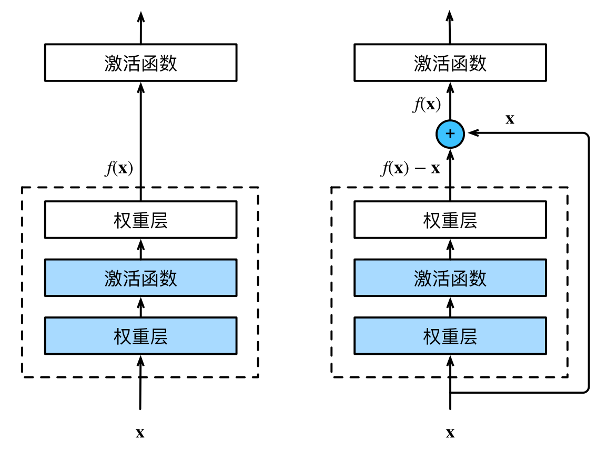
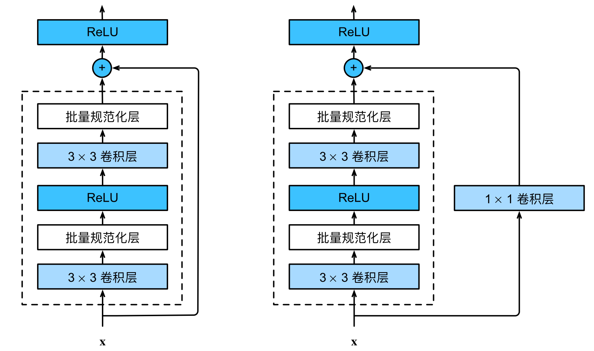
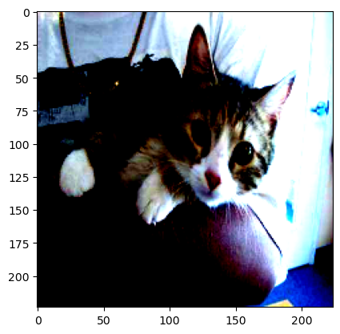
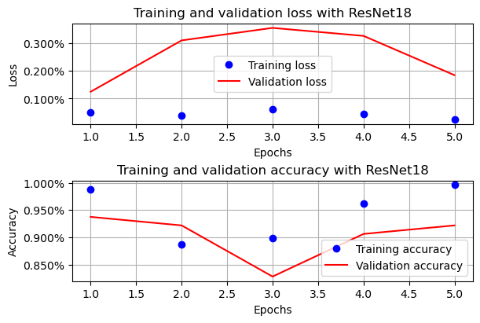
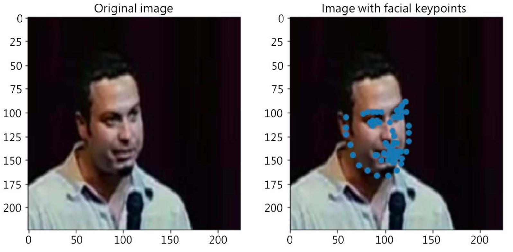

# ResNet 实战

## 1. 上节回顾

上节我们学习了处理过拟合的几种方式，以及 VGG16 网络的基本构成和代码实现。在项目练习中，我们对比了 VGG19 和 VGG16 准确率，我们可以看出神经网络的层数越深，其准确率就越高。

## 2. 项目介绍

然而，若仅增加层数就是诀窍，那么我们就可以不断给模型添加更多层（同时注意避免过拟合），以获得更准确的结果，然后针对感兴趣的数据集进行微调。不幸的是，情况并非如此。

有多个原因导致事情并不那么容易。在架构方面越深入时，可能会发生以下任何一种情况：

- 必须学习更多的特征
- 梯度消失出现了
- 在更深的层中存在过多的信息修改

ResNet 应运而生，以解决这种特定场景下的识别问题。

## 3. 项目内容

### 3.1. ResNet 架构

当构建过于深的网络时，存在两个问题。在前向传播中，网络的最后几层几乎没有任何关于原始图像
的信息。在后向传播中，靠近输入的前几层由于梯度消失（换句话说，它们几乎为零）而几乎得不到
梯度更新。

> 残差网络中的术语，残差（residual）是指模型需要从前一层学习并传递到下一层的附加信息。

#### 3.1.1. 残差块

让我们聚焦于神经⽹络局部：如下图所⽰，假设我们的原始输⼊为$x$，⽽希望学出的理想映射为$f(x)$（作为激活函数的输⼊）。下图左图虚线框中的部分需要直接拟合出该映射$f(x)$，⽽右图虚线框中的部分则需要拟合出残差映射$f(x) − x$。残差映射在现实中往往更容易优化。以恒等映射作为我们希望学出的理想映射$f(x)$，我们只需将下图中右图虚线框内上⽅的加权运算（如仿射）的权重和偏置参数设成 0，那么$f(x)$即为恒等映射。实际中，当理想映射$f(x)$极接近于恒等映射时，残差映射也易于捕捉恒等映射的细微波动。下图右图是 ResNet 的基础架构‒残差块（residual block）。在残差块中，输⼊可通过跨层数据线路更快地向前传播。



ResNet 沿⽤了 VGG 完整的 3 × 3 卷积层设计。残差块⾥⾸先有 2 个有相同输出通道数的 3 × 3 卷积层。每个卷积层后接⼀个批量规范化层和 ReLU 激活函数。然后我们通过跨层数据通路，跳过这 2 个卷积运算，将输⼊直接加在最后的 ReLU 激活函数前。这样的设计要求 2 个卷积层的输出与输⼊形状⼀样，从⽽使它们可以相加。若想改变通道数，就需要引⼊⼀个额外的 1 × 1 卷积层来将输⼊变换成需要的形状后再做相加运算。



以下是一种拓展性更好的写法

```python
from torch import nn
from torch.nn import functional as F


class Residual(nn.Module):
    def __init__(self, input_channels, num_channels, use_1x1conv=False, strides=1):
        super().__init__()
        self.conv1 = nn.Conv2d(
            input_channels, num_channels, kernel_size=3, padding=1, stride=strides
        )
        self.conv2 = nn.Conv2d(num_channels, num_channels, kernel_size=3, padding=1)
        if use_1x1conv:
            self.conv3 = nn.Conv2d(
                input_channels, num_channels, kernel_size=1, stride=strides
            )
        else:
            self.conv3 = None
        self.bn1 = nn.BatchNorm2d(num_channels)
        self.bn2 = nn.BatchNorm2d(num_channels)

    def forward(self, X):
        Y = F.relu(self.bn1(self.conv1(X)))
        Y = self.bn2(self.conv2(Y))
        if self.conv3:
            X = self.conv3(X)
        Y += X
        return F.relu(Y)
```

#### 3.1.2. ResNet 模型

ResNet 的前两层跟之前介绍的 VGG 中的⼀样：在输出通道数为 64、步幅为 2 的 7 × 7 卷积层后，接步幅为 2 的 3 × 3 的最⼤池化层。不同之处在于 ResNet 每个卷积层后增加了批量规范化层。即

```python
b1 = nn.Sequential(
    nn.Conv2d(1, 64, kernel_size=7, stride=2, padding=3),
    nn.BatchNorm2d(64),
    nn.ReLU(),
    nn.MaxPool2d(kernel_size=3, stride=2, padding=1),
)
```

ResNet 使⽤ 4 个由残差块组成的模块，每个模块使⽤若⼲个同样输出通道数的残差块。第⼀个模块的通道数同输⼊通道数⼀致。由于之前已经使⽤了步幅为 2 的最⼤池化层，所以⽆须减⼩⾼和宽。之后的每个模块在第⼀个残差块⾥将上⼀个模块的通道数翻倍，并将⾼和宽减半。

```python
def resnet_block(input_channels, num_channels, num_residuals, first_block=False):
    blocks = []
    for i in range(num_residuals):
        if i == 0 and not first_block:
            blocks.append(
                Residual(input_channels, num_channels, use_1x1conv=True, strides=2)
            )
        else:
            blocks.append(Residual(num_channels, num_channels))
    return blocks
```

接着在 ResNet 加⼊所有残差块，这⾥每个模块使⽤ 2 个残差块。

```python
b2 = nn.Sequential(*resnet_block(64, 64, 2, first_block=True))
b3 = nn.Sequential(*resnet_block(64, 128, 2))
b4 = nn.Sequential(*resnet_block(128, 256, 2))
b5 = nn.Sequential(*resnet_block(256, 512, 2))
```

最后，与 VGG ⼀样，在 ResNet 中加⼊全局平均汇聚层，以及全连接层输出。

```python
res_net = nn.Sequential(
    b1, b2, b3, b4, b5, nn.AdaptiveAvgPool2d((1, 1)), nn.Flatten(), nn.Linear(512, 10)
)
```

每个模块有 4 个卷积层（不包括恒等映射的 1 × 1 卷积层）。加上第⼀个 7 × 7 卷积层和最后⼀个全连接层，共有 18 层。因此，这种模型通常被称为 ResNet-18。通过配置不同的通道数和模块⾥的残差块数可以得到不同的 ResNet 模型，例如更深的含 152 层的 ResNet-152。在训练 ResNet 之前，让我们观察⼀下 ResNet 中不同模块的输⼊形状是如何变化的。在之前所有架构中，分辨率降低，通道数量增加，直到全局平均汇聚层聚集所有特征。

```python
import torch

X = torch.rand(size=(1, 1, 224, 224))
for layer in res_net:
    X = layer(X)
    print(f"{layer.__class__.__name__:<20} output shape: {X.shape}")

# Sequential           output shape: torch.Size([1, 64, 56, 56])
# Sequential           output shape: torch.Size([1, 64, 56, 56])
# Sequential           output shape: torch.Size([1, 128, 28, 28])
# Sequential           output shape: torch.Size([1, 256, 14, 14])
# Sequential           output shape: torch.Size([1, 512, 7, 7])
# AdaptiveAvgPool2d    output shape: torch.Size([1, 512, 1, 1])
# Flatten              output shape: torch.Size([1, 512])
# Linear               output shape: torch.Size([1, 10])
```

### 3.2. 猫狗数据集

#### 3.2.1. 必要工作

首先，我们还是先导入必要包和函数

```python
import random
from glob import glob

import cv2
import matplotlib.pyplot as plt
import torch
import torch.nn as nn
import torchvision.transforms as transforms
from torch.utils.data import Dataset
from torchvision import models

torch.manual_seed(0)
device = "cuda" if torch.cuda.is_available() else "cpu"
```

现在，让我们通过以下代码了解 ResNet18 模型在实际中的使用方式，使用的是猫狗数据集，提供一个返回猫和狗数据集输入 - 输出对的类，就像上一课中我们做的那样。注意，在这种情况下，我们只从每个文件夹中获取前 500 张图像：

```python
class CatsDogs(Dataset):
    def __init__(self, folder):
        cats = glob(folder + "/cats/*.jpg")
        dogs = glob(folder + "/dogs/*.jpg")
        self.fpaths = cats[:500] + dogs[:500]
        self.normalize = transforms.Normalize(
            mean=[0.485, 0.456, 0.406], std=[0.229, 0.224, 0.225]
        )

        random.seed(10)
        random.shuffle(self.fpaths)
        self.targets = [fpath.split("/")[-1].startswith("dog") for fpath in self.fpaths]

    def __len__(self):
        return len(self.fpaths)

    def __getitem__(self, ix):
        path = self.fpaths[ix]
        target = self.targets[ix]
        img = cv2.imread(path)[:, :, ::-1]
        img = cv2.resize(img, (224, 224))
        img = torch.tensor(img / 255)
        img = img.permute(2, 0, 1)
        img = self.normalize(img)  # 加入归一化
        return img.float().to(device), torch.tensor([target]).float().to(device)
```

获取图像及其标签

```python
import os

train_data_dir = "$HOME/Documents/col-models/cat-and-dog/training_set"
test_data_dir = "$HOME/Documents/col-models/cat-and-dog/test_set"
train_data_dir = os.path.expandvars(train_data_dir)
test_data_dir = os.path.expandvars(test_data_dir)

data = CatsDogs(train_data_dir)
im, label = data[200]
plt.imshow(im.permute(1, 2, 0).cpu())
print(label)
# tensor([0.])
```



#### 3.2.2. 载入模型

如同上次项目，我们不从头训练，而是从 `torchvision` 包中，载入预训练模型 ResNet18 及其预训练权重。同时，我们简化全链接层，使其更符合我们的训练目标。

```python
def get_model():
    model = models.resnet18()
    # 载入预训练权重
    weights_path = "$HOME/Documents/col-models/resnet18-f37072fd.pth"
    weights_path = os.path.expandvars(weights_path)
    model.load_state_dict(torch.load(weights_path, weights_only=True))

    for param in model.parameters():
        param.requires_grad = False
    model.avgpool = nn.AdaptiveAvgPool2d(output_size=(1, 1))
    model.fc = nn.Sequential(
        nn.Flatten(),
        nn.Linear(512, 128),
        nn.ReLU(),
        nn.Dropout(0.2),
        nn.Linear(128, 1),
        nn.Sigmoid(),
    )
    # BCE（Binary Cross Entropy）：二分类交叉熵，二分类损失函数
    criterion = nn.BCELoss()
    optimizer = torch.optim.Adam(model.parameters(), lr=1e-3)
    return model.to(device), criterion, optimizer
```

#### 3.2.3. 相关函数

```python
import numpy as np
from torch.utils.data import DataLoader


def train_batch(x, y, model, optimizer, criterion):
    model.train()
    prediction = model(x)
    batch_loss = criterion(prediction, y)
    batch_loss.backward()
    optimizer.step()
    optimizer.zero_grad()
    return batch_loss.item()


@torch.no_grad()
def accuracy(x, y, model):
    model.eval()
    prediction = model(x)
    is_correct = (prediction > 0.5) == y
    return is_correct.cpu().numpy().tolist()


@torch.no_grad()
def val_batch(x, y, model, criterion):
    model.eval()
    prediction = model(x)
    val_loss = criterion(prediction, y)
    return val_loss.item()


def get_data(batch_size=64):
    train = CatsDogs(train_data_dir)
    trn_dl = DataLoader(train, batch_size=batch_size, shuffle=True, drop_last=True)
    val = CatsDogs(test_data_dir)
    val_dl = DataLoader(val, batch_size=batch_size, shuffle=True, drop_last=True)
    return trn_dl, val_dl
```

#### 3.2.4. 训练评估

```python
trn_dl, val_dl = get_data()
res_net, criterion, optimizer = get_model()

train_losses, train_accuracies = [], []
val_losses, val_accuracies = [], []

n_epochs = 5
for epoch in range(n_epochs):
    train_epoch_losses, train_epoch_accuracies = [], []

    for _, (data, targets) in enumerate(iter(trn_dl)):
        data = data.to(device)
        targets = targets.to(device)
        batch_loss = train_batch(data, targets, res_net, optimizer, criterion)
        train_epoch_losses.append(batch_loss)
        is_correct = accuracy(data, targets, res_net)
        train_epoch_accuracies.extend(is_correct)
    train_epoch_loss = np.array(train_epoch_losses).mean()
    train_epoch_accuracy = np.mean(train_epoch_accuracies)
    train_losses.append(train_epoch_loss)
    train_accuracies.append(train_epoch_accuracy)

    for _, (data, targets) in enumerate(iter(val_dl)):
        data = data.to(device)
        targets = targets.to(device)
        val_is_correct = accuracy(data, targets, res_net)
        validation_loss = val_batch(data, targets, res_net, criterion)
        val_epoch_accuracy = np.mean(val_is_correct)
    val_losses.append(validation_loss)
    val_accuracies.append(val_epoch_accuracy)

    print(f"epoch: {epoch + 1}/{n_epochs}")
    print(f"train loss: {train_epoch_loss:.4f}")
    print(f"train accuracy: {train_epoch_accuracy:.4f}")
    print(f"val loss: {validation_loss:.4f}")
    print(f"val accuracy: {val_epoch_accuracy:.4f}")

# 不要忘记保存训练得到的模型权重
# torch.save(res_net.to("cpu").state_dict(), "data/chap06-resnet18-cats.pth")
```

绘制模型性能曲线

```python
from matplotlib.ticker import PercentFormatter

epochs = np.arange(n_epochs) + 1

_, axes = plt.subplots(2, 1, figsize=(6, 4), constrained_layout=True)

axes[0].plot(epochs, train_losses, "bo", label="Training loss")
axes[0].plot(epochs, val_losses, "r", label="Validation loss")
axes[0].set(
    title="Training and validation loss with ResNet18", xlabel="Epochs", ylabel="Loss"
)
axes[0].yaxis.set_major_formatter(PercentFormatter())
axes[0].legend()
axes[0].grid("off")

axes[1].plot(epochs, train_accuracies, "bo", label="Training accuracy")
axes[1].plot(epochs, val_accuracies, "r", label="Validation accuracy")
axes[1].set(
    title="Training and validation accuracy with ResNet18",
    xlabel="Epochs",
    ylabel="Accuracy",
)
axes[1].yaxis.set_major_formatter(PercentFormatter())
axes[1].legend()
axes[1].grid("off")
```



## 4. 项目练习（每题 20 分）

### 4.1. 背景

到目前为止，我们已经学习了预测二元类（猫与狗）或多标签（Fashion-MNIST）的类别。现在，让我们学习一个回归问题，在这个过程中，我们将学习一个预测不止一个而是多个输出的任务。

想象一个场景，你被要求预测一张人脸图像上的关键点；例如，眼睛、鼻子和下巴的位置。在这种情况下，我们需要采用一种新策略来构建一个检测关键点的模型。在进一步深入之前，让我们通过以下图像了解我们试图实现的目标。



如上图所示，面部关键点表示在包含人脸的图像上标记的各种关键点。为了解决这个问题，我们首先必须解决几个其他问题：

- 图像可以是不同的形状。这需要在调整图像以将它们全部调整到标准图像大小时，调整关键点位置。
- 面部关键点类似于散点图上的点，但这次是基于某种模式散布的。这意味着若图像被缩放到
224 x 224 x 3 的形状，那么这些值将介于 0 和 224 之间。
- 根据图像的大小对因变量（面部关键点的位置）进行归一化。若考虑它们相对于图像尺寸
的位置，那么关键点值始终介于 0 和 1 之间。
- 鉴于因变量值始终介于 0 和 1 之间，我们可以在最后使用一个 sigmoid 层来获取介于 0 和 1 之间的值。

下面我们定义数据集加载类

```python
from copy import deepcopy

from torch.utils.data import DataLoader, Dataset
from torchvision import models, transforms

root_dir = "$HOME/Documents/col-models/facial-keypoints"
root_dir = os.path.expandvars(root_dir)


class FacesData(Dataset):
    def __init__(self, df):
        super().__init__()
        self.df = df
        # 定义图像预处理所需的均值和标准差，以便它们可以被预训练的模型使用
        self.normalize = transforms.Normalize(
            mean=[0.40, 0.40, 0.40], std=[0.225, 0.225, 0.225]
        )

    def __len__(self):
        return len(self.df)

    def __getitem__(self, ix):
        # 获取给定索引（ix）对应的图像路径
        img_path = f"{root_dir}/training/" + self.df.iloc[ix, 0]
        # 缩放图像
        img = cv2.imread(img_path) / 255.0
        # 将预期输出值（关键点）作为原始图像尺寸的比例进行归一化
        kp = deepcopy(self.df.iloc[ix, 1:].tolist())
        kp_x = (np.array(kp[0::2]) / img.shape[1]).tolist()
        kp_y = (np.array(kp[1::2]) / img.shape[0]).tolist()
        # 在图像预处理后返回关键点（kp2）和图像（img）
        kp2 = kp_x + kp_y
        kp2 = torch.tensor(kp2)
        img = self.preprocess_input(img)
        return img, kp2

    # 定义一个函数来预处理图像
    def preprocess_input(self, img):
        img = cv2.resize(img, (224, 224))
        img = torch.tensor(img).permute(2, 0, 1)
        img = self.normalize(img).float()
        return img.to(device)

    # 定义一个函数来加载图像
    def load_img(self, ix):
        img_path = f"{root_dir}/training/" + self.df.iloc[ix, 0]
        img = cv2.imread(img_path, cv2.IMREAD_COLOR_RGB)/ 255.0
        return cv2.resize(img, (224, 224))
```

来创建训练和测试数据分割，并建立训练和测试数据集及数据加载器

```python
from sklearn.model_selection import train_test_split

train, test = train_test_split(data, test_size=0.2, random_state=101)
train_dataset = FacesData(train.reset_index(drop=True))
test_dataset = FacesData(test.reset_index(drop=True))

train_loader = DataLoader(train_dataset, batch_size=32)
test_loader = DataLoader(test_dataset, batch_size=32)
```

### 4.2. 基础题

1. ResNet18 ⽹络包括几个卷积层，几个全连接层？
2. 请参考 3.3.2 补全如下模型函数

```python
def get_model():
    model = models.resnet18()
    # 需补全
    # ResNet 默认是 7×7 AdaptiveAvgPool
    model.avgpool = nn.AdaptiveAvgPool2d(output_size=(7, 7))
    model.classifier = nn.Sequential(
        nn.Flatten(),
        nn.Linear(512 * 7 * 7, 512),
        # 需补全
    )
    # 需补全
```

3. 不计算准确率，绘制模型性能曲线

> 提示：参考 3.2.4，当显示`can’t convert cuda:0 device type tensor to numpy.`等错误，使用`train_epoch_losses.append(batch_loss.cpu().detach().numpy())`替换对应行进行修复。

### 4.3. 进阶题

1. 利用如下准确率函数，绘制模型性能曲线

```python
@torch.no_grad()
def accuracy(x, y, model):
    model.eval()
    pred = model(x)  # (width, 136) 网络输出，已用 Sigmoid 归一化
    width, _ = pred.shape
    pred = pred.view(width, -1, 2)  # (width, 68, 2)
    y = y.view(width, -1, 2)

    # 计算归一化距离（这里简单地用图像宽高归一化，实际可按数据集头部框大小做归一化）
    # 假设输入图像已缩放到统一尺寸，归一化因子用 1.0（即坐标已归一化到 [0,1]）
    norm_factor = 1.0
    # 欧氏距离
    dist = torch.norm(pred - y, dim=-1) / norm_factor  # (width, 68)
    # PCK@0.05：距离 ≤ 0.05 视为正确
    correct = dist <= 0.05  # (width, 68)
    acc_per_sample = correct.float().mean(dim=-1)  # (width,)
    return acc_per_sample.cpu().numpy().tolist()
```

2. 用预训练的 ResNet50 代替 ResNet18，重复上述任务，对比两者训练效率

最后，可使用如下函数验证结果

```python
import pandas as pd

data = pd.read_csv(f"{root_dir}/training_frames_keypoints.csv")

idx = 0
_, axes = plt.subplots(1, 2, figsize=(8, 4), constrained_layout=True)

im = test_dataset.load_img(idx)
axes[0].set(title="Original image")
axes[0].imshow(im)
axes[0].grid(False)

axes[1].set(title="Image with facial keypoints")
axes[1].imshow(im)
x, _ = test_dataset[idx]
kp = res_net(x[None]).flatten().detach().cpu()
n_kp = int(data.shape[1] / 2)
axes[1].scatter(kp[:n_kp] * 224, kp[n_kp:] * 224, c="r")
axes[1].grid(False)
```

## 5. 参考阅读

- [残差神经网络](https://zh.d2l.ai/chapter_convolutional-modern/resnet.html)
