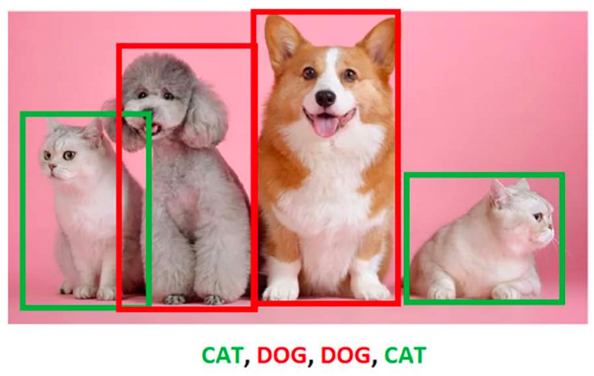
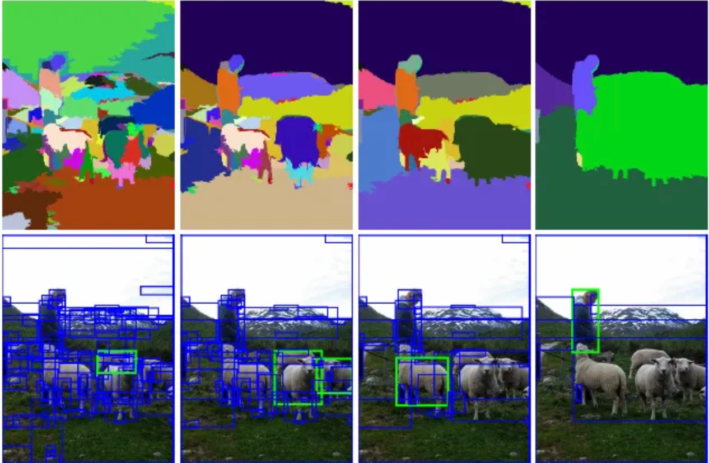
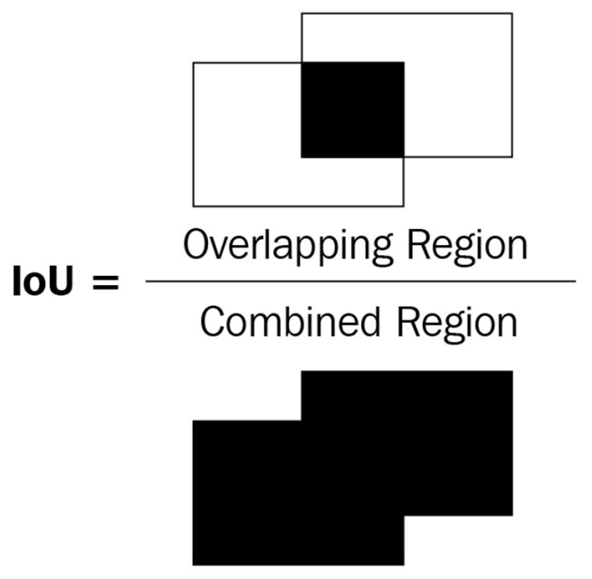
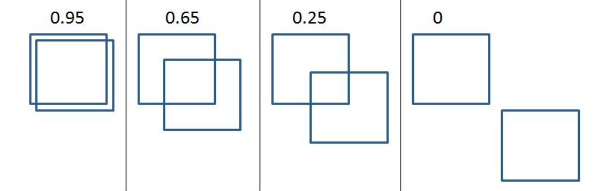
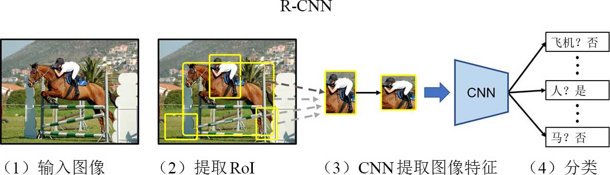
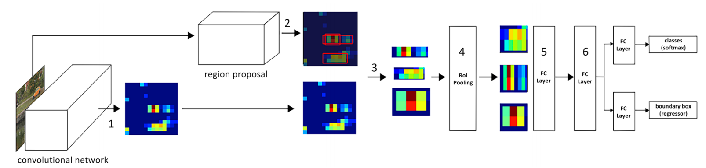
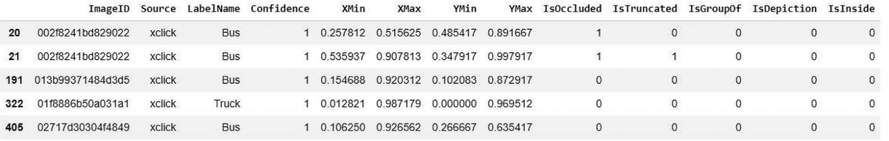
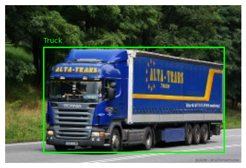

# R-CNN 实战

## 1. 上节回顾

上节我们学习了 ResNet18 网络的基本构成和代码实现。在项目练习中，我们完成了一个多输出的任务，人脸图像的关键点识别，包括

- 补全模型函数
- 对比 ResNet50 和 ResNet18 的模型性能

本节我们将来学习目标检测的相关知识。

## 2. 项目介绍

随着自动驾驶汽车、人脸检测、智能视频监控和人员计数解决方案的兴起，对快速准确的物体检测系统需求量很大。这些系统不仅包括从图像中进行物体分类，还包括通过在它们周围绘制适当的边界框来确定每个物体的位置。想象一个场景，其中你有一张包含多个对象的图像。我要求你预测图像中对象的类别。例如，假设图像中既包含猫也包含狗。你会如何对这类图像进行分类？在需要预测图像中对象的位置（边界框）以及单个边界框内对象的类别的场景中，目标检测就派上用场了。



## 3. 项目内容

在本项目中，我们将学习预测图像中物体的类别，并在物体周围有一个紧密的边界框，这是定位任务。我们还将学习检测图像中多个物体的对应类别，以及每个物体周围的边界框，这是目标检测任务。

训练一个典型的目标检测模型涉及以下步骤：

1. 创建包含图像中各种对象对应的边界框标签和类别的真值数据
2. 构思扫描图像以识别可能包含对象的区域的机制（区域提议）
3. 使用 IoU 指标创建目标类别变量
4. 创建目标边界框偏移变量以修正步骤 2 中区域提议的位置
5. 构建一个能够预测对象类别以及对应于区域提议的目标边界框偏移的模型
6. 使用平均精度均值（mAP）测量目标检测的准确性

### 3.1. 必要技术

#### 3.1.1. 区域提议

想象一个假设场景，其中目标图像包含背景中的人和环境。假设背景（天空）的像素强度变化很小，而前景（人）的像素强度变化很大。

仅从上述描述本身，我们可以得出这里有两个主要区域——人和天空。此外，在图像中的人的区域，对应于头发的像素将具有与对应于脸的像素不同的强度，这表明一个区域内可以有多个子区域。

区域提议（region proposals）是一种帮助识别像素彼此相似的区域岛的技术。区域提议有助于目标定位，可用于识别一个完全围绕目标的边界框。

SelectiveSearch 是一种用于目标定位的区域建议算法，它根据像素强度生成可能聚在一起的区域建议。SelectiveSearch 基于相似像素的层次分组来分组像素，这反过来又利用了图像内内容的颜色、纹理、大小和形状兼容性。首先，SelectiveSearch 通过基于先前属性分组像素来过度分割图像。然后，它遍历这些过度分割的组，并根据相似性对它们进行分组。在每次迭代中，它将较小的区域组合成较大的区域。其实现可参见 [selectivesearch](https://github.com/AlpacaTechJP/selectivesearch)。



#### 3.1.2. IoU

想象一个场景，我们为某个目标提出了一个边界框预测。我们如何衡量我们的预测准确性？在这种情况下，IoU（intersection over union）概念派上了用场。术语“交并比”中的“交集”指的是衡量预测的边界框和实际边界框重叠的程度，而“并集”指的是衡量两个边界框可能重叠的总体空间。交并比是两个边界框重叠区域（overlapping region）与两个边界框组合区域（combined region）的比率。这可以用以下图表来表示：



在前面两个边界框（矩形）的图中，让我们将左侧边界框视为真实情况，右侧边界框视为对象的预测位置。观察下图中，随着边界框之间重叠的变化，IoU 指标的变化



我们可以看到，随着重叠减少，IoU 减少，并且在最终图中，没有重叠的情况下，IoU 指标为 0。

#### 3.1.3. 非极大值抑制

想象一个场景，其中生成了多个区域建议，并且它们之间显著重叠。本质上，所有预测的边界框坐标（区域建议的偏移量）都显著重叠。非极大值指的是那些不包含对象的最高概率的边界框，而抑制指的是我们丢弃这些边界框。在非极大值抑制中，我们识别出包含对象的最高概率的边界框，并丢弃所有与包含对象的最高概率的边界框 IoU 低于某个阈值的其他边界框。在 PyTorch 中，非极大值抑制是通过在 `torchvision.ops` 模块中的 `nms` 函数执行的。

#### 3.1.4. mAP

在尝试理解 mAP（平均精度均值）之前，让我们先理解精度，然后是平均精度，最后是 mAP：

- 精度：通常，精度被定义为

$$
\frac{真阳性}{真阳性 + 假阳性}
$$

其中，真阳性是指预测了正确类别且与真实边界框的交并比大于特定阈值的边界框。假阳性是指预测了错误类别或者与真实边界框的交并比小于定义的阈值的边界框。此外，若一个真实边界框被多个边界框识别，只有一个可以是真阳性，其余的都是假阳性。

- 平均精度：平均精度是在各种 IoU 阈值下计算的精度值的平均值。
- mAP：在数据集中所有目标类别的各种 IoU 阈值下计算出的精确度值的平均值。

### 3.2. R-CNN 家族

#### 3.2.1. R-CNN

R-CNN 代表基于区域（Region-based）的卷积神经网络。R-CNN 中的基于区域指的是用于识别图像中目标区域建议。

1. 从图像中提取区域建议。我们需要确保提取大量的建议，以避免错过图像中的任何潜在目标。
2. 将所有提取的区域调整大小以获得相同大小的区域。
3. 将调整大小的区域建议通过网络传递。通常，我们将调整大小的区域建议通过预训练模型（如 VGG16 或 ResNet50）传递，并在全连接层中提取特征。
4. 创建模型训练数据，其中输入是通过预训练模型传递区域建议所提取的特征。输出是每个区域建议对应的类别以及区域建议与图像对应的真实值的偏移量。
5. 连接两个输出头，一个对应图像的类别，另一个对应区域建议与真实边界框的偏移量，以提取对象上的精细边界框。
6. 在编写一个自定义损失函数后训练模型，该损失函数最小化对象分类误差和边界框偏移误差。



> R-CNN 训练时间较长，这里我们略过。

#### 3.2.2. Fast R-CNN

R-CNN 的一个主要缺点是生成预测需要耗费大量时间。这是因为为每张图像生成区域建议、调整区域裁剪的大小以及提取与每个裁剪（区域建议）对应的特征，这些过程造成了瓶颈。Fast R-CNN 通过将整张图像传递给预训练模型来提取特征，从而绕开了这一问题，然后它会提取出与原始图像的区域建议（这些区域建议是从选择性搜索中获得的）相对应的特征区域。其流程如下：



### 3.3. 代码实现

#### 3.3.1. 载入数据

```python
import os

import pandas as pd

data_folder = "$HOME/Documents/col-models/open-images-bus-trucks"
data_folder = os.path.expandvars(data_folder)

bus_df = pd.read_csv(f"{data_folder}/df.csv")
bus_df.head()
```



实现数据集包装类

```python
import cv2
import numpy as np
from torch.utils.data import DataLoader, Dataset


class OpenImages(Dataset):
    def __init__(self, df, root=data_folder):
        self.root = root
        self.img_ids = df["ImageID"].unique()
        self.df = df
        # 获取数据框中存在的唯一 ImageID 值，因为一张图像可能包含多个对象
        self.unique_images = df["ImageID"].unique()

    def __len__(self):
        return len(self.unique_images)

    # 根据索引（ix）获取对应的图像（image_id）、获取其边界框坐标（boxes）以及类别，并返回图像、边界框、类别和图像路径
    def __getitem__(self, ix):
        img_id = self.img_ids[ix]
        img_path = f"{self.root}/images/{img_id}.jpg"
        img = cv2.imread(img_path, cv2.IMREAD_COLOR_BGR2RGB)

        h, w, _ = img.shape
        df = self.df.copy()
        df = df[df["ImageID"] == img_id]
        boxes = df[["XMin", "YMin", "XMax", "YMax"]].values
        boxes = (boxes * np.array([w, h, w, h])).astype(np.uint16).tolist()
        classes = df["LabelName"].values.tolist()
        return img, boxes, classes, img_path


ds = OpenImages(df=bus_df)
img, boxes, labels, path = ds[9]
```

查看

```python
import matplotlib.pyplot as plt


def show_anchors(ax, img, boxes=None, anchors=None, labels=None, linewidth=2):
    # 真值框
    ax.imshow(img)
    if boxes:
        for (x1, y1, x2, y2), label in zip(boxes, labels or [None] * len(boxes)):
            ax.add_patch(
                plt.Rectangle(
                    (x1, y1),
                    x2 - x1,
                    y2 - y1,
                    fill=False,
                    edgecolor="lime",
                    linewidth=linewidth,
                )
            )
            if label:
                ax.text(x1, y1 - 3, str(label), color="lime", fontsize=10, va="bottom")
    # 锚框
    if anchors:
        for x1, y1, x2, y2 in anchors:
            ax.add_patch(
                plt.Rectangle(
                    (x1, y1),
                    x2 - x1,
                    y2 - y1,
                    fill=False,
                    edgecolor="red",
                    linewidth=linewidth,
                    linestyle="--",
                )
            )
    ax.axis("off")


_, ax = plt.subplots(figsize=(8, 4))
show_anchors(ax, img, boxes=boxes, labels=labels)
```



#### 3.3.2. 必要函数

下面实现对候选区域的提取。

```python
def extract_candidates(img):
    # 创建 Selective Search 分割器
    ss = cv2.ximgproc.segmentation.createSelectiveSearchSegmentation()
    ss.setBaseImage(img)
    # 使用“快速”策略
    ss.switchToSelectiveSearchFast()
    # 执行分割，得到所有候选框
    rects = ss.process()  # rects: ndarray, shape=(N, 4), dtype=int
    rects = rects.tolist()  # [[x, y, w, h], ...]

    # 后处理：去掉极小 / 极大框
    img_area = img.shape[0] * img.shape[1]
    candidates = []
    for x, y, w, h in rects:
        roi_area = w * h
        if roi_area < 0.05 * img_area or roi_area > 1.0 * img_area:
            continue
        # 去重（可选，OpenCV 本身已去重，但保险起见）
        if [x, y, w, h] not in candidates:
            candidates.append([x, y, w, h])

    return candidates
```

根据候选框计算 IoU

```python
import torch
import torchvision.ops as ops


def extract_iou(boxA, boxB):
    tA = torch.tensor(np.array([boxA]), dtype=torch.float32)
    tB = torch.tensor(np.array([boxB]), dtype=torch.float32)
    return ops.box_iou(tA, tB)[0, 0].item()
```

#### 3.3.3. 获取区域建议和偏移量的真值

在这一部分，我们创建与我们的模型相对应的输入和输出值。输入包括使用选择性搜索方法提取的候选区域，而输出包括候选区域对应的类别以及若候选区域包含对象，与它重叠最多的边界框的偏移量。

```python
# 初始化空列表以存储文件路径（FPATHS）、真实边界框（GTBBS）、对象的类别（CLSS）、边界框与区域建议之间的偏移量（DELTAS）、区域建议位置（ROIS）以及区域建议与真实值的交并比（IOUS）。
FPATHS, GTBBS, CLSS, DELTAS, ROIS, IOUS = [], [], [], [], [], []

# 我们仅使用前 500 个数据点来进行演示。当然训练的点越多，精度越高。
N = 500
for ix, (im, bbs, labels, fpath) in enumerate(ds):
    if ix == N:
        break
    # 使用 extract_candidates 函数从每张图像（im）中提取候选区域，并将提取到的区域坐标从 (x, y, w, h) 格式转换为 (x, y, x+w, y+h) 格式：
    H, W, _ = im.shape
    candidates = extract_candidates(im)
    candidates = np.array([(x, y, x + w, y + h) for x, y, w, h in candidates])
    # 遍历所有选择性搜索提出的候选区域
    ious, rois, clss, deltas = [], [], [], []
    # 存储所有候选区域与图像中所有真实边界框的 IoU，其中 bbs 是图像中不同对象的真实边界框，candidates 是在上一步中获得的区域提议候选区域。
    ious = np.array(
        [
            [extract_iou(candidate, _bb_) for candidate in candidates]
            for _bb_ in np.array(bbs)
        ]
    ).T
    for jx, candidate in enumerate(candidates):
        cx, cy, cX, cY = candidate
        candidate_ious = ious[jx]
        # 找出具有最高 IoU 的候选区域的索引（best_iou_at）以及对应的真实边界框（best_bb）。
        best_iou_at = np.argmax(candidate_ious)
        best_iou = candidate_ious[best_iou_at]
        best_bb = _x, _y, _X, _Y = bbs[best_iou_at]
        if best_iou > 0.3:
            clss.append(labels[best_iou_at])
        else:
            clss.append("background")
        # 调整当前提议的左、右、上、下边距多少，使其与真实边界框`best_bb`完全对齐。
        delta = np.array([_x - cx, _y - cy, _X - cX, _Y - cY]) / np.array([W, H, W, H])
        deltas.append(delta)
        rois.append(candidate / np.array([W, H, W, H]))

    FPATHS.append(fpath)
    IOUS.append(ious)
    ROIS.append(rois)
    CLSS.append(clss)
    DELTAS.append(deltas)
    GTBBS.append(bbs)

F_PATHS = [f"{data_folder}/images/{os.path.basename(f)}" for f in FPATHS]
FPATHS, GTBBS, CLSS, DELTAS, ROIS = [F_PATHS, GTBBS, CLSS, DELTAS, ROIS]
```

为每个区域提议分配类别。

```python
import itertools

CLSS2 = list(itertools.chain.from_iterable(CLSS))
targets = pd.DataFrame(CLSS2, columns=["label"])
label2target = {l: t for t, l in enumerate(targets["label"].unique())}
target2label = {t: l for l, t in label2target.items()}
background_class = label2target["background"]
```

#### 3.3.4. 创建训练集

```python
from torchvision import models, transforms

device = "cuda" if torch.cuda.is_available() else "cpu"
normalize = transforms.Normalize(mean=[0.450] * 3, std=[0.225] * 3)


def preprocess_image(img):
    img = torch.tensor(img).permute(2, 0, 1)
    img = normalize(img)
    return img.to(device).float()


class FRCNNDataset(Dataset):
    def __init__(self, fpaths, rois, labels, deltas, gtbbs):
        self.fpaths = fpaths
        self.gtbbs = gtbbs
        self.rois = rois
        self.labels = labels
        self.deltas = deltas

    def __len__(self):
        return len(self.fpaths)

    # 根据区域提议提取裁剪区域，并获取与类别和边界框偏移量相关的其他真实值
    def __getitem__(self, ix):
        fpath = str(self.fpaths[ix])
        image = cv2.imread(fpath, cv2.IMREAD_COLOR_RGB)
        gtbbs = self.gtbbs[ix]
        rois = self.rois[ix]
        labels = self.labels[ix]
        deltas = self.deltas[ix]
        return image, rois, labels, deltas, gtbbs, fpath

    # 对裁剪区域的图像进行调整大小和标准化
    def collate_fn(self, batch):
        # rois 保存有关哪些 RoI 属于批量处理中的哪张图像的信息
        # rixs 是一个索引列表，其中的每个整数将相应的边界框与适当的图像关联起来。
        input, rois, rixs, labels, deltas = [], [], [], [], []
        for ix in range(len(batch)):
            image, image_rois, image_labels, image_deltas, _, _ = batch[ix]
            image = cv2.resize(image, (224, 224))
            input.append(preprocess_image(image / 255.0)[None])
            rois.extend(image_rois)
            rixs.extend([ix] * len(image_rois))
            labels.extend([label2target[c] for c in image_labels])
            deltas.extend(image_deltas)

        input = torch.cat(input).to(device)
        rois = torch.Tensor(rois).float().to(device)
        rixs = torch.Tensor(rixs).float().to(device)
        labels = torch.Tensor(labels).long().to(device)
        deltas = torch.Tensor(deltas).float().to(device)
        return input, rois, rixs, labels, deltas
```

创建 DataLoader

```python
n_train = 9 * len(FPATHS) // 10
train_ds = FRCNNDataset(
    FPATHS[:n_train], ROIS[:n_train], CLSS[:n_train], DELTAS[:n_train], GTBBS[:n_train]
)
test_ds = FRCNNDataset(
    FPATHS[n_train:], ROIS[n_train:], CLSS[n_train:], DELTAS[n_train:], GTBBS[n_train:]
)
train_loader = DataLoader(
    train_ds, batch_size=2, collate_fn=train_ds.collate_fn, drop_last=True
)
test_loader = DataLoader(
    test_ds, batch_size=2, collate_fn=test_ds.collate_fn, drop_last=True
)
```

#### 3.3.5. 构建模型

```python
from torch import nn
from torchvision.ops import RoIPool


class FRCNN(nn.Module):
    def __init__(self):
        super().__init__()
        # 使用预训练模型
        backbone = models.vgg16()
        # weights
        weights_path = "$HOME/Documents/col-models/vgg16-397923af.pth"
        weights_path = os.path.expandvars(weights_path)

        backbone.load_state_dict(torch.load(weights_path, weights_only=True))
        for param in backbone.features.parameters():
            param.requires_grad = True

        self.seq = nn.Sequential(*list(backbone.features.children())[:-1])
        # 指定 RoIPool 将提取一个 (7 x 7) 的输出。在这里，spatial_scale 是将提议（来自原始图像）缩小的因子，以便每个输出在通过扁平层之前具有相同的形状。图像是 (224 x 224) 大小，而特征图是 (14 x 14) 大小
        self.roipool = RoIPool(7, spatial_scale=14 / 224)
        feature_dim = 512 * 7 * 7
        self.cls_score = nn.Linear(feature_dim, len(label2target))
        self.bbox = nn.Sequential(
            nn.Linear(feature_dim, 512), nn.ReLU(), nn.Linear(512, 4), nn.Tanh()
        )
        self.cel = nn.CrossEntropyLoss()
        self.sl1 = nn.L1Loss()

    def forward(self, input, rois, ridx):
        # 将输入图像通过预训练模型
        res = input
        res = self.seq(res)
        # 为 self.roipool 创建一个 rois 矩阵作为输入，首先将 ridx 作为第一列，接下来的四列是区域提议边界框的绝对值
        rois = torch.cat([ridx.unsqueeze(-1), rois * 224], dim=-1)
        res = self.roipool(res, rois)
        feat = res.view(len(res), -1)
        cls_score = self.cls_score(feat)
        bbox = self.bbox(feat)  # .view(-1, len(label2target), 4)
        return cls_score, bbox

    # 我们返回检测损失和回归损失的总和。若实际类别是背景类别，我们不会计算与偏移量对应的回归损失。
    def calc_loss(self, probs, _deltas, labels, deltas):
        detection_loss = self.cel(probs, labels)
        (ixs,) = torch.where(labels != background_class)
        _deltas = _deltas[ixs]
        deltas = deltas[ixs]
        self.lmb = 10.0
        if len(ixs) > 0:
            regression_loss = self.sl1(_deltas, deltas)
            return (
                detection_loss + self.lmb * regression_loss,
                detection_loss.detach(),
                regression_loss.detach(),
            )
        regression_loss = 0
        return (
            detection_loss + self.lmb * regression_loss,
            detection_loss.detach(),
            regression_loss,
        )
```

#### 3.3.6. 训练模型

定义训练和验证函数

```python
def train_batch(inputs, model, optimizer, criterion):
    input, rois, rixs, clss, deltas = inputs
    rois = torch.Tensor(rois).float().to(device)
    model.train()
    optimizer.zero_grad()
    _clss, _deltas = model(input, rois, rixs)
    loss, loc_loss, regr_loss = criterion(_clss, _deltas, clss, deltas)
    _, preds = _clss.max(-1)
    accs = clss == preds
    loss.backward()
    optimizer.step()
    return loss.detach(), loc_loss, regr_loss, accs.cpu().numpy()


def validate_batch(inputs, model, criterion):
    input, rois, rixs, clss, deltas = inputs
    with torch.no_grad():
        model.eval()
        _clss, _deltas = model(input, rois, rixs)
        rois = torch.Tensor(rois).float().to(device)
        loss, loc_loss, regr_loss = criterion(_clss, _deltas, clss, deltas)
        _, preds = _clss.max(-1)
        accs = clss == preds
    return _clss, _deltas, loss.detach(), loc_loss, regr_loss, accs.cpu().numpy()
```

开始训练

```python
from torch.optim import SGD

frcnn = FRCNN().to(device)
criterion = frcnn.calc_loss
optimizer = SGD(frcnn.parameters(), lr=1e-3)
n_epochs = 5

train_losses = []
val_losses = []
for epoch in range(n_epochs):
    train_epoch_losses = []

    for _, inputs in enumerate(train_loader):
        loss, loc_loss, regr_loss, accs = train_batch(
            inputs, frcnn, optimizer, criterion
        )
        train_epoch_losses.append(loss)
    train_epoch_loss = np.array(train_epoch_losses).mean()

    for _, inputs in enumerate(test_loader):
        _, _, val_epoch_loss, loc_loss, regr_loss, accs = validate_batch(
            inputs, frcnn, criterion
        )

    train_losses.append(train_epoch_loss)
    val_losses.append(val_epoch_loss)
    print(f"epoch: {epoch + 1}/{n_epochs}")
    print(f"{train_epoch_loss:.4f}")
    print(f"{val_epoch_loss:.4f}")

# 不要忘记保存训练得到的模型权重
# torch.save(res_net.to("cpu").state_dict(), "data/chap07-frcnn-bus-truck.pth")
```

## 4. 项目练习（每题 20 分）

### 4.1. 基础题

1. 绘制 3.3 中模型的训练损失和验证损失随训练周期变化的曲线（模型性能曲线）
2. 尝试用 ResNet18 取代 VGG16 模型，并比较两者的模型性能曲线

使用如下代码，取代模型对应部分

```python
class FRCNN(nn.Module):
    def __init__(self):
        super().__init__()
        backbone = models.resnet18()
        weights_path = "$HOME/Documents/col-models/resnet18-f37072fd.pth"
        weights_path = os.path.expandvars(weights_path)
        backbone.load_state_dict(torch.load(weights_path, weights_only=True))
        for param in backbone.parameters():
            param.requires_grad = True
        self.seq = nn.Sequential(
            backbone.conv1,
            backbone.bn1,
            backbone.relu,
            backbone.maxpool,
            backbone.layer1,
            backbone.layer2,
            backbone.layer3,
            backbone.layer4,
        )
        self.roipool = RoIPool(7, spatial_scale=7 / 224)
```

3. 根据代码总结 R-CNN 流程

### 4.2. 进阶题

1. 根据代码注释，使用两种方法降低当前模型的训练误差，尝试比较哪种方式的差异
2. 利用如下函数和此前定义的`show_anchors`函数，绘制带有预测锚框的图像（类似 3.3.1 中的图像）

```python
import matplotlib.pyplot as plt
from PIL import Image
from torchvision.ops import nms


def get_prob_and_boxes(filename):
    img = cv2.resize(np.array(Image.open(filename)), (224, 224))
    candidates = extract_candidates(img)
    candidates = [(x, y, x + w, y + h) for x, y, w, h in candidates]
    input = preprocess_image(img / 255.0)[None]
    rois = [[x / 224, y / 224, X / 224, Y / 224] for x, y, X, Y in candidates]
    rixs = np.array([0] * len(rois))
    rois, rixs = [torch.Tensor(item).to(device) for item in [rois, rixs]]

    with torch.no_grad():
        frcnn.eval()
        probs, deltas = frcnn(input, rois, rixs)
        confs, clss = torch.max(probs, -1)
    candidates = np.array(candidates)
    confs, clss, probs, deltas = [
        tensor.detach().cpu().numpy() for tensor in [confs, clss, probs, deltas]
    ]

    ixs = clss != background_class
    confs, clss, probs, deltas, candidates = [
        tensor[ixs] for tensor in [confs, clss, probs, deltas, candidates]
    ]
    bbs = candidates + deltas
    ixs = nms(torch.tensor(bbs.astype(np.float32)), torch.tensor(confs), 0.05)
    confs, clss, probs, deltas, candidates, bbs = [
        tensor[ixs] for tensor in [confs, clss, probs, deltas, candidates, bbs]
    ]
    if len(ixs) == 1:
        confs, clss, probs, deltas, candidates, bbs = [
            tensor[None] for tensor in [confs, clss, probs, deltas, candidates, bbs]
        ]
    # 返回物体的置信度（概率）列表和锚框数组
    return confs, bbs.astype(np.uint16), clss
```

## 5. 参考阅读

- [区域卷积神经网络](https://zh-v2.d2l.ai/chapter_computer-vision/rcnn.html)
