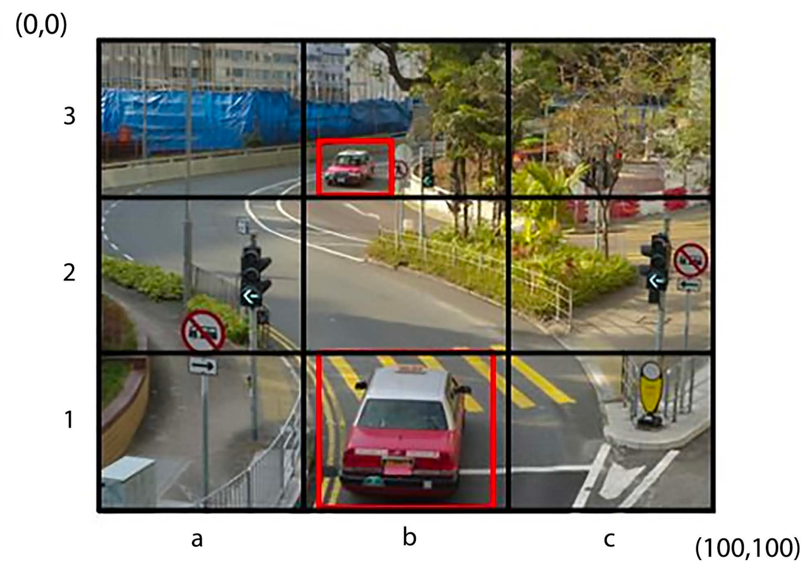
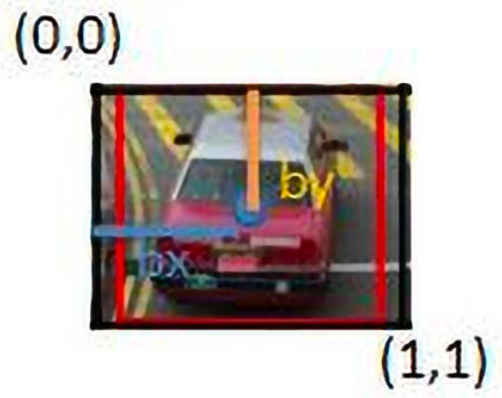
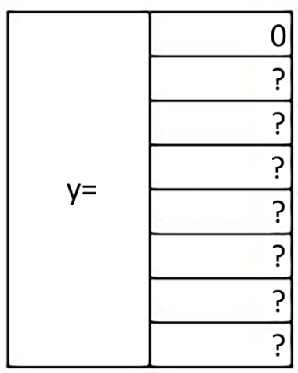
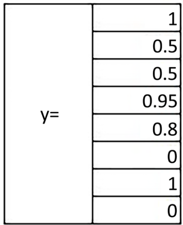
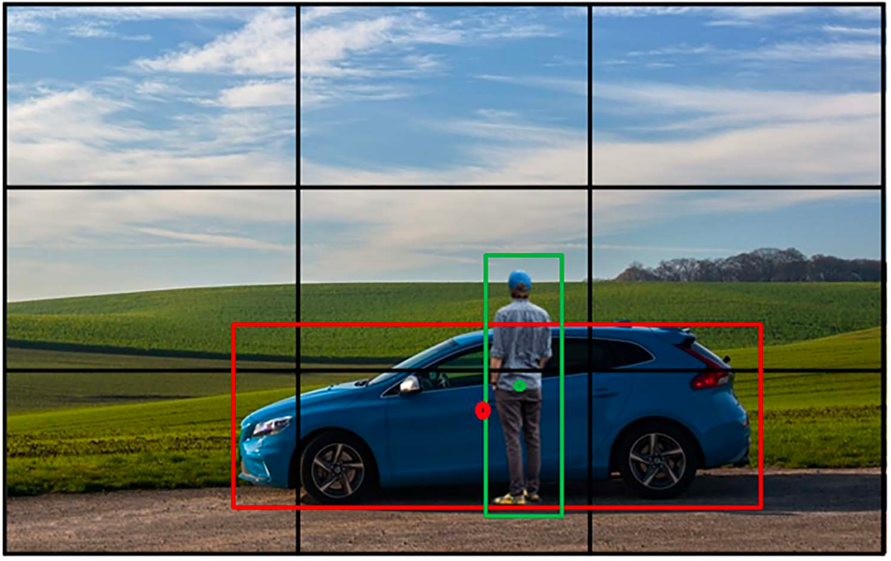

# YOLO 初探

## 1. 上节回顾

上节我们学习了 R-CNN 和 Fast R-CNN 的主要流程，并对后者进行了代码实现。在项目练习中，我们完成了对目标检测。同时，还学习了目标检测相关知识，包括

- 交并比（IoU）
- 平均精度均值（mAP）
- 感兴趣区域（RoI）
- 选择性搜索

本节我们将来学习当前最为流行的目标探测框架 YOLO。

> 本节涉及模型知识较多，代码量大，建议关注主要处理流程，暂时搁置细节。本节以理论学习为主。

## 2. 项目介绍

### 2.1. YOLO 架构

我们先回顾一下之前学习的 R-CNN 模型，其思路是先使用一个搜索算法从图像中提取出若干感兴趣区域（RoI），然后使用一个卷积神经网络（CNN）分别处理每一个感兴趣区域，提取特征，并完成最终的分类。不难想象，提取的过程会十分耗时。

2015 年，一个革命性的工作，YOLO（You Only Look Once）问世。不同于 R-CNN 的两阶段检测范式，YOLO 的作者团队认为，提取候选区域（定位）和逐一识别（分类）完全可由一个单独的网络来同时完成，无须分成两个阶段，不需要对每一个特征区域进行依次分类，从而能够减少处理过程中的大量冗余操作。在这一技术理念下，YOLO 只需对输入图像处理一次，即可获得最终的检测结果。

### 2.2. YOLOv1

尽管 YOLOv1 已经是 2015 年的工作了，有着不少不完善的地方，但其中很多设计理念至今还能够在先进的目标检测框架中有所体现。从网络结构上来看，YOLOv1 使用串联的 1x1 卷积和 3x3 卷积所组成的模块，所以它的主干网络的结构非常简单。


传统的图像分类网络都会将特征图展平（flatten），得到一个一维特征向量，然后连接全连接层去做预测。YOLOv1 继承了这个思想，将主干网络最后输出的特征图。然后部署若干全连接层来处理该特征向量。最后部署一个全连接层输出最终的预测。这样会产生的参数量级会达到$10^8$级。从资源占用的角度来看，YOLOv1 的这一缺陷是致命的，也为 YOLO 的后续改进埋下了伏笔。

#### 2.2.1. 网格空间

无论如何，让我们来了解一下 YOLO 的最基本的工作原理。

1. 考虑一张带有红色标记的真实边界框的图像。
2. 将图像划分为$N*N$的网格单元（假设为 3）。



3. 确定包含至少一个真实边界框中心的网格单元。如$3*3$网格图像中的单元格 b1 和 b3。
4. 真实边界框中点所在的单元格负责预测该物体的边界框。为每个单元格创建对应的真实情况（目标对象的概率）。
5. 将网格单元（以 b1 网格单元为例）视为坐标系，并将其归一化到 0 到 1 的范围。其中，bx 和 by 是真实边界框中点相对于网格单元图像的位置，如 bx = 0.5，因为真实边界框的中点距离原点 0.5 个单位。同样地，by = 0.5。



到目前为止，我们已经计算了从网格单元中心到图像中目标对象对应的真实边界框中心的偏移量。现在，我们来理解如何计算 bw 和 bh：

- bw 是边界框宽度与网格单元宽度的比率。
- bh 是边界框高度与网格单元高度的比率。

6. 接下来，将预测与网格单元对应的类别。若有 3 个类别（c1——卡车，c2——汽车，c3——公交车），我们将预测该网格单元包含这三个类别中任何一类对象的概率。注意，这里不需要背景类别。
7. 考虑网格单元 a3 的输出。由于该网格单元不包含任何对象，因此第一个输出（目标得分）为 0，其余值也无关紧要，因为该网格单元不包含任何对象的真实边界框的中心。



8. 考虑网格单元 b1 的输出。该网格单元包含一个对象，其 bx、by、bw 和 bh 值是按照我们之前介绍的方式获得的，并且最终类别是汽车，这导致 c2 为 1，而 c1 和 c3 为 0。



综上，对于每个单元格，我们可以获取 8 个输出。因此，对于 $3*3$ 的单元格网格，我们获取 $3*3*8$ 个输出。

#### 2.2.2. 后续步骤

1. 定义一个模型，其输入是一幅图像，输出是 $3*3*8$，其中真实标签如前一步所述。
2. 通过考虑锚框来定义真实标签。

到目前为止，我们构建的场景是期望每个单元格内只有一个目标。然而，在现实情况下，可能存在一个单元格内有多个目标的情况。这将导致生成的真实标签不正确。如，一个 19*19 的网格。然而，即使增加了网格单元格的数量，仍然可能存在无法解决的情况。在这种情况下，锚框就派上用场了。假设我们有两个锚框——一个的高度大于宽度（对应于人），另一个的宽度大于高度（对应于汽车）：



通常情况下，锚框会以网格单元格的中心为其中心点。

3. 定义损失

在计算与模型相关的损失时，我们需要确保当目标性得分低于某个阈值时（这对应于不包含目标的单元格），不计算回归损失和分类损失。接下来，若单元格包含目标，我们需要确保跨不同类别的分类尽可能准确。最后，若单元格包含目标，边界框的偏移量应尽可能接近预期。然而，由于宽度和高度的偏移量可能比中心的偏移量大得多（因为中心的偏移量范围在 0 到 1 之间，而宽度和高度的偏移量则不一定），我们通过获取平方根值，给宽度和高度的偏移量赋予较低的权重。

## 3. 项目内容

### 3.1. 载入数据集

#### 3.1.1. 加载相关包

```python
import os
from collections import Counter

import pandas as pd
import torch
import torch.nn as nn
import torch.optim as optim
import torchvision.transforms as transforms
from torch.utils.data import DataLoader
from tqdm import tqdm

device = "cuda" if torch.cuda.is_available() else "cpu"
seed = 123
torch.manual_seed(seed)
```

#### 3.1.2. 读取数据集

```python
data_path = "$HOME/Documents/col-models/fruit-images-for-object-detection"

files_dir = f"{data_path}/train_zip/train"
files_dir = os.path.expandvars(files_dir)
test_dir = f"{data_path}/test_zip/test"
test_dir = os.path.expandvars(test_dir)

# 读取训练集目录下所有 .jpg 文件，按文件名升序排序后存入列表
images = [image for image in sorted(os.listdir(files_dir)) if image[-4:] == ".jpg"]
# 准备保存训练集对应标注文件名的空列表
annots = []
# 遍历训练集图片名，将“.jpg”替换成“.xml”，构造标注文件名
for image in images:
    annot = image[:-4] + ".xml"
    annots.append(annot)

# 将训练图片列表转为 pandas Series，列名设为 images
images = pd.Series(images, name="images")
# 将训练标注文件列表转为 pandas Series，列名设为 annots
annots = pd.Series(annots, name="annots")

# 按列拼接两个 Series，形成两列 DataFrame：images | annots
df = pd.concat([images, annots], axis=1)
# 显式转换成 DataFrame（此行可与上一行合并，但保留无妨）
df = pd.DataFrame(df)

# 对测试集做相同处理
test_images = [image for image in sorted(os.listdir(test_dir)) if image[-4:] == ".jpg"]
test_annots = []
for image in test_images:
    annot = image[:-4] + ".xml"
    test_annots.append(annot)


test_images = pd.Series(test_images, name="test_images")
test_annots = pd.Series(test_annots, name="test_annots")
test_df = pd.concat([test_images, test_annots], axis=1)
test_df = pd.DataFrame(test_df)
```

#### 3.1.3. 数据包装类

```python
import os
import xml.etree.ElementTree as ET

import torch
from PIL import Image


class FruitImagesDataset(torch.utils.data.Dataset):
    def __init__(self, df=df, files_dir=files_dir, S=7, B=2, C=3, transform=None):
        self.df = df  # DataFrame 形式的图片 - 标注对应表
        self.root = files_dir  # 数据根目录
        self.tf = transform  # 数据增强/预处理
        self.S = S  # 网格尺寸
        self.B = B  # 每网格框数
        self.C = C  # 类别数
        self.cls = {"apple": 0, "banana": 1, "orange": 2}  # 类别映射

    def __len__(self):
        """返回样本总数"""
        return len(self.df)

    def __getitem__(self, idx):
        """按索引读取单张图片及其标签，返回 (img_tensor, label_tensor)"""
        # 读取 xml 与图片
        xml_path = os.path.join(self.root, self.df.iloc[idx, 1])
        img_path = os.path.join(self.root, self.df.iloc[idx, 0])

        root = ET.parse(xml_path).getroot()
        img = Image.open(img_path).convert("RGBA").convert("RGB")

        # 获取图片宽高（若 xml 中 height=0 则通过 PIL 获取）
        w, h = (
            img.size
            if int(root.findtext("size/height") or 0) == 0
            else (int(root.findtext("size/width")), int(root.findtext("size/height")))
        )

        # 解析所有物体框 → [class, cx, cy, bw, bh]（相对坐标）
        boxes = []
        for obj in root.findall("object"):
            c = self.cls[obj.findtext("name")]
            xmin, xmax, ymin, ymax = map(
                int,
                [obj.findtext(f"bndbox/{k}") for k in ("xmin", "xmax", "ymin", "ymax")],
            )
            cx, cy = ((xmin + xmax) / 2) / w, ((ymin + ymax) / 2) / h
            bw, bh = (xmax - xmin) / w, (ymax - ymin) / h
            boxes.append([c, cx, cy, bw, bh])
        boxes = torch.tensor(boxes)

        # 数据增广
        if self.tf:
            img, boxes = self.tf(img, boxes)

        # 构造 YOLO 网格标签 (S,S,C+5*B)
        label = torch.zeros(self.S, self.S, self.C + 5 * self.B)
        for c, x, y, bw, bh in boxes:
            j, i = int(self.S * x), int(self.S * y)  # 网格索引
            if label[i, j, self.C] == 0:  # 每个网格只负责一个物体
                label[i, j, self.C] = 1  # objectness=1
                label[i, j, 4:8] = torch.tensor(
                    [self.S * x - j, self.S * y - i, bw * self.S, bh * self.S]
                )
                label[i, j, int(c)] = 1  # one-hot 类别
        return img, label
```

#### 3.1.4. 数据载入类

```python
class Compose:
    def __init__(self, transforms):
        self.transforms = transforms

    def __call__(self, img, bboxes):
        for t in self.transforms:
            img, bboxes = t(img), bboxes

        return img, bboxes

# 选 448*448 的主要原因：YOLO v1 原文固定输入尺寸就是 448*448，网络后续会把图片再下采样 32 倍得到 7*7 的网格（448 / 32 = 14，但 YOLO v1 在卷积前先把 448 缩成 224*224，然后再通过特殊结构得到 7*7，具体参加下文的骨干网络结构配置表）。
transform = Compose([transforms.Resize((448, 448)), transforms.ToTensor()])

BATCH_SIZE = 16
train_dataset = FruitImagesDataset(transform=transform, files_dir=files_dir)
test_dataset = FruitImagesDataset(transform=transform, files_dir=test_dir)
train_loader = DataLoader(
    dataset=train_dataset, batch_size=BATCH_SIZE, shuffle=True, drop_last=False
)
test_loader = DataLoader(
    dataset=test_dataset, batch_size=BATCH_SIZE, shuffle=True, drop_last=False
)
```

### 3.2. 构建模型

#### 3.2.1. 骨干网络结构配置表

```python
# 元组：(kernel_size, number of filters, strides, padding)
# 列表：[(tuple), (tuple), times to repeat]
# "M"：最大池化层
architecture_config = [
    (7, 64, 2, 3),
    "M",
    (3, 192, 1, 1),
    "M",
    (1, 128, 1, 0),
    (3, 256, 1, 1),
    (1, 256, 1, 0),
    (3, 512, 1, 1),
    "M",
    # --- 瓶颈结构：1×1 降维→3×3 升维，重复 4 次 ---
    [(1, 256, 1, 0), (3, 512, 1, 1), 4],
    (1, 512, 1, 0),
    (3, 1024, 1, 1),
    "M",
    # --- 瓶颈结构：1×1 降维→3×3 升维，重复 2 次 ---
    [(1, 512, 1, 0), (3, 1024, 1, 1), 2],
    (3, 1024, 1, 1),
    (3, 1024, 2, 1),
    (3, 1024, 1, 1),
    (3, 1024, 1, 1),
]
```

#### 3.2.2. CNN 块

```python
class CNNBlock(nn.Module):

    def __init__(self, in_channels, out_channels, **kwargs):
        super().__init__()
        self.conv = nn.Conv2d(in_channels, out_channels, bias=False, **kwargs)
        # 检测任务需要同时关注背景（负响应）和前景，LeakyReLU 让负值仍能贡献梯度，增强模型对背景的区分能力
        self.leakyrelu = nn.LeakyReLU(0.1)

    def forward(self, x):
        """前向：卷积 → LeakyReLU"""
        return self.leakyrelu(self.conv(x))
```

#### 3.2.3. 组装网络

```python
class YOLOv1(nn.Module):

    def __init__(self, in_channels=3, **kwargs):
        super().__init__()
        self.in_channels = in_channels
        # 为了训练效率，这里对卷积骨干，我们实现一个类 YOLOv2 主干的 Darknet 网络
        self.architecture = architecture_config
        self.darknet = self.conv_layers(self.architecture)
        self.fcs = self.fc_layers(**kwargs)                 # 全连接检测头

    def forward(self, x):
        x = self.darknet(x)                # 卷积特征 (B,1024,S,S)
        return self.fcs(x)                 # 拉平后接全连接

    # ---------------- 构建卷积骨干 ----------------
    def conv_layers(self, arch):
        layers, in_c = [], self.in_channels
        for x in arch:
            if isinstance(x, tuple):       # 单卷积
                layers += [CNNBlock(in_c, x[1], kernel_size=x[0], stride=x[2], padding=x[3])]
                in_c = x[1]
            elif x == "M":                 # 最大池化
                layers += [nn.MaxPool2d(2, 2)]
            elif isinstance(x, list):      # 重复块：conv1→conv2，重复 n 次
                (k1, c1, s1, p1), (k2, c2, s2, p2), n = x
                for _ in range(n):
                    layers += [
                        CNNBlock(in_c, c1, kernel_size=k1, stride=s1, padding=p1),
                        CNNBlock(c1, c2, kernel_size=k2, stride=s2, padding=p2),
                    ]
                    in_c = c2
        return nn.Sequential(*layers)

    # ---------------- 构建检测头 ----------------
    def fc_layers(self, split_size, num_boxes, num_classes):
        S, B, C = split_size, num_boxes, num_classes
        return nn.Sequential(
            nn.Flatten(),                           # (B,1024*S*S)
            nn.Linear(1024 * S * S, 496),
            nn.Dropout(0.0),
            nn.LeakyReLU(0.1),
            nn.Linear(496, S * S * (C + B * 5)),    # 最终预测向量
        )
```

### 3.3. 测度函数

在检测任务中，通常有如下两种简历坐标的方式

- 中点式（midpoint），输入为锚框中心坐标，以及锚框的宽和高
- 顶角式（corners）：输入为锚框的两个对角顶点，`x1, y1`：左上角（x 最小，y 最小）
`x2, y2`：右下角（x 最大，y 最大），因此锚框的宽度 = x2 − x1，高度 = y2 − y1

```python
from torchvision.ops import box_convert, box_iou, nms
```

#### 3.3.1. 交并比

```python
def intersection_over_union(boxes_preds, boxes_labels, box_format="midpoint"):

    # 统一转成 xyxy 方便计算
    src_fmt = {"midpoint": "cxcywh", "corners": "xyxy"}[box_format]
    preds_xyxy  = box_convert(boxes_preds,  in_fmt=src_fmt, out_fmt="xyxy")
    labels_xyxy = box_convert(boxes_labels, in_fmt=src_fmt, out_fmt="xyxy")

    # 展平成 (N,4) -> 计算两两 IoU -> 取对角线
    # (N,4) 中的 N 是锚框个数，4 是指 4 个坐标
    N   = preds_xyxy.numel() // 4
    iou = box_iou(preds_xyxy.view(N, 4), labels_xyxy.view(N, 4))  # (N,N)
    return iou.diag().view((*boxes_preds.shape[:-1], 1))          # (...,1)
```

#### 3.3.2. 非极大值抑制

```python
def non_max_suppression(bboxes, iou_threshold, threshold, box_format="corners"):
    # 空输入快速返回
    if len(bboxes) == 0:
        return []

    # 根据置信度过滤低分框
    bboxes = [box for box in bboxes if box[1] > threshold]
    if len(bboxes) == 0:
        return []

    bboxes_after_nms = []
    # 按类别分组，分别做 NMS（避免不同类别相互抑制）
    classes = {box[0] for box in bboxes}
    for c in classes:
        class_boxes = [box for box in bboxes if box[0] == c]

        # 统一转成 corners 坐标，便于使用 torchvision.ops.nms
        if box_format == "midpoint":
            boxes = torch.tensor(
                [
                    [
                        b[2] - b[4] / 2,
                        b[3] - b[5] / 2,
                        b[2] + b[4] / 2,
                        b[3] + b[5] / 2,
                    ]
                    for b in class_boxes
                ]
            )
        else:
            boxes = torch.tensor([b[2:6] for b in class_boxes])

        scores = torch.tensor([b[1] for b in class_boxes])

        # 调用 PyTorch 官方 NMS
        keep = nms(boxes, scores, iou_threshold)

        # 根据保留索引收集结果
        bboxes_after_nms.extend(class_boxes[idx] for idx in keep)

    return bboxes_after_nms
```

#### 3.3.3. 平均精度均值

```python
from collections import Counter


def mean_average_precision(
    pred_boxes,
    true_boxes,
    iou_threshold=0.5,
    box_format="midpoint",
    num_classes=20,
    eps=1e-6,
):
    aps = []
    for c in range(num_classes):
        dt = [b for b in pred_boxes if b[1] == c]  # 预测
        gt = [b for b in true_boxes if b[1] == c]  # 真值
        if not gt:
            continue

        # 每张图片对应哪些 gt 已被匹配
        hit = {img: torch.zeros(n) for img, n in Counter(b[0] for b in gt).items()}
        # 按置信度降序
        dt.sort(key=lambda x: x[2], reverse=True)

        tp = fp = torch.zeros(len(dt))
        for i, d in enumerate(dt):
            img_id, img = d[0], d[2]
            box_pred = torch.tensor(d[3:])
            gts = [b for b in gt if b[0] == img]
            ious = [
                intersection_over_union(
                    torch.tensor(box_pred), torch.tensor(b[3:]), box_format
                )
                for b in gts
            ]
            if not ious:
                fp[i] = 1
                continue
            best_iou, best_idx = max(zip(ious, range(len(ious))))
            if best_iou > iou_threshold and hit[img][best_idx] == 0:
                tp[i] = 1
                hit[img][best_idx] = 1
            else:
                fp[i] = 1

        tp_cum, fp_cum = torch.cumsum(tp, 0), torch.cumsum(fp, 0)
        rec = tp_cum / (len(gt) + eps)
        prec = tp_cum / (tp_cum + fp_cum + eps)
        aps.append(
            torch.trapz(
                torch.cat([torch.tensor([1]), prec]),
                torch.cat([torch.tensor([0]), rec]),
            )
        )
    return sum(aps) / (len(aps) or 1)
```

### 3.4. 训练函数

#### 3.4.1. 获取锚框

```python
def get_bboxes(loader, model, iou, threshold, fmt="midpoint"):
    """
    遍历 DataLoader，返回所有经过 NMS 的预测框与满足阈值的真实框。
    """
    model.eval()  # 推理模式
    pred, true = [], []  # 收集列表
    for x, y in loader:
        x = x.to(device)
        y = y.to(device)
        with torch.no_grad():
            p = model(x)  # (B, 7, 7, C+10)

        # 逐张图片解码并 NMS
        for i, (pp, yy) in enumerate(zip(cellboxes_to_boxes(p), cellboxes_to_boxes(y))):
            img_id = len(pred) // (7 * 7) + i  # 全局图片索引
            pred.extend(
                [img_id, *b] for b in non_max_suppression(pp, iou, threshold, fmt)
            )
            true.extend([img_id, *b] for b in yy if b[1] > threshold)

    model.train()
    return pred, true


def convert_cellboxes(p, S=7, C=3):
    """
    将 YOLO 网格输出 (B, S, S, C+10) 解码成绝对坐标框 (B, S, S, 6)。
    """
    p = p.cpu().reshape(p.size(0), S, S, C + 10)  # 拉平通道

    # 两个候选框
    b1 = p[..., C + 1 : C + 5]  # 框 1 (dx,dy,dw,dh)
    b2 = p[..., C + 6 : C + 10]  # 框 2
    sel = p[..., C : C + 6 : 5].argmax(-1, keepdim=True)  # 0/1 选择最优框

    # 选择最优框并反归一化到全图
    box = torch.where(sel == 0, b1, b2)
    ij = torch.arange(S).view(1, S, 1, 1)
    x = (box[..., 0:1] + ij) / S
    y = (box[..., 1:2] + ij.transpose(1, 2)) / S
    w = box[..., 2:3] / S
    h = box[..., 3:4] / S

    # 类别与置信度
    cls = p[..., :C].argmax(-1, keepdim=True).float()
    conf = p[..., C : C + 6 : 5].max(-1, keepdim=True)[0]

    return torch.cat([cls, conf, x, y, w, h], dim=-1)


def cellboxes_to_boxes(out, S=7):
    """
    把模型输出 (B, S, S, 6) 展平成每张图片的框列表。
    """
    boxes = convert_cellboxes(out).view(out.size(0), S * S, -1)
    boxes[..., 0] = boxes[..., 0].long()
    return [[row.tolist() for row in b] for b in boxes]
```

#### 3.4.2. 定义损失

```python
class YoloLoss(nn.Module):
    def __init__(self, S=7, B=2, C=3):
        super().__init__()
        self.mse = nn.MSELoss(reduction="sum")

        """
        S：图像被划分的网格大小
        B：每个网格预测的边界框数量
        C：类别数量（当前数据集为 3）
        """
        self.S = S
        self.B = B
        self.C = C

        # 以下权重用于控制无物体网格与坐标损失的相对重要性
        self.lambda_noobj = 0.5
        self.lambda_coord = 5

    def forward(self, predictions, target):
        # 输入 predictions 形状为 (BATCH_SIZE, S*S*(C+B*5))
        predictions = predictions.reshape(-1, self.S, self.S, self.C + self.B * 5)

        # 计算两个预测框与真实框的 IoU
        iou_b1 = intersection_over_union(
            predictions[..., self.C + 1 : self.C + 5],
            target[..., self.C + 1 : self.C + 5],
        )
        iou_b2 = intersection_over_union(
            predictions[..., self.C + 6 : self.C + 10],
            target[..., self.C + 1 : self.C + 5],
        )
        ious = torch.cat([iou_b1.unsqueeze(0), iou_b2.unsqueeze(0)], dim=0)

        # 选出 IoU 更高的框
        iou_maxes, bestbox = torch.max(ious, dim=0)
        # 是否存在物体的掩码
        exists_box = target[..., self.C].unsqueeze(3)

        # ======================== #
        #   边界框坐标损失           #
        # ======================== #
        box_predictions = exists_box * (
            bestbox * predictions[..., self.C + 6 : self.C + 10]
            + (1 - bestbox) * predictions[..., self.C + 1 : self.C + 5]
        )
        box_targets = exists_box * target[..., self.C + 1 : self.C + 5]

        # 对宽、高取平方根，以缓解大框和小框尺度差异
        box_predictions[..., 2:4] = torch.sign(box_predictions[..., 2:4]) * torch.sqrt(
            torch.abs(box_predictions[..., 2:4] + 1e-6)
        )
        box_targets[..., 2:4] = torch.sqrt(box_targets[..., 2:4])

        box_loss = self.mse(
            torch.flatten(box_predictions, end_dim=-2),
            torch.flatten(box_targets, end_dim=-2),
        )

        # ==================== #
        #   有物体置信度损失       #
        # ==================== #
        pred_box = (
            bestbox * predictions[..., self.C + 5 : self.C + 6]
            + (1 - bestbox) * predictions[..., self.C : self.C + 1]
        )
        object_loss = self.mse(
            torch.flatten(exists_box * pred_box),
            torch.flatten(exists_box * target[..., self.C : self.C + 1]),
        )

        # ======================= #
        #   无物体置信度损失        #
        # ======================= #
        no_object_loss = self.mse(
            torch.flatten(
                (1 - exists_box) * predictions[..., self.C : self.C + 1], start_dim=1
            ),
            torch.flatten(
                (1 - exists_box) * target[..., self.C : self.C + 1], start_dim=1
            ),
        )
        no_object_loss += self.mse(
            torch.flatten(
                (1 - exists_box) * predictions[..., self.C + 5 : self.C + 6],
                start_dim=1,
            ),
            torch.flatten(
                (1 - exists_box) * target[..., self.C : self.C + 1], start_dim=1
            ),
        )

        # ================== #
        #   类别损失           #
        # ================== #
        class_loss = self.mse(
            torch.flatten(exists_box * predictions[..., : self.C], end_dim=-2),
            torch.flatten(exists_box * target[..., : self.C], end_dim=-2),
        )

        return (
            self.lambda_coord * box_loss
            + object_loss
            + self.lambda_noobj * no_object_loss
            + class_loss
        )
```

### 3.5. 训练评估

#### 3.5.1. 训练函数

```python
def train_batch(train_loader, model, optimizer, loss_fn):
    loop = tqdm(train_loader, leave=True)
    mean_loss = []

    for _, (x, y) in enumerate(loop):
        x, y = x.to(device), y.to(device)
        out = model(x)
        loss = loss_fn(out, y)
        mean_loss.append(loss.item())
        optimizer.zero_grad()
        loss.backward()
        optimizer.step()
        loop.set_postfix(loss=loss.item())

    print(f"Mean loss was {sum(mean_loss) / len(mean_loss)}")
```

#### 3.5.2. 开始训练

```python
LEARNING_RATE = 2e-5
EPOCHS = 10

model = YOLOv1(split_size=7, num_boxes=2, num_classes=3).to(device)

lr = []
optimizer = optim.Adam(model.parameters(), lr=LEARNING_RATE)
scheduler = optim.lr_scheduler.ReduceLROnPlateau(
    optimizer=optimizer, factor=0.1, patience=3, mode="max"
)
loss_fn = YoloLoss()


for _ in range(EPOCHS):
    train_batch(train_loader, model, optimizer, loss_fn)

    pred_boxes, target_boxes = get_bboxes(train_loader, model, iou=0.5, threshold=0.4)

    mean_avg_prec = mean_average_precision(pred_boxes, target_boxes, iou_threshold=0.5)
    scheduler.step(mean_avg_prec)
    print(f"Train mAP: {mean_avg_prec}")


# 100%|██████████| 15/15 [02:38<00:00, 10.57s/it, loss=269]
# Mean loss was 642.7412353515625
# Train mAP: 0.0
# 100%|██████████| 13/15 [01:58<00:18,  9.10s/it, loss=234]
# Mean loss was 378.5625741235351
# Train mAP: 0.05000023
# ...
```

## 4. 项目练习（每题 20 分）

### 4.1. 基础题

1. 相比于 R-CNN，YOLOv1 有哪些优势和劣势？
2. YOLOv1 把输入图像划分成多少个网格？
3. YOLOv1 中，最大池化层和瓶颈结构分别会带来哪些变化？

### 4.2. 进阶题

1. 绘制上述 YOLOv1 的模型损失曲线和平均精度均值曲线
2. 通过调整参数显著提升 YOLOv1 的平均精度均值，并绘制其变化曲线

## 5. 参考阅读

- [YOLO 三部曲解读——YOLOv1](https://zhuanlan.zhihu.com/p/70387154)
- [深入浅出完整解析 YOLOv1-v7 全系列模型核心基础知识](https://zhuanlan.zhihu.com/p/590986066)
