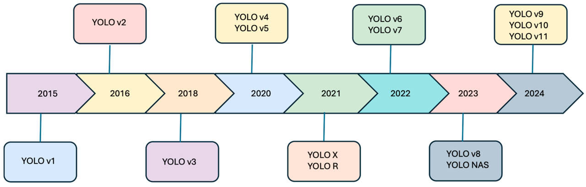
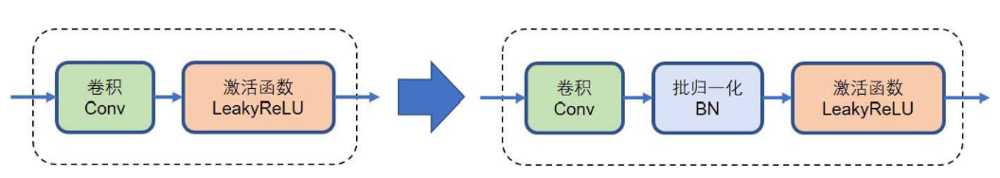
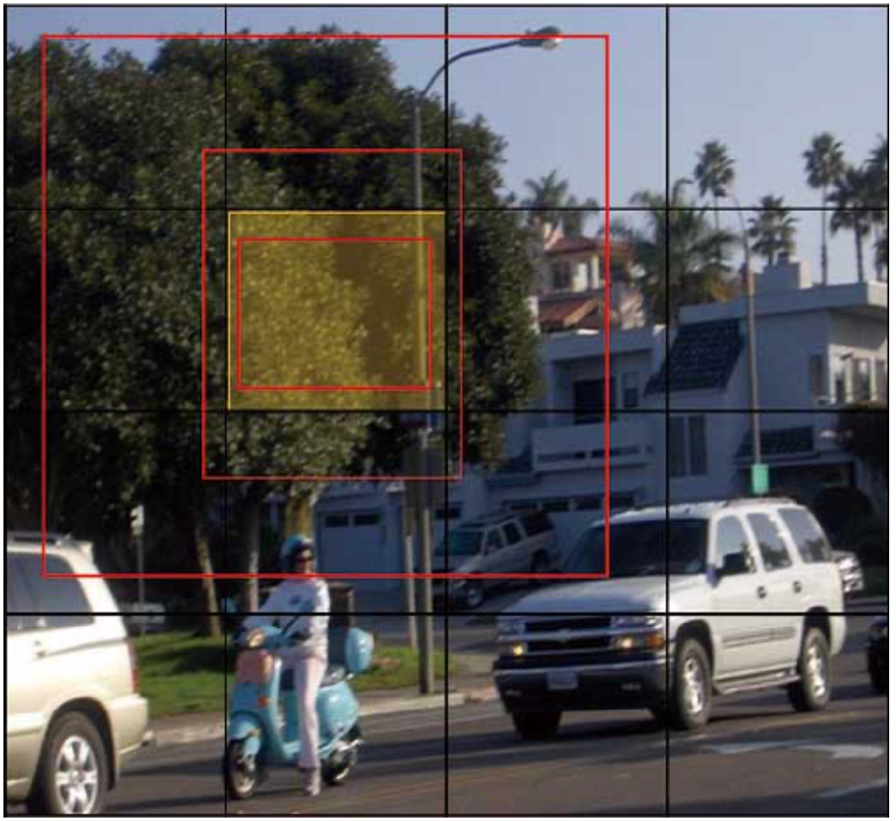
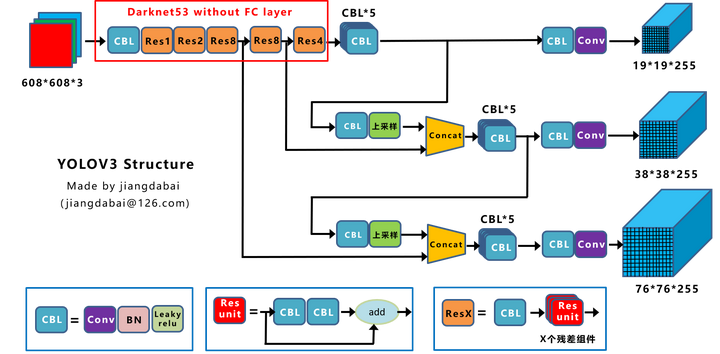
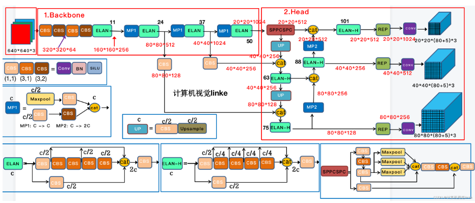
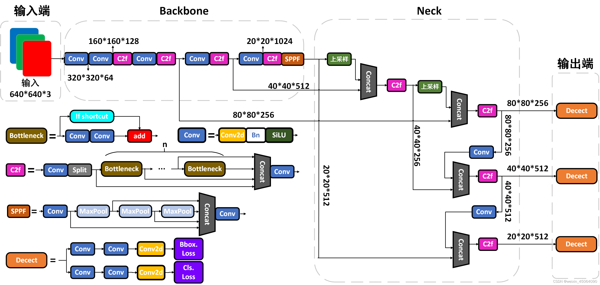

# YOLO 进阶

## 1. 上节回顾

上节我们了解了 YOLO 诞生的背景，其与 R-CNN 的对比，以及 YOLOv1 优缺点，并用代码实现了 YOLOv1。

本节我们将学习当下最流行的 YOLO 版本 YOLOv8。

## 2. 项目介绍

我们首先来梳理一下，YOLOv8 问世之前，YOLO 框架的发展历程。



### 2.1. YOLOv2~YOLOv3

在 2016 年 IEEE 主办的计算机视觉与模式识别（CVPR）会议上，继在 YOLOv1 工作获得了瞩目的成功之后，YOLO 的作者团队立即推出了第二代 YOLO 检测器：YOLOv2。新提出的 YOLOv2 在 YOLOv1 基础之上做了大量的改进和优化，如引入批归一化层、引入由 Faster R-CNN 工作提出的先验框机制、提出基于 k 均值聚类算法的先验框聚类算法，以及采用新的边界框回归方法等。



在 VOC2007 数据集上，凭借着这一系列的改进，YOLOv2 不仅大幅度超越了上一代的 YOLOv1，同时也超越了同年发表在欧洲计算机视觉国际会议（ECCV）上的新型 one-stage 检测器：SSD，成为了那个年代当之无愧的最强目标检测器之一。

我们提到了不论是 YOLOv1 还是 YOLOv2，都有一个共同的缺陷：小目标检测的性能差。而导致这一缺陷的原因则是只使用了最后一个经过 32 倍降采样的特征图。2018 年推出的 YOLOv3 使用更高效的骨干网络 DarkNet-53、多锚和空间金字塔池进一步增强了模型的性能。



其中，DarkNet-53 共可以被划分为五大部分，每个部分所堆叠的这些模块的数量分别为：1、2、8、8 和 4。这种“12884”的堆叠数量配置也成为后续诸多 YOLO 框架的范式之一。至此，YOLO 架构基本定型：主干网络、特征金字塔以及基于网格的检测头（包括 anchor box based 和 anchor box free 两大类）。



### 2.2. YOLOv4~YOLOv7

2020 年，YOLOv4 发布，引入了马赛克数据增强、新的无锚检测头和新的损失函数等创新技术。随后的 YOLOv5 增加了超参数优化、集成实验跟踪和自动导出为常用导出格式等新功能。很多人考虑到 YOLOv5 的创新性不足，对算法是否能够进化，称得上 YOLOv5 而议论纷纷。2022 年，美团开源 YOLOv6，不久，身在台湾的 YOLOv4 的原班人马再度出手，提出了 YOLOv7。



上图可以看出中 CBS 模块的组成为一个卷积（Conv）层，一个批归一化（BN）层，和一个 SiLU 层。MP 模块、ELAN 模块、ELAN-H 模块等也有对应的释义。，其中

$$
SiLU(x) = x⋅sigmoid(x)
$$

YOLOv7 在其主干中采用了诸如扩展高效层聚合网络（ELAN）之类的技术，以提高特征提取效率。一个主要的贡献是“可训练的免费赠品包”的概念，它涉及在训练期间应用优化策略（如辅助头和由粗到精的指导），以提高最终模型精度，而不会在推理期间增加计算开销。

### 2.3. YOLOv8

YOLOv7 架构和新颖的训练技术可能很复杂，难以完全掌握和针对自定义用例进行优化。较大的 YOLOv7 模型需要大量的 GPU 资源来进行训练。更重要的是，YOLOv7 主要侧重于目标检测。与其他任务（如实例分割或图像分类）的实现需要单独的、非集成的实现。

人工智能公司 Ultralytics 于 2023 年发布的 YOLOv8 引入了新的功能和改进，提高了性能、灵活性和效率，支持全方位的视觉人工智能任务。该公司还是 YOLOv5 的创造者，其一直致力于为用户提供更加容易上手的 YOLO 模型工程化实现。



YOLOv8 首次将检测、分割、分类、姿势估计和定向目标检测统一于一个模型框架内，并提供了全面的文档、简单的工作流程以及简单的 Python 和 CLI 接口，用于训练和部署。

## 3. 项目内容

### 3.1. 目标检测

在本教程里，我们用 COCO128，它是从大规模的 COCO 数据集中抽取的 128 张图像。

- 包含 80 个类别（person、dog、car 等）。
- 每张图片有标注：`x, y, w, h, class_id`。
- 适合快速调试，但不适合训练高精度模型。

任务流程

- 训练：利用标注数据更新模型权重。
- 验证：在验证集上测试性能，指标主要是 mAP（mean Average Precision）。
- 推理：给模型输入一张新图，输出目标框 + 类别。

```python
from ultralytics import YOLO

# 加载预训练 YOLOv8n 检测模型（nano 版，轻量快速）
model = YOLO("data/yolov8n.pt")

# 训练：使用内置 COCO128 数据集
results = model.train(
    data="coco128.yaml",  # 数据集配置，内置文件名即可
    epochs=20,  # 训练轮数
    imgsz=640,  # 输入图像尺寸
    batch=16,  # 每批样本数
    device="cpu",
)

# 在验证集上评估
metrics = model.val()

# 推理：可以对图片/文件夹/视频/URL 做预测
model.predict(
    source="https://ultralytics.com/images/bus.jpg",
    save=True,  # 保存带框结果到 runs/predict/*
    conf=0.25,  # 置信度阈值
)
```

### 3.2. 超参数搜索

YOLOv8 已经默认设置了合理的参数，但在训练真实任务时，可以通过调节来提升效果。以下按重要性列出：

#### 3.2.1. 训练过程相关

- `epochs`：训练轮数
  - 默认 100，教程里演示用 10。
  - 数据量大或任务难时应增加（100~300）。
  - 不要盲目无限增加，监控验证集 mAP，如果趋于收敛就可停止。
- `batch`：每批图像数量
  - 受 GPU 显存限制，越大越稳定，但速度未必更快。
  - 若显存不足，可减小 `batch`；如有多 GPU，可并行增大。
- `imgsz`：输入图像分辨率
  - 默认 640。提高到 960/1280 可以提升精度，代价是训练速度和显存消耗。
  - 小目标任务推荐更高分辨率。
- `device`：计算设备
  - `0` 代表 GPU:0；`cpu` 表示用 CPU（速度很慢，仅调试时用）。

#### 3.2.2. 学习率相关

- `lr0`：初始学习率
  - 默认 ~0.01。
  - 如果训练很不稳定（loss 抖动），可以降低到 0.005 或 0.001。
- `lrf`：最终学习率相对于初始学习率的比例
  - 默认 0.01，表示最后会衰减到初始学习率的 1%。
  - 对训练稳定性有帮助，通常不用改。

#### 3.2.3. 数据增强相关

YOLOv8 默认启用了很多 在线数据增强，有助于泛化：

- mosaic（拼接增强，默认 1.0）
  - 将 4 张图像拼成一张，有助于检测小目标。
  - 小数据集时效果好，但在验证时关闭。
- `hsv_h`, `hsv_s`, `hsv_v`（颜色抖动）
  - 控制色相、饱和度、亮度变化。
  - 默认 (0.015, 0.7, 0.4)，一般不需要调整。
- `flipud` / `fliplr`（上下/左右翻转概率）
  - 默认 0.0 和 0.5。一般保持默认。

以下为实例代码

```python
import itertools

import matplotlib.pyplot as plt
from ultralytics import YOLO

# 搜索空间
search_space = {
    "imgsz": [640, 960],  # 输入分辨率
    "batch": [16, 32],  # batch 大小
}

# 模型 & 数据
base_model = "yolov8n.pt"
data_cfg = "coco128.yaml"

# 存储结果
results = []
# 枚举所有组合
param_grid = list(itertools.product(search_space["imgsz"], search_space["batch"]))

for i, (lr0, imgsz, batch) in enumerate(param_grid):
    print(f"\n=== 实验 {i + 1}/{len(param_grid)} | imgsz={imgsz}, batch={batch} ===")
    # 加载模型
    model = YOLO(base_model)
    # 自定义训练参数，加入 scheduler
    model.train(
        data=data_cfg,
        epochs=10,
        imgsz=imgsz,
        batch=batch,
        lr0=lr0,
        optimizer="SGD",
        cos_lr=True,  # 使用 cosine scheduler
        device=0,  # 0:GPU；或使用 'cpu'
        verbose=False,
    )

    # 验证
    metrics = model.val()
    mAP50 = metrics.box.map50
    mAP = metrics.box.map
    results.append({"imgsz": imgsz, "batch": batch, "mAP50": mAP50, "mAP": mAP})
```

可视化

```python
# 柱状图：不同实验配置 vs mAP
labels = [f"sz={r['imgsz']}, b={r['batch']}" for r in results]
mAPs = [r["mAP"] for r in results]

_, ax = plt.subplots(figsize=(8, 4))

ax.bar(range(len(results)), mAPs)
ax.set_xticks(range(len(results)), labels, rotation=45, ha="right")
ax.set_ylabel("mAP@[.5:.95]")
ax.set_title("不同超参数组合的 mAP 对比")
```

### 3.3. 导出模型

YOLO 模型支持导出 10 种以上的格式

| 格式         | 典型扩展名          | 主要用途                                        |
|--------------|---------------------|-------------------------------------------------|
| PyTorch      | .pt                 | 继续训练、调试                                  |
| TorchScript  | .torchscript        | LibTorch/C++、移动端                            |
| **ONNX**     | .onnx               | C++/C#、OpenCV、ONNXRuntime、OpenVINO、TensorRT |
| **TensorRT** | .engine             | NVIDIA GPU 部署                                 |
| **OpenVINO** | .xml+.bin           | Intel CPU/GPU/VPU                               |
| CoreML       | .mlmodel            | iOS/macOS                                       |
| TF-Lite      | .tflite             | 安卓/嵌入式                                     |
| PaddlePaddle | .pdiparams+.pdmodel | 飞桨生态                                        |

```python
import torch

# 导出为 TorchScript
export_path = model.export(format="torchscript")  # 返回文件路径

# 纯 PyTorch 读取 TorchScript 并推理（端到端包含后处理）
ts_model = torch.jit.load(export_path)
ts_model.eval()

# 假设我们有一张 RGB 输入图像张量 x，形状 [1, 3, 640, 640]，数值范围 0~1
# 这里仅演示尺寸/范围要求；真实使用时可用 YOLOv8 的预处理或 torchvision.transforms 处理得到 x
dummy = torch.rand(1, 3, 640, 640)
with torch.inference_mode():
    out = ts_model(dummy)  # 导出的模型已封装后处理（含 NMS），输出为检测结果结构
print(type(out), "推理完成")
```

### 3.4. 批量推理

```python
import os

from torchvision.datasets import PennFudanPed
from ultralytics import YOLO

# 下载数据（只下载不训练）
data_folder = "$HOME/Documents/col-models/"
data_folder = os.path.expandvars(data_folder)
ds = PennFudanPed(data_folder, download=True)
images_dir = os.path.join(ds.root, "PennFudanPed", "PNGImages")

# 2. 用检测模型对整个文件夹做批量推理
model = YOLO("data/yolov8s.pt")
model.predict(source=images_dir, save=True)  # 预测结果图保存在 runs/predict/*
```

## 4. 项目练习

### 4.1. 基础题（60 分）

对上文模型增加超参数搜索，寻找更优模型

### 4.2. 进阶题（40 分）

YOLOv8 也支持分类任务（`yolov8n-cls.pt` 等。试着修改如下代码，使之运行。

```python
import os

from PIL import Image
from torchvision import datasets
from ultralytics import YOLO

data_folder = "$HOME"
data_folder = os.path.expandvars(data_folder)
root = f"{data_folder}/cifar10-yolo"
train_dir = f"{root}/train"
val_dir = f"{root}/val"
train_dir.mkdir(parents=True, exist_ok=True)
val_dir.mkdir(parents=True, exist_ok=True)

# 下载 CIFAR10
train_set = datasets.CIFAR10(data_folder, train=True, download=True)
test_set = datasets.CIFAR10(data_folder, train=False, download=True)


# 保存为文件夹分类结构（演示用，保存 PNG）
def dump_split(ds, out_dir):
    # 创建类别子目录
    for _, cls_name in enumerate(ds.classes):
        (out_dir / cls_name).mkdir(parents=True, exist_ok=True)
    # 逐样本保存
    for i, (img, label) in enumerate(ds):
        cls_name = ds.classes[label]
        Image.fromarray(img).save(out_dir / cls_name / f"{i:06d}.png")


dump_split(train_set, train_dir)
dump_split(test_set, val_dir)

# 训练 YOLOv8 分类模型（n/s/m/l 可选）
model = YOLO("data/yolov8s-cls.pt")
model.train(data=str(root), epochs=5, imgsz=224, batch=128)  # 分类常用 224 尺寸
model.val()
```

## 5. 参考阅读

- [探索 Ultralytics YOLOv8](https://docs.ultralytics.com/zh/models/yolov8/)
- [模型对比：YOLOv7 与 YOLOv8 的目标检测](https://docs.ultralytics.com/zh/compare/yolov7-vs-yolov8/)
