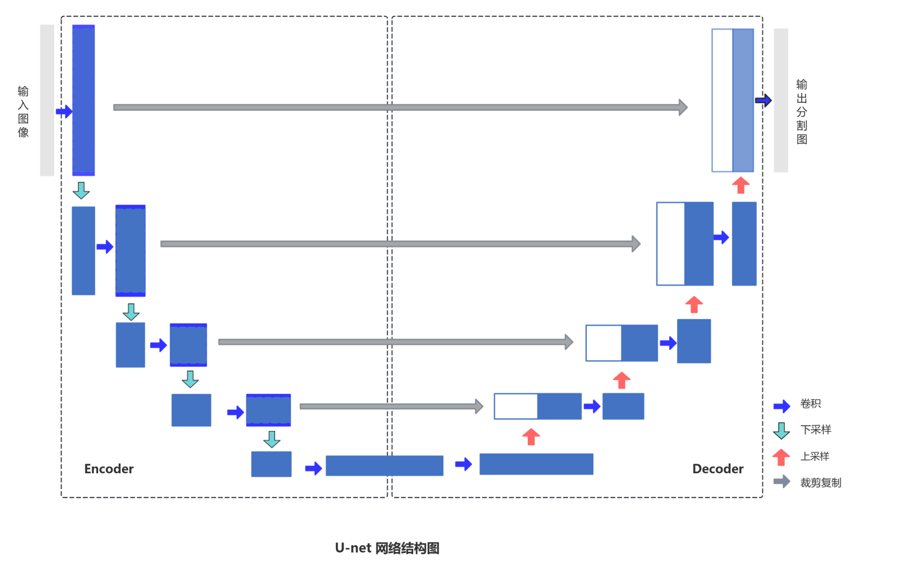
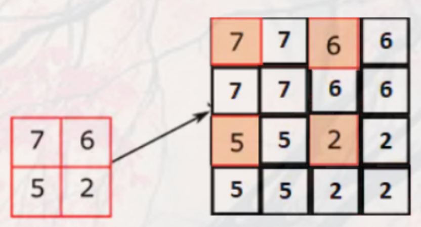
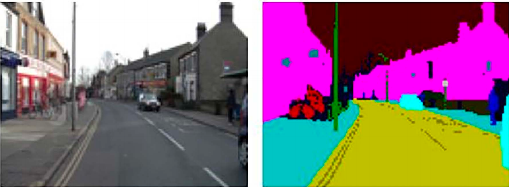
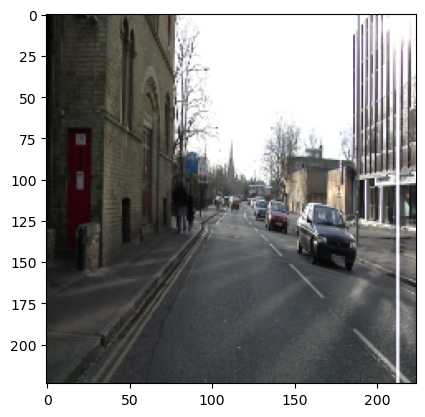
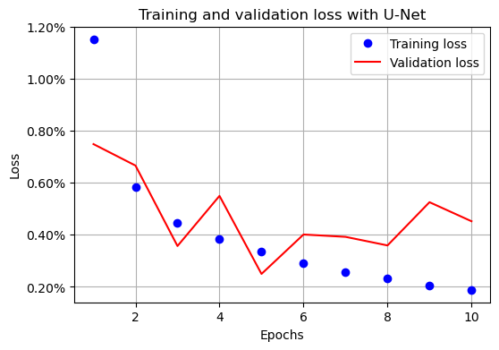
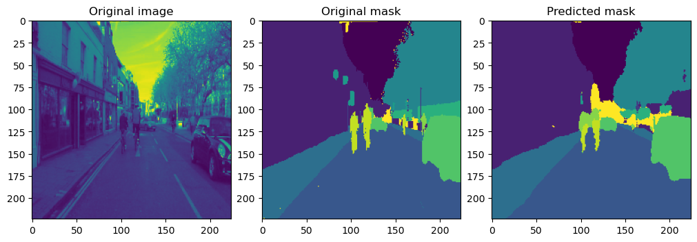

# 图像分割实战

## 1. 上节回顾

前面两节我们学习了 YOLO 的架构知识，并利用 ultralytics 中的 YOLO 模型进行了实战。

本节我们将学习图像分割的相关知识。

## 2. 项目介绍

### 2.1. U-Net 架构

想象这样一个场景：你得到了一张图像，并被要求预测哪个像素对应于哪个物体。到目前为止，当我们预测物体类别和边界框时，我们通过一个网络来传递图像，然后将图像通过一个主干架构（如 VGG 或 ResNet），在某一层展平输出，并在对类别和边界框偏移量进行预测之前连接额外的全连接层。

然而，在图像分割的情况下，输出形状与输入图像的形状相同，展平卷积的输出然后再重建图像可能会导致信息丢失。此外，在图像分割的情况下，原始图像中的轮廓和形状在输出图像中不会变化，因此我们迄今为止处理过的网络（展平最后一层并连接额外的全连接层）在进行分割时并不是最优的。

在进行分割时，我们需要考虑的两个方面如下：

- 原始图像中物体的形状和结构在分割后的输出中保持不变。
- 利用全卷积架构（而不是展平某一层的结构）可以在这方面提供帮助，因为我们以一张图像作为输入，并以另一张图像作为输出。

U-Net 架构有助于我们实现这一点。U-Net 的典型表示如下：



上述架构被称为 U-Net 架构，因其形状类似字母“U”。在上图的左半部分，我们可以看到图像经过了卷积层，并且图像的尺寸不断减小，而通道数不断增加。然而，在右半部分，我们可以看到我们将缩小的图像进行了上采样，恢复到原始的高度和宽度，但通道数与类别数一样多。

此外，在进行上采样时，我们还利用左半部分对应层的信息，通过跳跃连接（skip connection）来高分辨率的细节信息拼回深层语义特征，提高分割边缘精度。这样，U-Net 架构在利用卷积的特征来预测每个像素对应的类别时，学会了保持原始图像的结构（和物体的形状）。一般来说，输出中的通道数与我们想要预测的类别数一样多。

### 2.2. 上采样

上采样（upsampling），又称图像插值的主要目的是：放大原图像，从而可以显示在更高分辨率的显示设备上。在 U-Net 架构中，上采样是通过 `nn.ConvTranspose2d` 方法实现的。以下是一个 `ConvTranspose2d` 的示例计算过程



在上面的例子中，我们采用了一个形状为 2×2 的输入数组（输入数组），应用了一个步长为 2 的操作，将输入值分布以适应步长（调整步长后的输入数组），然后用零填充该数组（调整步长和填充后的输入数组），最后将填充后的输入与一个卷积核进行卷积，以获得输出数组。为了了解`nn.ConvTranspose2d`如何帮助放大数组，让我们通过以下代码进行了解：

```python
import torch
import torch.nn as nn

x = torch.tensor([[7, 6], [5, 2]], dtype=torch.float32).view(1, 1, 2, 2)
upsample = nn.ConvTranspose2d(1, 1, kernel_size=2, stride=2, bias=False)
upsample.weight.data.fill_(1.0)

y = upsample(x)
y
# tensor([[[[7., 7., 6., 6.],
#           [7., 7., 6., 6.],
#           [5., 5., 2., 2.],
#           [5., 5., 2., 2.]]]], grad_fn=<ConvolutionBackward0>)
```

## 3. 项目内容

在本节中，我们将利用 U-Net 架构来预测图像中所有像素所对应的类别。以下是一个输入 - 输出组合的示例：



在上面的图片中，属于同一类别的对象（左侧的输入图像）具有相同的像素值（右侧的输出图像），这就是我们将语义上相似的像素进行分割的原因。这通常也被称为语义分割。让我们学习如何编写语义分割代码。

### 3.1. 载入数据集

```python
import glob
import os

import cv2
from torch.utils.data import DataLoader, Dataset
from torchvision import transforms

device = "cuda" if torch.cuda.is_available() else "cpu"

data_folder = "$HOME/Documents/col-models/segment-1"
data_folder = os.path.expandvars(data_folder)
# 定义将用于转换图像的函数
tfms = transforms.Compose(
    [transforms.ToTensor(), transforms.Normalize([0.45] * 3, [0.225] * 3)]
)


class SegData(Dataset):
    def __init__(self, split, data_path=data_folder):
        self.data_path = data_path
        self.split = split
        self.items = glob.glob(f"{data_path}/images_prepped_{split}/*.png")

    def __len__(self):
        return len(self.items)

    # 将输入（图像）和输出（掩码）图像都进行了缩放，使它们具有相同的形状。
    def __getitem__(self, ix):
        image = cv2.imread(f"{self.items[ix]}")[:, :, ::-1]
        image = cv2.resize(image, (224, 224))
        mask = cv2.imread(
            self.items[ix].replace("images_prepped_", "annotations_prepped_"),
            cv2.IMREAD_GRAYSCALE,
        )
        mask = cv2.resize(mask, (224, 224), interpolation=cv2.INTER_NEAREST)
        return image, mask

    # 定义 collate_fn 方法以对一批图像进行预处理
    def collate_fn(self, batch):
        imgs, masks = list(zip(*batch))
        imgs = (
            torch.cat([tfms(im.copy() / 255.0)[None] for im in imgs]).float().to(device)
        )
        # ce_masks 是一个长整型张量，类似于交叉熵目标
        ce_masks = (
            torch.cat([torch.Tensor(mask[None]) for mask in masks]).long().to(device)
        )
        return imgs, ce_masks
```

定义训练和验证数据集，以及数据加载器，并预览数据

```python
import matplotlib.pyplot as plt

trn_ds = SegData("train")
val_ds = SegData("test")
trn_dl = DataLoader(trn_ds, batch_size=4, shuffle=True, collate_fn=trn_ds.collate_fn)
val_dl = DataLoader(val_ds, batch_size=1, shuffle=True, collate_fn=val_ds.collate_fn)

plt.imshow(trn_ds[10][0])
```



### 3.2. 定义卷积块

定义用于训练分割任务的神经网络模型架构。注意，U-Net 包含传统的卷积层以及上卷积层

```python
def conv(in_channels, out_channels):
    return nn.Sequential(
        nn.Conv2d(in_channels, out_channels, kernel_size=3, stride=1, padding=1),
        nn.BatchNorm2d(out_channels),
        nn.ReLU(inplace=True),
    )

def up_conv(in_channels, out_channels):
    # ConvTranspose2d 确保我们对图像进行上采样，而 Conv2d 操作会减少图像的维度。ConvTranspose2d 接受一个具有 in_channels 数量输入通道的图像，并产生一个具有 out_channels 数量输出通道的图像。
    return nn.Sequential(
        nn.ConvTranspose2d(in_channels, out_channels, kernel_size=2, stride=2),
        nn.ReLU(inplace=True),
    )
```

### 3.3. 组装网络

这次我们的主干模型依旧选择 VGG16。

```python
from torchvision import models


class UNet(nn.Module):
    def __init__(self, out_channels=12):
        super().__init__()
        backbone = models.vgg16_bn()
        weights_path = "$HOME/Documents/col-models/vgg16_bn-6c64b313.pth"
        weights_path = os.path.expandvars(weights_path)
        backbone.load_state_dict(torch.load(weights_path, weights_only=True))
        for param in backbone.parameters():
            param.requires_grad = False

        self.encoder = backbone.features
        self.block1 = nn.Sequential(*self.encoder[:6])
        self.block2 = nn.Sequential(*self.encoder[6:13])
        self.block3 = nn.Sequential(*self.encoder[13:20])
        self.block4 = nn.Sequential(*self.encoder[20:27])
        self.block5 = nn.Sequential(*self.encoder[27:34])

        self.bottleneck = nn.Sequential(*self.encoder[34:])
        self.conv_bottleneck = conv(512, 1024)

        self.up_conv6 = up_conv(1024, 512)
        self.conv6 = conv(512 + 512, 512)
        self.up_conv7 = up_conv(512, 256)
        self.conv7 = conv(256 + 512, 256)
        self.up_conv8 = up_conv(256, 128)
        self.conv8 = conv(128 + 256, 128)
        self.up_conv9 = up_conv(128, 64)
        self.conv9 = conv(64 + 128, 64)
        self.up_conv10 = up_conv(64, 32)
        self.conv10 = conv(32 + 64, 32)
        self.conv11 = nn.Conv2d(32, out_channels, kernel_size=1)

    def forward(self, x):
        block1 = self.block1(x)
        block2 = self.block2(block1)
        block3 = self.block3(block2)
        block4 = self.block4(block3)
        block5 = self.block5(block4)

        bottleneck = self.bottleneck(block5)
        x = self.conv_bottleneck(bottleneck)

        # 我们通过在适当的张量对上使用 `torch.cat`，建立了下采样和上采样卷积特征之间的 U 形连接。
        x = self.up_conv6(x)
        x = torch.cat([x, block5], dim=1)
        x = self.conv6(x)

        x = self.up_conv7(x)
        x = torch.cat([x, block4], dim=1)
        x = self.conv7(x)

        x = self.up_conv8(x)
        x = torch.cat([x, block3], dim=1)
        x = self.conv8(x)

        x = self.up_conv9(x)
        x = torch.cat([x, block2], dim=1)
        x = self.conv9(x)

        x = self.up_conv10(x)
        x = torch.cat([x, block1], dim=1)
        x = self.conv10(x)

        x = self.conv11(x)

        return x
```

### 3.4. 定义训练相关函数

```python
ce = nn.CrossEntropyLoss()


def UnetLoss(preds, targets):
    ce_loss = ce(preds, targets)
    acc = (torch.max(preds, 1)[1] == targets).float().mean()
    return ce_loss, acc


def train_batch(model, data, optimizer, criterion):
    model.train()
    ims, ce_masks = data
    _masks = model(ims)
    optimizer.zero_grad()
    loss, acc = criterion(_masks, ce_masks)
    loss.backward()
    optimizer.step()
    return loss.item(), acc.item()


@torch.no_grad()
def validate_batch(model, data, criterion):
    model.eval()
    ims, masks = data
    _masks = model(ims)
    loss, acc = criterion(_masks, masks)
    return loss.item(), acc.item()
```

### 3.5. 训练评估

```python
import numpy as np
from torch.optim import Adam

model = UNet().to(device)
criterion = UnetLoss
optimizer = Adam(model.parameters(), lr=1e-3)
n_epochs = 10

train_losses = []
val_losses = []
for epoch in range(n_epochs):
    train_epoch_losses = []

    for _, inputs in enumerate(trn_dl):
        loss, acc = train_batch(model, inputs, optimizer, criterion)
        train_epoch_losses.append(loss)
    train_epoch_loss = np.array(train_epoch_losses).mean()

    for _, inputs in enumerate(val_dl):
        val_epoch_loss, val_epoch_acc = validate_batch(model, inputs, criterion)

    train_losses.append(train_epoch_loss)
    val_losses.append(val_epoch_loss)
    print(f"epoch: {epoch + 1}/{n_epochs}")
    print(f"{train_epoch_loss:.4f}")
    print(f"{val_epoch_loss:.4f}")

# 不要忘记保存训练得到的模型权重
# torch.save(res_net.to("cpu").state_dict(), "data/chap08-mrcnn-street.pth")
```

绘制性能曲线

```python
from matplotlib.ticker import PercentFormatter

epochs = np.arange(n_epochs) + 1

_, ax = plt.subplots(figsize=(6, 4))

ax.plot(epochs, train_losses, "bo", label="Training loss")
ax.plot(epochs, val_losses, "r", label="Validation loss")
ax.set(title="Training and validation loss with U-Net", xlabel="Epochs", ylabel="Loss")
ax.yaxis.set_major_formatter(PercentFormatter())
ax.legend()
ax.grid("off")
```



在一张新图像上计算预测输出，以观察模型在未见图像上的表现。

```python
im, mask = next(iter(val_dl))
_mask = model(im)
_, _mask = torch.max(_mask, dim=1)

_, axes = plt.subplots(1, 3, figsize=(10, 6), constrained_layout=True)

datas = [
    im[0].permute(1, 2, 0).detach().cpu()[:, :, 0],
    mask.permute(1, 2, 0).detach().cpu()[:, :, 0],
    _mask.permute(1, 2, 0).detach().cpu()[:, :, 0],
]
titles = ["Original image", "Original mask", "Predicted mask"]

for ax, data, title in zip(axes.flatten(), datas, titles):
    ax.imshow(data)
    ax.set(title=title)
```



从上面的图片中，我们可以看到，使用 U-Net 架构可以成功生成分割掩码。然而，所有同一类别的实例都将具有相同的预测像素值。

## 4. 项目练习（每题 20 分）

### 4.1. 基础题

1. 上述 U-Net 模型一共有多少层，每层都是什么？
2. 在 U-Net 的解码器里，每次上采样通常把特征图的 H、W 放大几倍？
3. 在 `forward`函数里，为什么每次上采样之后都要用 `torch.cat([x, blockX], dim=1)`？

### 4.2. 进阶题

1. 下面哪一个整数序列最可能是 `self.encoder[0:6]` 里各层的通道数变化？

- (A) 3 → 64 → 64 → 128 → 128 → 256
- (B) 3 → 64 → 64 → 64 → 64 → 64
- (C) 64 → 64 → 128 → 128 → 256 → 256
- (D) 64 → 128 → 256 → 512 → 512 → 512

2. 回顾上节学习的 YOLOv8 模型，尝试调整下面的代码，使用其进行图像分割

```python
from ultralytics import YOLO

m = YOLO("data/yolov8n-seg.pt")
m.train(data="coco128-seg.yaml", epochs=5, imgsz=640)
m.predict(source="图片路径", save=True)
```

## 5. 参考阅读

- [U-Net](https://www.ultralytics.com/zh/glossary/u-net)
- [Mask R-CNN](https://www.ultralytics.com/zh/blog/what-is-mask-r-cnn-and-how-does-it-work)
