# 补充资料

## 1. 前馈神经网络

### 1.1. 训练批次大小

在前面的部分，训练数据集的每个批次考虑 32 个数据点。这导致每个 epoch 的权重更新次数更多，因为有 1,875 次权重更新（60,000/32 几乎等于 1,875，其中 60,000 是训练图像的数量）。

此外，我们没有考虑模型在验证数据集上的表现。本部分将比较以下内容：

- 训练批次大小为 32 时，训练数据和验证数据的损失和准确率值
- 训练批次大小为 10,000 时，训练数据和验证数据的损失和准确率值

我们需要做的仅是修改如下部分代码

```python
def get_data():
    train = FMNISTDataset(tr_images, tr_targets)
    return DataLoader(train, batch_size=10_000, shuffle=True)
```

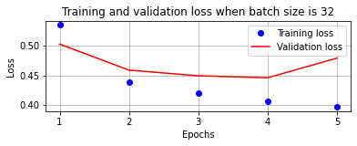
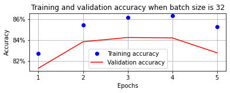
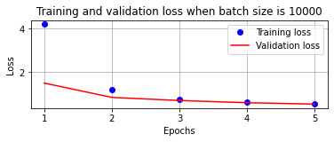
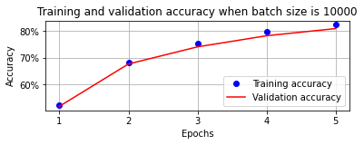

### 1.2. 损失优化器

为了最小化总体损失，需要调整权重值。损失优化器（调整权重值以最小化损失值的不同方法）会影响模型的总体损失和准确率。比较 10 个 epoch 内，SGD 和 Adam 的性能

```python
from torch.optim import Adam


def get_model():
    model = nn.Sequential(nn.Linear(28 * 28, 1000), nn.ReLU(), nn.Linear(1000, 10))
    criterion = nn.CrossEntropyLoss()
    optimizer = Adam(model.parameters(), lr=1e-2)
    return model, criterion, optimizer
```

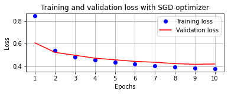
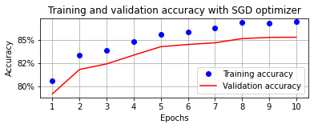
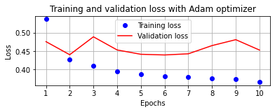
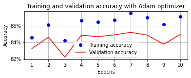

显然，10 个 epoch 内，Adam 优化器的表现不及 SGD 的。

### 1.3. 网络层数

到目前为止，我们的神经网络架构只有一层隐藏层。在本节中，我们将对比具有两层隐藏层和没有隐藏层（没有隐藏层相当于逻辑回归）的模型性能。以下是具有两层隐藏层的修改后的 `get_model` 函数（来自批次大小为 32 部分的代码）：

```python
def get_model():
    model = nn.Sequential(
        nn.Linear(28 * 28, 1000),
        nn.ReLU(),
        nn.Linear(1000, 1000),  # 增加一层
        nn.ReLU(),
        nn.Linear(1000, 10),
    )
    criterion = nn.CrossEntropyLoss()
    optimizer = Adam(model.parameters(), lr=1e-3)
    return model, criterion, optimizer
```

类似地，没有隐藏层的 `get_model` 函数如下：

```python
def get_model():
    model = nn.Sequential(
        nn.Linear(28 * 28, 10)  # 仅此一层
    )
    criterion = nn.CrossEntropyLoss()
    optimizer = Adam(model.parameters(), lr=1e-3)
    return model, criterion, optimizer
```

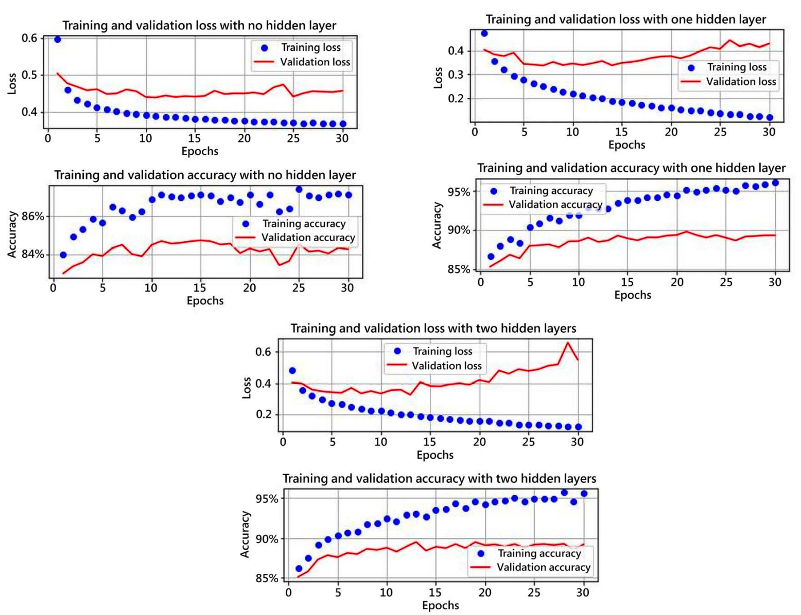

请注意以下几点：

- 当没有隐藏层时，模型无法很好地学习。
- 具有两层隐藏层的模型相比于一层隐藏层的模型，过拟合的程度更大（两层模型的验证损失高于一层模型的验证损失）。

到目前为止，在不同的部分中，我们已经看到，当输入数据没有缩放（降到较小范围）时，模型无法很好地训练。未缩放的数据（数据范围较大）也可能出现在隐藏层中（尤其是在具有多个隐藏层的深度神经网络中），因为隐藏层节点的值是通过矩阵乘法计算得到的。

## 2. 卷积神经网络

### 2.1. 解构 CNN

卷积神经网络（CNN）是最常用的图像处理架构，它们解决了深度神经网络的主要局限性，就像我们在上一节中看到的。除了图像分类，CNN 还能用于目标检测、图像分割、生成对抗网络（GAN）等，基本上适用于所有涉及图像的应用。此外，构建 CNN 的方法有很多种，并且有许多预训练模型利用 CNN 来执行各种任务。从现在开始，我们将广泛使用 CNN。

#### 2.1.1. 卷积

卷积本质上是两个矩阵的乘法运算。正如你在此前看到的，矩阵乘法是训练神经网络的关键组成部分。（我们在计算隐藏层值时会进行矩阵乘法——这涉及到输入值和连接输入到隐藏层的权重值的矩阵乘法。类似地，我们也会进行矩阵乘法来计算输出层的值。）

卷积神经网络中的卷积运算其实是互相关运算（cross-correlation）。

假设

- 输入形状：$3×3$
- 卷积核形状：$2×2$

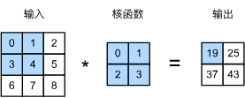

> 有时，我们也将卷积核（kernel）成为过滤器（filter）。

互相关运算结果为

$$
\begin{aligned}
  & 0 × 0 + 1 × 1 + 3 × 2 + 4 × 3 = 19 \\
  & 1 × 0 + 2 × 1 + 4 × 2 + 5 × 3 = 25 \\
  & 3 × 0 + 4 × 1 + 6 × 2 + 7 × 3 = 37 \\
  & 4 × 0 + 5 × 1 + 7 × 2 + 8 × 3 = 43
\end{aligned}
$$

注意，输出大小等于输入大小减去卷积核大小，即

$$
  (n_h - k_h + 1) × (n_w - k_w + 1)
$$

其中，$n$代表输入，$k$代表卷积核，$h$代表高度，$w$代表宽度。

> 这是因为我们需要足够的空间在图像上“移动”卷积核。

#### 2.1.2. 卷积核

卷积核是一个在开始时随机初始化的权重矩阵。模型会随着训练周期的增加，学习卷积核的最佳权重值。卷积核的概念引出了两个不同的方面：

- 卷积核学习的内容
- 卷积核的表示方式

一般来说，CNN 中卷积核越多，模型就越能学习图像的更多特征。眼下，我们先保持一个初步的理解，即卷积核学习图像中不同的特征。例如，某个卷积核可能会学习猫的耳朵，并在卷积的图像部分包含猫的耳朵时产生较高的激活值（矩阵乘法结果）。

此外，当处理具有三个通道的彩色图像时，卷积核与原始图像卷积也需要具有三个通道，从而产生每个卷积运算的单个标量输出。

- 若卷积核与中间输出卷积，假设其形状为 64x112x112，则卷积核需要有 64 个通道才能获取标量输出。
- 若有 512 个卷积核与中间层获得的输出卷积，则经过 512 个卷积核卷积后的输出形状将为 512x112x112。

#### 2.1.3. 填充和步幅

填充和步幅可⽤于有效地调整数据的维度。其中

- 填充可以增加输出的⾼度和宽度。这常⽤来使输出与输⼊具有相同的⾼和宽。
- 步幅可以减⼩输出的⾼度和宽度。

由于我们通常使⽤⼩卷积核，因此对于任何单个卷积，我们可能只会丢失⼏个像素。但随着我们应⽤许多连续卷积层，累积丢失的像素数就多了。解决这个问题的简单⽅法即为填充（padding）：在输⼊图像的边界填充元素（通常填充元素是 0）。

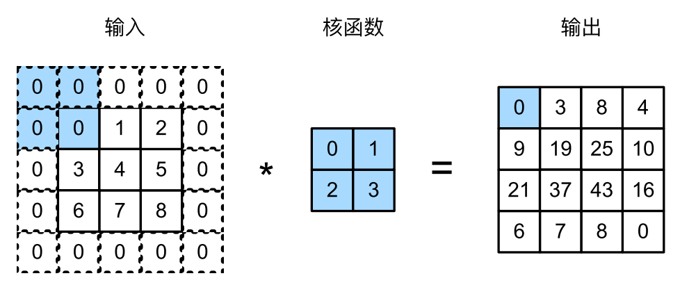

通常，若添加$p_h$⾏填充（⼤约⼀半在顶部，⼀半在底部）和$p_w$列填充（左侧⼤约⼀半，右侧⼀半），则输出形状将为

$$
(n_h - k_h + p_h + 1) × (n_w - k_w + p_w + 1)
$$

在许多情况下，我们需要设置 $p_h = k_h − 1$ 和 $p_w = k_w − 1$，使输⼊和输出具有相同的⾼度和宽度。这样可以在构建⽹络时更容易地预测每个图层的输出形状。假设 $k_h$ 是奇数，我们将在⾼度的两侧填充 $p_h/2$ ⾏。若 $k_h$ 是偶数，则⼀种可能性是在输⼊顶部填充$[p_h/2]$⾏，在底部填充$[p_h/2]$⾏。同理，我们填充宽度的两侧。

CNN 中卷积核的⾼度和宽度通常为奇数。选择奇数的好处是，保持空间维度的同时，我们可以在顶部和底部填充相同数量的⾏，在左侧和右侧填充相同数量的列。

在计算互相关时，卷积窗⼝从输⼊张量的左上⻆开始，向下、向右滑动。在前⾯的例⼦中，我们默认每次滑动⼀个元素。但是，有时候为了⾼效计算或是缩减采样次数，卷积窗⼝可以跳过中间位置，每次滑动多个元素。我们将每次滑动元素的数量称为步幅（stride）。

为了计算输出中第⼀列的第⼆个元素和第⼀⾏的第⼆个元素，卷积窗⼝分别向下滑动三⾏和向右滑动两列。但是，当卷积窗⼝继续向右滑动两列时，没有输出，因为输⼊元素⽆法填充窗⼝（除⾮我们添加另⼀列填充）。

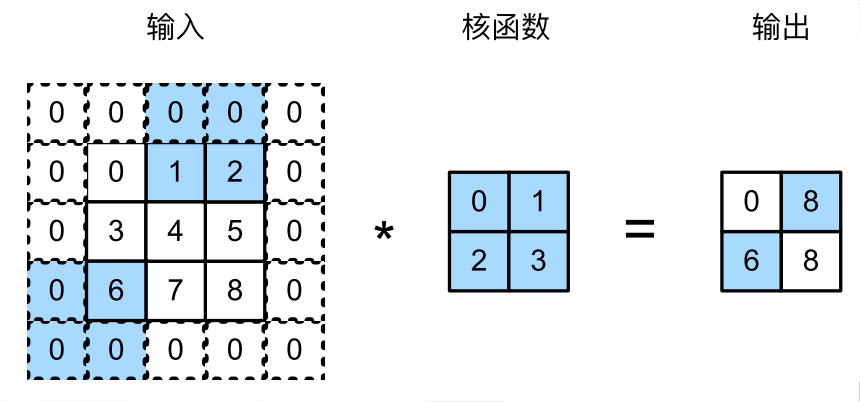

通常，当垂直步幅为 sh、⽔平步幅为 sw 时，输出形状为

$$
[(n_h − k_h + p_h + s_h)/s_h] × [(n_w − k_w + p_w + s_w)/s_w]
$$

若设置了$p_h = k_h − 1$和$pw = k_w − 1$，则输出形状将简化为$[(n_h + s_h − 1)/s_h] × [(n_w + s_w − 1)/s_w]$。更进⼀步，若输⼊的⾼度和宽度可以被垂直和⽔平步幅整除，则输出形状将为$(n_h/s_h) × (n_w/s_w)$。

#### 2.1.4. 池化

通常当我们处理图像时，我们希望逐渐降低隐藏表⽰的空间分辨率、聚集信息，这样随着我们在神经⽹络中层叠的上升，每个神经元对其敏感的感受野（输⼊）就越⼤。

⽽我们的机器学习任务通常会跟全局图像的问题有关，所以我们最后⼀层的神经元应该对整个输⼊的全局敏感。通过逐渐聚合信息，⽣成越来越粗糙的映射，最终实现学习全局表⽰的⽬标，同时将卷积图层的所有优势保留在中间层。

池化（pooling）层，它具有双重⽬的：降低卷积层对位置的敏感性，同时降低对空间降采样表⽰的敏感性。与卷积层类似，池化层运算符由⼀个固定形状的窗⼝组成，该窗⼝根据其步幅⼤⼩在输⼊的所有区域上滑动，为固定形状窗⼝（有时称为池化窗⼝）遍历的每个位置计算⼀个输出。然⽽，不同于卷积层中的输⼊与卷积核之间的互相关计算，池化层不包含参数。相反，池运算是确定性的，我们通常计算池化窗⼝中所有元素的最⼤值或平均值。这些操作分别称为最⼤池化层（maximum pooling）和平均池化层（average pooling）。池化窗⼝形状为$p × q$的池化层称为$p × q$池化层，池化操作称为$p × q$池化。

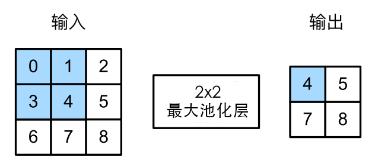

> 与卷积层⼀样，汇聚层也可以改变输出形状。和以前⼀样，我们可以通过填充和步幅以获得所需的输出形状。

## 3. R-CNN

### 3.1. Fast R-CNN

Fast R-CNN 由 Ross Girshick 于 2015 年开发，是原始 R-CNN（基于区域的卷积神经网络）模型的演变。它旨在解决 R-CNN 和 SPPnet 的低效问题，提供一种更快、更高效的目标检测方法。Fast R-CNN 通过引入简化的训练过程改进了其前身，该过程同时更新分类器和边界框回归器，并通过使用共享的卷积特征图来处理图像中的所有目标，显著减少了计算时间。

1. 将图像通过预训练模型传递，以在展平层（flatten）之前提取特征；我们称它们为输出特征图。
2. 提取与图像对应的区域建议。
3. 提取与区域建议对应的特征图区域（注意，当图像通过 VGG16 时，由于执行了 5 次池化，图像在输出时会被缩小 32 倍。
4. 依次将与区域建议对应的特征图通过感兴趣区域（RoI）池化层，以便所有区域建议的特征图具有相似的形状。
5. 将 RoI 池化层的输出值通过全连接层。
6. 训练模型以预测每个区域建议对应的类别和偏移量。

### 3.2. Faster R-CNN
