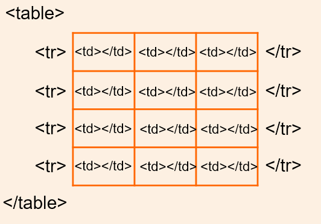

# Markdown 进阶

<link rel="stylesheet" type="text/css" href="styles/zero.css">

## 扩展要求

- Markdown All In One
- rumdl
- Markdown Footnotes
- Foam

## 作业要求

使用 Markdown 实现本文档内分割线以下部分包含的各种样式

- 链接
  - [ ] 超链接（5 分）
  - [ ] 网络图片（5 分）
  - [ ] 脚注（10 分）
  - [ ] 文件内跳转（5 分）
  - [ ] 目录（5 分）
- 表情（5 分）
- HTML
  - [ ] 下划线（5 分）
  - [ ] 高亮（5 分）
  - [ ] 字体颜色（5 分）
- CSS
  - [ ] 表格居中（5 分）
  - [ ] 表格跨列和跨行（5 分）
  - [ ] 表头居中（5 分）
  - [ ] 表格宽度占页面 80%（5 分）
  - [ ] 表格奇、偶数行不同色（10 分）
  - [ ] 自定义高亮背景（与默认不同即可，5 分）
  - [ ] 自定义有序列表（与默认不同即可，5 分）
  - [ ] 自定义二级有序列表（与默认不同即可，5 分）
  - [ ] 流式分栏（5 分）

作业以 .md 和 .css 文件提交，文件命名模式为：`02-学号-姓名.md`和`02-学号-姓名.css`。

---

- [扩展要求](#扩展要求)
- [作业要求](#作业要求)
- [Markdown 编程环境概览（二级标题）](#markdown-编程环境概览二级标题)
  - [语法扩展（三级标题）](#语法扩展三级标题)
    - [Markdown All in One](#markdown-all-in-one)
    - [rumdl](#rumdl)
- [HTML](#html)
  - [复杂表格（三级标题）](#复杂表格三级标题)
  - [与 CSS 及 JS 的关系（三级标题）](#与-css-及-js-的关系三级标题)
  - [与 XML](#与-xml)

## Markdown 编程环境概览（二级标题）

Markdown 是一种易于读写的轻量级的<u>标记语言</u>，编写出的作品简洁美观，近年来受到了越来越多的追捧，被广泛地用于日常写作，乃至电子书发表。与此同时，一系列优秀 Markdown 编辑器应运而生。其中较为著名的免费应用有 [Obsidian](https://obsidian.md)（此为网络链接）和 Typora。

VSCode 是当下<mark>最流行</mark>的代码编辑器，拥有丰富的扩展，见[以下部分](#rumdl)（此为文件内跳转，跳转至 rumdl 部分），搞定 Markdown 自然不在话下。与上面提到的编辑器相比，VSCode 的明显优势有

- 集成的布局：大纲（outline）、工作区（workspace）；
- 强大的补全：LaTeX 公式；
- 丰富的扩展：方便整合其他工具（详见下文的功能扩展部分）；

### 语法扩展（三级标题）

#### Markdown All in One

如名称所述，这是个大一统型的扩展，集成了撰写 Markdown 时所需要的大部分功能，是 Markdown 类插件中下载榜榜首。可认为是 VSCode 中的 Markdown 必备扩展。其功能涵盖：

- 快捷命令及代码片
- 自动生成标题编号
- 自动生成并更新目录
- LaTeX 数学公式支持

](https://pic2.zhimg.com/80/v2-48bbd284deacef0b5896427e660b2a51_1440w.png)

#### rumdl

rumdl[^1] 是个功能强大的 Markdown 语法检查器（linter）和格式化器（formatter），可以帮助你书写✍（类似表情均有分）出规范的文档，同时避免书写错误导致文档无法渲染。

[^1]: lint 的意思是绒毛，动词引申为求疵。

## HTML

### 复杂表格（三级标题）

Markdown 中表格实现相对繁琐，复杂样式的实现完全依赖 HTML。需要使用的标签和属性如下：

<link rel="stylesheet" type="text/css" href="styles/md.css">

    <table border="2">
        <tr>
            <th colspan="3" >table</th>
        </tr>
        <tr>
            <th rowspan="3">子标签</th>
            <td>tr</td>
            <td>表格行</td>
        </tr>
        <tr>
            <td>th</td>
            <td>表头单元格</td>
        </tr>
        <tr>
            <td>td</td>
            <td>数据单元格</td>
        </tr>
        <tr>
            <th rowspan="3">子标签属性</th>
            <td>colspan</td>
            <td>跨列合并单元格</td>
        </tr>
        <tr>
            <td>rowspan</td>
            <td>跨行合并单元格</td>
        </tr>
    </table>

基本的标签对应关系如下所示

Markdown 并不是 HTML 的替代品，而是 HTML 的简化版本。实际上，Markdown 的最终目标就是转换为 <mark>HTML</mark>。

### 与 CSS 及 JS 的关系（三级标题）

这三者 99% 的情况下都是搭配使用的，但也不是绝对的，具体关系是：

1. HTML
   1. 与 CSS、JS 是不同的技术，可以独立存在；
   2. 一般需要 CSS 和 JS 来配合使用，否则效果不理想；
2. CSS 一般是不能脱离 HTML 或 XML 的；
3. JS
   1. 可以脱离 HTML 和 CSS 而独立存在；
   2. JS 可以操作 HTML 和 CSS。

### 与 XML

XML 和 HTML 都是标记文本，他们在结构上大致相同，都是以标记的形式来描述信息。

 HTML 文件本质上是一个可以在 Web 浏览器中打开的网页。

 XML 文件是一种通用文件类型，可用于存储数据，然后根据用于查看 XML 文件的软件，这些数据可以呈现为多种格式。

