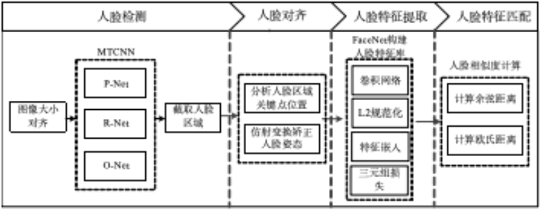
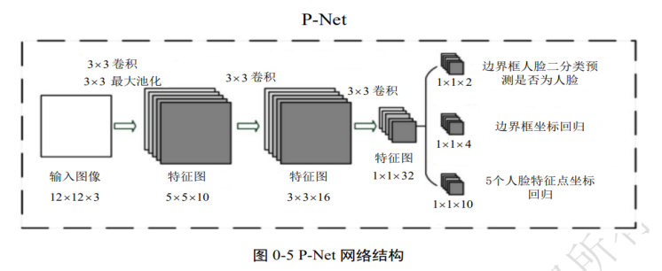
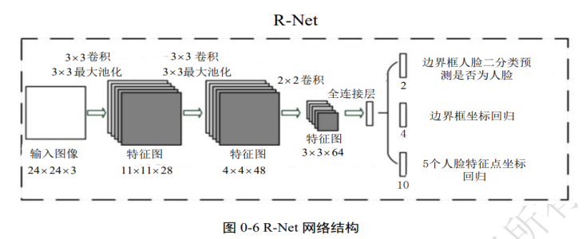
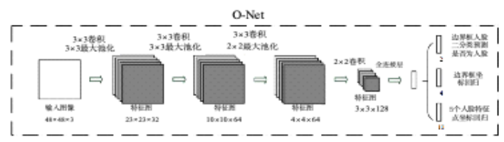
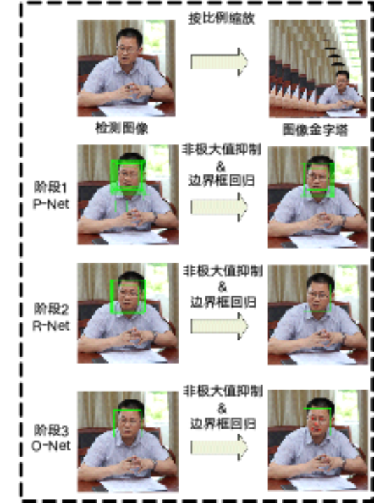
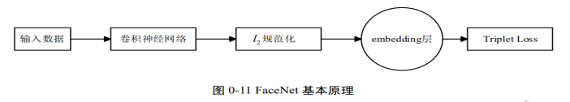

# 人脸检测和识别（深度学习）

## 目的和要求

1. 掌握深度学习MTCNN+FaceNet实现人脸识别的模型结构；
2. 掌握MTCNN+FaceNet人脸检测和识别的方法和流程；
3. 强化Python面向深度学习框架TensorFlow的编程能力；

## 实验设备与准备

- 计算机：CPU四核i7-6700处理器；内存8G；SATA硬盘2TB硬盘；Intel芯片主板；集成声卡、千兆网卡、显卡；20寸液晶显示器。
- 环境：Python3.14、VSCode、OpenCV4.0等

## 实验内容

通过深度学习MTCNN+FaceNet实现对于人脸检测和人脸识别，要求掌握人脸识别的流程：人脸检测、人脸对齐、人脸特征提取、人脸特征匹配等过程。



## 实现过程

### 预备知识

熟悉和掌握MTCNN人脸检测和FaceNet人脸识别的有关知识。

### MTCNN







```python
class mtcnn():
    def __init__(self):
        self.Pnet = create_Pnet('model_data/pnet.h5')
        self.Rnet = create_Rnet('model_data/rnet.h5')
        self.Onet = create_Onet('model_data/onet.h5')

    # 人脸检测函数
    def detectFace(self, img, threshold):
        # -----------------------------#
        #   归一化
        # -----------------------------#
        copy_img = (img.copy() - 127.5) / 127.5
        origin_h, origin_w, _ = copy_img.shape

        # -----------------------------#
        #   计算原始输入图像
        #   每一次缩放的比例
        # -----------------------------#
        scales = calculateScales(img)
        out = []
        # -----------------------------#
        #   粗略计算人脸框
        #   pnet部分
        # -----------------------------#
        for scale in scales:
            hs = int(origin_h * scale)
            ws = int(origin_w * scale)
            scale_img = cv2.resize(copy_img, (ws, hs))
            inputs = scale_img.reshape(1, *scale_img.shape)
            # Pnet预测人脸框
            ouput = self.Pnet.predict(inputs)
            out.append(ouput)

        image_num = len(scales)
        rectangles = []
        for i in range(image_num):
            # 有人脸的概率
            cls_prob = out[i][0][0][:, :, 1]
            # 其对应的框的位置
            roi = out[i][1][0]
            # 取出每个缩放后图片的长宽
            out_h, out_w = cls_prob.shape
            out_side = max(out_h, out_w)
            # 解码过程
            rectangle = detect_face_12net(cls_prob, roi, out_side,
                                          1 / scales[i], origin_w, origin_h,threshold[0])
            rectangles.extend(rectangle)

        # 进行非极大抑制
        rectangles = NMS(rectangles, 0.8)

        if len(rectangles) == 0:
            return rectangles

        # -----------------------------#
        #   稍微精确计算人脸框
        #   Rnet部分
        # -----------------------------#
        predict_24_batch = []
        for rectangle in rectangles:
            crop_img = copy_img[int(rectangle[1]):int(rectangle[3]), int(rectangle[0]):int(rectangle[2])]
            scale_img = cv2.resize(crop_img, (24, 24))
            predict_24_batch.append(scale_img)

        predict_24_batch = np.array(predict_24_batch)
        # Rnet预测人脸框
        out = self.Rnet.predict(predict_24_batch)
        # 置信度
        cls_prob = out[0]
        cls_prob = np.array(cls_prob)
        # 如何调整某一张图片对应的rectangle
        roi_prob = out[1]
        roi_prob = np.array(roi_prob)
        # 对pnet处理后的结果进行处理
        rectangles = filter_face_24net(cls_prob, roi_prob, rectangles, origin_w, origin_h, threshold[1])
        if len(rectangles) == 0:
            return rectangles

        # -----------------------------#
        #   计算人脸框
        #   onet部分
        # -----------------------------#
        predict_batch = []
        for rectangle in rectangles:
            crop_img = copy_img[int(rectangle[1]):int(rectangle[3]), int(rectangle[0]):int(rectangle[2])]
            scale_img = cv2.resize(crop_img, (48, 48))
            predict_batch.append(scale_img)

        predict_batch = np.array(predict_batch)
        # Onet预测人脸框和人脸关键点
        output = self.Onet.predict(predict_batch)
        cls_prob = output[0]
        roi_prob = output[1]
        pts_prob = output[2]

        # 对onet处理后的结果进行处理
        rectangles = filter_face_48net(cls_prob, roi_prob, pts_prob, rectangles, origin_w, origin_h, threshold[2])
        return rectangles
```

### FaceNet

FaceNet基本原理和实现步骤：

- 设输入图像为x，经过卷积神经网络得到f(x)
- 将图像特征f(x)进行L2规范化
- 通过嵌入层embedding将图像特征映射到超球面空间（即为图像的特征向量）
- 利用三元组损失Triplet Loss对特征相似性进行评估，实现人脸相似性度量



```python
# 定义facenet人脸检测处理类
class Face_Rec():
    def __init__(self):
        # 创建mtcnn对象
        # 检测图片中的人脸
        self.mtcnn_model = mtcnn()
        # 门限函数
        self.threshold = [0.5, 0.8, 0.9]

        # 载入facenet
        # 将检测到的人脸转化为128维的向量
        self.facenet_model = build_model()
        # model.summary()
        # model_path = './model_data/facenet_keras.h5'
        model_path = 'weights/model.01-0.2455.h5'
        # 加载模型文件
        self.facenet_model.load_weights(model_path)

        # -----------------------------------------------#
        #   对数据库中的人脸进行编码
        #   known_face_encodings中存储的是编码后的人脸
        #   known_face_names为人脸的名字
        # -----------------------------------------------#
        face_list = os.listdir('./face_dataset/')
        self.known_face_encodings = []
        self.known_face_names = []

        for root, dirs, files in os.walk('./face_dataset/'):
            if len(files)<=0:
                continue
            for file in files:
                name = root.split("/")[2]
                # 读取图像
                img = cv2.imread(root+"/"+file)
                # 转RGB
                img = cv2.cvtColor(img, cv2.COLOR_BGR2RGB)

                # 检测人脸
                rectangles = self.mtcnn_model.detectFace(img, self.threshold)
                if len(rectangles) ==0:
                    continue
                # 转化成正方形
                rectangles = rect2square(np.array(rectangles))
                # facenet要传入一个160x160的图片
                rectangle = rectangles[0]
                # 记下landmark
                landmark = (np.reshape(rectangle[5:15], (5, 2)) - np.array([int(rectangle[0]), int(rectangle[1])])) / (
                        rectangle[3] - rectangle[1]) * 160

                # 裁剪人脸图像
                crop_img = img[int(rectangle[1]):int(rectangle[3]), int(rectangle[0]):int(rectangle[2])]
                H, W = crop_img.shape[:2]
                if H <= 0 or W <= 0:
                    continue
                crop_img = cv2.resize(crop_img, (160, 160))

                # 对齐人脸
                new_img, _ = Alignment(crop_img, landmark)
                # 扩展一个维度
                new_img = np.expand_dims(new_img, 0)
                # 将检测到的人脸传入到facenet的模型中，实现128维特征向量的提取
                face_encoding = calc_vec(self.facenet_model, new_img)

                self.known_face_encodings.append(face_encoding)
                self.known_face_names.append(name)

        # # 遍历人脸数据库
        # for face in face_list:
        #     name = face.split(".")[0]
        #     # 读取图像
        #     img = cv2.imread('./face_dataset/' + face)
        #     # 转RGB
        #     img = cv2.cvtColor(img, cv2.COLOR_BGR2RGB)
        #
        #     # 检测人脸
        #     rectangles = self.mtcnn_model.detectFace(img, self.threshold)
        #
        #     # 转化成正方形
        #     rectangles = rect2square(np.array(rectangles))
        #     # facenet要传入一个160x160的图片
        #     rectangle = rectangles[0]
        #     # 记下landmark
        #     landmark = (np.reshape(rectangle[5:15], (5, 2)) - np.array([int(rectangle[0]), int(rectangle[1])])) / (
        #                 rectangle[3] - rectangle[1]) * 160
        #
        #     # 裁剪人脸图像
        #     crop_img = img[int(rectangle[1]):int(rectangle[3]), int(rectangle[0]):int(rectangle[2])]
        #     crop_img = cv2.resize(crop_img, (160, 160))
        #
        #     # 对齐人脸
        #     new_img, _ = Alignment(crop_img, landmark)
        #     # 扩展一个维度
        #     new_img = np.expand_dims(new_img, 0)
        #     # 将检测到的人脸传入到facenet的模型中，实现128维特征向量的提取
        #     face_encoding = calc_vec(self.facenet_model, new_img)
        #
        #     self.known_face_encodings.append(face_encoding)
        #     self.known_face_names.append(name)

    def recognize(self, draw):
        # -----------------------------------------------#
        #   人脸识别
        #   先定位，再进行数据库匹配
        # -----------------------------------------------#
        height, width, _ = np.shape(draw)
        draw_rgb = cv2.cvtColor(draw, cv2.COLOR_BGR2RGB)

        # 检测人脸
        rectangles = self.mtcnn_model.detectFace(draw_rgb, self.threshold)

        if len(rectangles) == 0:
            return

        # 转化成正方形
        rectangles = rect2square(np.array(rectangles, dtype=np.int32))
        rectangles[:, 0] = np.clip(rectangles[:, 0], 0, width)
        rectangles[:, 1] = np.clip(rectangles[:, 1], 0, height)
        rectangles[:, 2] = np.clip(rectangles[:, 2], 0, width)
        rectangles[:, 3] = np.clip(rectangles[:, 3], 0, height)
        # -----------------------------------------------#
        #   对检测到的人脸进行编码
        # -----------------------------------------------#
        face_encodings = []

        # 遍历每个人脸框
        for rectangle in rectangles:
            # 记下landmark
            landmark = (np.reshape(rectangle[5:15], (5, 2)) - np.array([int(rectangle[0]), int(rectangle[1])])) / (
                        rectangle[3] - rectangle[1]) * 160

            # 裁剪图像
            crop_img = draw_rgb[int(rectangle[1]):int(rectangle[3]), int(rectangle[0]):int(rectangle[2])]
            crop_img = cv2.resize(crop_img, (160, 160))

            # 对齐人脸
            new_img, _ = Alignment(crop_img, landmark)
            new_img = np.expand_dims(new_img, 0)

            # 计算人脸特征编码
            face_encoding = calc_vec(self.facenet_model, new_img)
            face_encodings.append(face_encoding)

        face_names = []
        for face_encoding in face_encodings:
            # 取出一张脸并与数据库中所有的人脸进行对比，计算得分
            matches = compare_faces(self.known_face_encodings, face_encoding, tolerance=0.9)
            name = "Unknown"
            # 找出距离最近的人脸
            face_distances = face_distance(self.known_face_encodings, face_encoding)
            # 取出这个最近人脸的得分
            best_match_index = np.argmin(face_distances)
            if matches[best_match_index]:
                name = self.known_face_names[best_match_index]
            face_names.append(name)

        rectangles = rectangles[:, 0:4]
        # -----------------------------------------------#
        #   画框
        # -----------------------------------------------#
        for (left, top, right, bottom), name in zip(rectangles, face_names):
            cv2.rectangle(draw, (left, top), (right, bottom), (0, 0, 255), 2)

            font = cv2.FONT_HERSHEY_SIMPLEX
            cv2.putText(draw, name, (left, bottom - 15), font, 0.75, (255, 255, 255), 2)
        return draw
```

## 总结和要求

- 通过本项目要掌握深度学习MTCNN+FaceNet人脸检测和人脸识别的方法和实现流程，理解深度学习的流程方法。
- 形成一个完整的实验报告。
