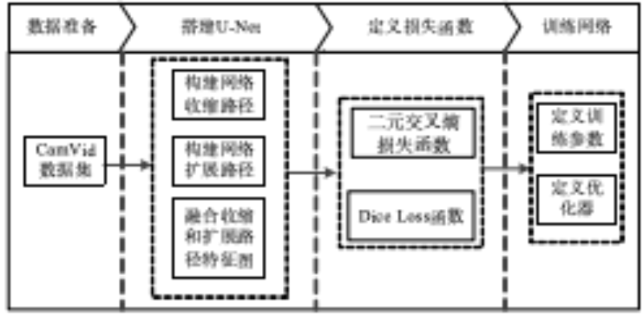
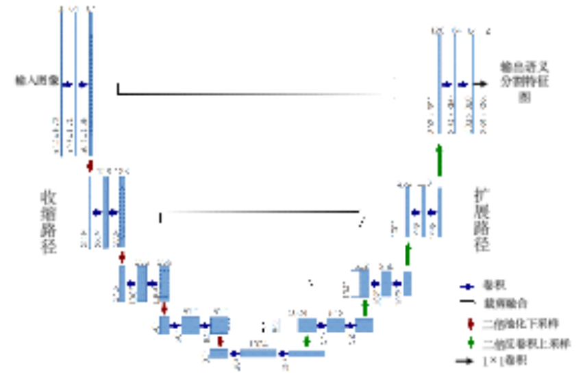

# 图像分割（基于U-Net的城市道路场景分割实战）

## 目的和要求

1. 掌握CamVID数据集标注样本的格式，并如何加载；
2. 掌握U-Net模型构建和训练的方法和流程；
3. 掌握语义分割网络损失函数设计方法和评价语义分割算法的方法；

## 实验设备与准备

- 计算机：CPU四核i7-6700处理器；内存8G；SATA硬盘2TB硬盘；Intel芯片主板；集成声卡、千兆网卡、显卡；20寸液晶显示器。
- 环境：Python3.14、VSCode、OpenCV4.0等

## 实验内容

图像语义分割是进行视觉感知的基础工作。然而面对道路场景物体复杂多变，面向自动驾驶的语义分割对算法的鲁棒性及泛化能力提出了极高的要求。而基于深度学习的语义分割方法能够依据先验对象实现准确地建模，能够达到自动驾驶级别的图像语义分割要求。通过CamVid数据集训练U-Net语义分割网络对城市道路场景进行图像分割，实现获取并感知城市道路环境的目的。

1. 训练U-Net语义分割网络实现城市道路场景分割的流程图步骤主要有以下
2. 将CamVid数据集划分为训练集、验证集和测试集，并对不同语义像素进行染色
3. 构建U-Net的收缩路径和扩展路径，将收缩路径和扩展路径中对应步骤的特征图进行融合
4. 定义二元交叉熵损失函数和Dice Loss函数，用于判断模型输出与真实值的距离
5. 定义训练参数和优化器后训练网络

## 实现过程

### 预备知识

熟悉和掌握U-Net语义分割网络的有关知识。U-Net属于全卷积神经网络，是一个有监督的端到端的图像分割网络，由德国弗赖堡大学的奥拉夫（Olaf）在IEEE生物医学成像国际会议（ISBI）举办的细胞影像分割比赛中提出。

U-Net的结构形似字母U，共有27层卷积层，进行了4次下采样与4次上采样，无全连接层，U-Net网络结构如图所示。

### 损失函数

U-Net最后一层卷积的激活函数为Sigmoid函数，输出掩模中每个像素值的分布区间为0～1，表示该像素值属于某类别的概率。

相应地，CamVid数据集训练的模型输出有32个掩模，每个掩模的像素值对应相应类别的概率。

采用二分类常用的二元交叉熵损失判断每个掩模的输出与真实值的距离，二元交叉熵损失函数的表达式如下式所示。

$$
L_{\mathrm{BCE}}=\frac{\sum_{i=1}^N\left[y_i \cdot \log \left(p\left(x_i\right)\right)+\left(1-y_i\right) \cdot \log \left(1-p\left(x_i\right)\right)\right]}{N}
$$

在分割图像的像素类别中，存在车道线、电线杆、行人等在图像中占比较小的目标对象，其像素数量会小于背景像素数量并且相距较远，由此产生了类不平衡问题。
如果仅使用二元交叉熵函数对模型进行优化，在模型损失较小时，占比较小的目标的分割效果依然欠佳。

因此引入了Dice Loss，增加占比较小的目标错误分类时产生的损失。Dice Loss的表达式如式所示。

$$
L_{\text {Dice }}=1-\frac{2|X \cap Y|}{|X|+|Y|}
$$

在上式中，X为预测像素的集合，Y为真实像素的集合。

当两个集合的并集与交集的两倍相等时，Dice Loss取得最小值，此时预测像素的集合X与真实像素的集合Y完全一致。

二元交叉熵损失值与像素数量N有关，当某些目标类的像素数量较少时模型无法取得较好的分割效果。而Dice Loss仅与预测结果与真实结果的IoU相关，与像素数量无关，因此能够较好地解决像素数量相距较远产生的类不平衡问题。

### 模型评价

测试集共有66张图片，以类别平均交并比mIoU和像素分类准确率Accuracy作为评价指标。
真实值与预测值的交集如图所示，类别平均交并比mIoU本质上就是通过计算预测掩膜和真实掩膜的交集和并集的比值来判断掩膜的分割效果。
像素分类准确率为掩膜分类正确的像素数量和掩膜像素总量的比值。

## 总结和要求

- 通过本项目要掌握U-Net模型构建和训练的方法和流程，理解图像分割的流程方法。
- 形成一个完整的实验报告。
