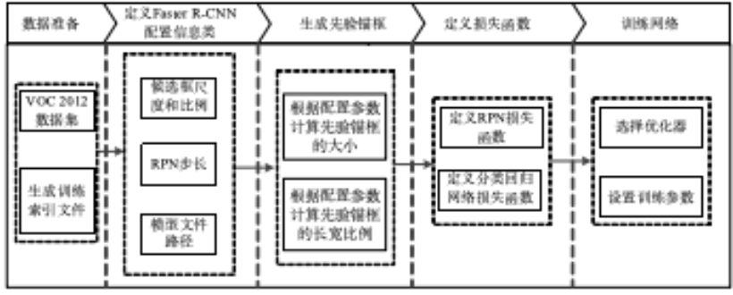
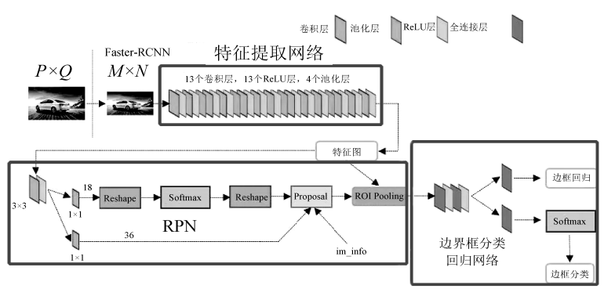
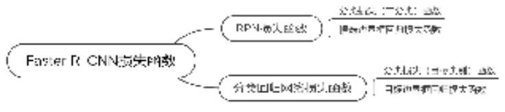

# 目标检测

## 目的和要求

1. 掌握VOC数据集标注样本的格式，并批量处理VOC数据集标注样本；
2. 掌握FasterRCNN模型构建和训练的方法和流程；
3. 掌握目标检测算法的性能评估指标的构建方法；

## 实验设备与准备

- 计算机：CPU四核i7-6700处理器；内存8G；SATA硬盘2TB硬盘；Intel芯片主板；集成声卡、千兆网卡、显卡；20寸液晶显示器。
- 环境：Python3.14、VSCode、OpenCV4.0等

## 实验内容

通过VOC 2012数据集训练基于Faster R-CNN的通用目标检测模型，利用该模型对图像和视频的物体进行检测。



训练Faster R-CNN主要包括以下步骤：

1. 由VOC 2012数据集生成用于模型训练的索引文件。
2. 定义Faster R-CNN配置信息类，包括候选框尺度和比例、RPN步长、模型文件路径等。
3. 根据配置参数计算先验锚框的大小和长宽比例，并生成先验锚框。
4. 定义RPN和分类回归网络的损失函数。
5. 选择优化器和设置训练参数后训练模型。

## 实现过程

### 预备知识

熟悉和掌握Faster R-CNN的有关知识。Faster R-CNN由3部分组成，如图所示，即特征提取网络、RPN和边界框分类回归网络，分别实现提取区域特征、获取兴趣区域和目标边界框分类的任务。



RPN和边界框分类回归网络共享特征提取网络提取的特征，为了产生多个兴趣区域，需要在共享卷积层后添加新的卷积层，新添加的卷积层属于RPN，因此RPN实际是一个全卷积神经网络（Fully Convolutional Neural Network，FCN）。

特征提取网络的作用是将输入图像转换为高维的语义特征，图中的特征提取网络为VGG16。在具体应用中，更多使用性能表现更好的ResNet50作为Faster R-CNN的特征网络。

### 静态图片目标检测

```python
from frcnn import FRCNN
from PIL import Image
import cv2
import numpy as np

frcnn = FRCNN()                      # 声明类对象

img = "img/street.jpg"               # 定义需要检测图像路径
image = Image.open(img)              # 加载图像数据

r_image = frcnn.detect_image(image)  # 开始检测
r_image.show()                       # 显示检测后图像
#frcnn.close_session()                # 关闭会话
```

### 视频目标检测

```python
from frcnn import FRCNN
from PIL import Image
import cv2
import numpy as np

frcnn = FRCNN()         # 声明Faster R-CNN类对象
cap = cv2.VideoCapture("test_data/street.mp4") # 读取视频流
fps = 15      # 定义输出视频帧率
size = (int(cap.get(cv2.CAP_PROP_FRAME_WIDTH)), int(cap.get(cv2.CAP_PROP_FRAME_HEIGHT))) # 定义输出视频图像大小

videoWriter = cv2.VideoWriter('test_data/out_street.mp4', cv2.VideoWriter_fourcc('M','P','E','G'), fps, size) # 定义视频输出方法

while(1):

    ret, frame = cap.read()  # 读取视频帧
    if ret:
        image = Image.fromarray(cv2.cvtColor(frame,cv2.COLOR_BGR2RGB)) # 转换视频帧格式为PIL格式方便检测
        r_image = frcnn.detect_image(image)  # 开始检测
        frame_out = cv2.cvtColor(np.asarray(r_image),cv2.COLOR_RGB2BGR) # 将检测输出图像转换为opencv图像格式
        videoWriter.write(frame_out) # 将检测结果opencv图像写成视频
    else:
        break
```

### 损失函数

Faster R-CNN损失函数包括RPN损失函数和分类回归网络损失函数，并且两部分损失都包括分类损失函数和回归损失函数，Faster R-CNN损失函数结构如下图所示。



完成损失函数的定义后开始训练模型，采用Adam优化器训练100个循环。初始学习率设置为0.0001，并随着训练循环次数和损失收敛情况进行衰减。

### 模型评价

在目标检测问题中，使用IoU作为判定目标是否被检测到的依据。IoU是指模型预测得到的边界框与真值边界框的交集和并集面积的比值。

在PASCAL VOC挑战赛中，满足的$IoU>0.5$边界框可以被认为是成功检测出目标的边界框。模型的识别精度由每种类别的检测精度以及总体的平均精度（Mean Average Precision，mAP）进行定量评估。

## 总结和要求

- 通过本项目要掌握FasterRCNN模型构建和训练的方法和流程，理解目标检测的流程方法。
- 形成一个完整的实验报告。
